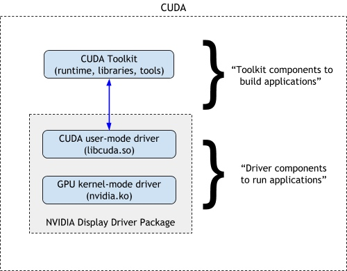
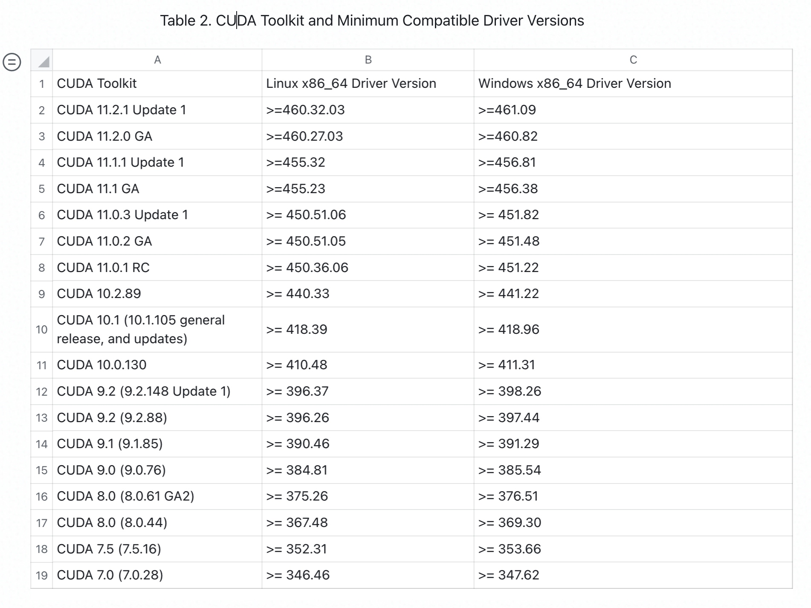
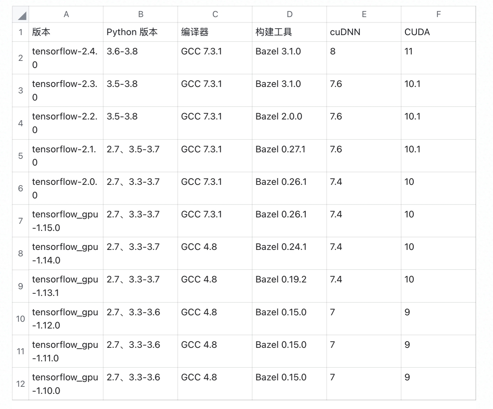
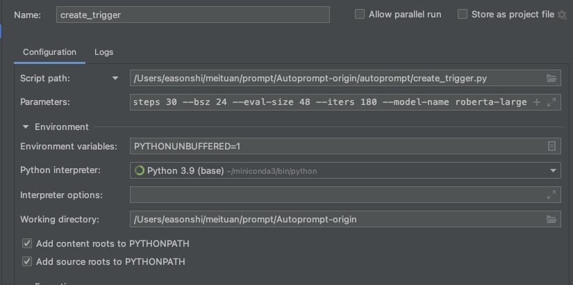

# 实验环境相关

```bash
scp -r -P 20016 root@10.192.6.138:prompt .
```

## Linux

### user 管理

```bash
sudo useradd -s /bin/bash -G sudo -d /home/syc syc
# 加组
-g team -G admin,developer,leader
# usermod
sudo useradd -s /sbin/nologin gtwang
# 加入 root
sudo usermod -aG sudo username

sudo useradd -s /bin/bash -m test
echo "test:test" | sudo chpasswd
```

```bash
# 修改shell的三种方式
usermod -s /sbin/nologin gtwang
chsh --shell /bin/sh tecmint
vi /etc/passwd
```

## SSH

### authorized_keys 免密登陆

在 `.ssh/authorized_keys` 中添加记录即可

### config

参见 CNBlogs 这篇 [linux下开启SSH，并且允许root用户远程登录,允许无密码登录](https://www.cnblogs.com/toughlife/p/5633510.html)

配置 `vim /etc/ssh/sshd_config`

```bash
# 禁止root用户远程登录
PermitRootLogin no

# PermitEmptyPasswords yes
```

修改后记得重启 ssh 服务，不同系统可能不一样

```bash
sudo /etc/init.d/ssh restart
# CentOS
sudo systemctl restart sshd
# Ubuntu
sudo service ssh restart
```

### Debug

#### connection refused

可能是未开启 SSH 服务。

可以通过网页管理页面进入服务器，尝试 `ssh localhost` ；若出现下面的情况则确定未开启。

```bash
(base) root@44c8ff33884d:~# ssh 127.0.0.1
ssh: connect to host 127.0.0.1 port 22: Connection refused
```

使用 `/etc/init.d/ssh -start`开启服务端。

见 [错误处理 ssh connection refused_love23_linuxer的博客-CSDN博客](https://blog.csdn.net/weixin_35827672/article/details/73521633)

#### 无法免密登录

参见 [ssh免密登陆失败原因总结(Linux)](https://blog.csdn.net/zhangmingcai/article/details/95734889)

- a) 服务器B上.ssh目录的权限必须是700
- b) 服务器B上.authorized_keys文件权限必须是600或者644
- c) 服务器B上用户家目录文件权限必须是700，比如用户名是aischang，则/home/aischang这个目录权限必须是700。如果不是700，在服务器A上查看/var/log/secure文件会报错
- d) 服务器B上SELinux关闭为disabled，可以使用命令修改setenforce 0 ，查看状态的命令为getenforce或者 查看/etc/selinux/config 文件中是否是disabled

## git

- 图解 <https://marklodato.github.io/visual-git-guide/index-zh-cn.html> 利用图示讲解了 `checkout, reset, merge, cherry-pick, rebase` 等指令到底做了什么，可惜没有涉及到远程仓库的命令。Cheatsheet 性质的

- Git Pro ebook: <http://iissnan.com/progit/> 写得非常详细，图示也很赞
    - 看了其中的远程分支和 [分支的rebase](http://iissnan.com/progit/html/zh/ch3_6.html) 章节

```bash
# 查看远程分支
git branch -a

# 创建并切换
git branch test
git checkout test

# push 到远程
git push origin test:test


#查看文件修改
git log --pretty=oneline -- 文件名    # 查看文件的修改历史；在 zsh 中定义为 glog
git show 356f6def9d -- 文件名
```

### 合并远程分支

在本地分支 a 的基础上合并远程分支 b：

- Pull 远程分支
- merge

```bash
# 在本地新建一个与远程的分支b相同(被合并的版本)的分支b
git checkout -b b origin/b
# 将远程代码pull到本地
git pull origin b

git checkout a
# 合并分支a与分支b
git merge b
```

## Nvidia driver

- 驱动 [下载地址](https://www.nvidia.com/Download/Find.aspx)

### debug

#### Driver/library version mismatch

`nvidia-smi` 报错

```bash
Failed to initialize NVML: Driver/library version mismatch
```

简单的说就是使用了两种不同的方式安装或更新了驱动，导致版本冲突。这种情况下最好卸载之前安装的全部显卡驱动，然后重新安装。

通过 `dmesg` 查看启动日志，找到

```bash
[   52.396206] NVRM: API mismatch: the client has the version 440.82, but
               NVRM: this kernel module has the version 390.48.  Please
               NVRM: make sure that this kernel module and all NVIDIA driver
               NVRM: components have the same version.
```

查看驱动版本

```bash
cat /proc/driver/nvidia/version
# sudo rmmod nvidia_drm nvidia_modeset nvidia 实现卸载了内核驱动？
modinfo nvidia  
```

```bash
NVRM version: NVIDIA UNIX x86_64 Kernel Module  440.82  Wed Apr  1 20:04:33 UTC 2020
GCC version:  gcc version 7.5.0 (Ubuntu 7.5.0-3ubuntu1~18.04)
```

##### 方案1 重载驱动模块 失败

reload kernel mod

```bash
# 尝试 rmmod nvidia 可以发现依赖，逐渐找到 nvidia_drm 卸载整个驱动
sudo rmmod nvidia_drm nvidia_modeset nvidia
# 卸载后重新运行这个即可
nvidia-smi

# 查看 mod 使用
lsmod | grep nvidia

# 查看哪些进程使用了 
sudo lsof -n -w  /dev/nvidia*
```

但还是会有问题，重启之后还是会出现 Failed to initialize NVML: Driver/library version mismatch 的问题，运行 `dmesg` 仍然发现系统和驱动版本不一致的问题。

##### 方案2 重新安装驱动

```bash
# 1. 卸载驱动
sudo dpkg -l | grep nvidia  # 查找残余的包
sudo apt remove --purge libnvidia*
sudo apt remove --purge nvidia*
sudo dpkg -l | grep nvidia  # 可能还有一些，手动 apt 卸载
# or
sudo /usr/bin/nvidia-uninstall
sudo apt-get --purge remove nvidia-*
sudo apt-get purge nvidia*
sudo apt-get purge libnvidia*

# 2. 重启！
sudo reboot

# 3. 重新安装驱动
sudo bash NVIDIA-Linux-x86_64-440.82.run  # 默认配置即可
```

梁斌说的三步走「清除驱动。重启。重装驱动。」解决。
之前尝试过通过 apt 安装驱动，还是有问题；中间一定需要重启？

参见 [here](https://www.dtmao.cc/news_show_4471541.shtml)

#### 原因 也可能是Kernel更新使得驱动不可用

## CUDA

### 相关概念理解

拓展：[运行时（runtime）是什么意思？](https://www.zhihu.com/question/20607178) ⭐️

CUDA doc <https://docs.nvidia.com/cuda/index.html>

- CUDA组件
    - <https://developer.nvidia.com/gpu-accelerated-libraries> 列出了CUDA加速库，例如 cuDNN 就是其中之一
    - <https://docs.nvidia.com/cuda/cuda-toolkit-release-notes/index.html> 介绍了CUDA版本的驱动版本的兼容表
    - [兼容性说明](https://docs.nvidia.com/cuda/cuda-c-best-practices-guide/index.html#cuda-compatibility-and-upgrades) 中提到这些区别
        - CUDA Toolkit (libraries, CUDA runtime and developer tools) - SDK for developers to build CUDA applications.
        - CUDA driver - User-mode driver component used to run CUDA applications (e.g. libcuda.so on Linux systems).
        - NVIDIA GPU device driver - Kernel-mode driver component for NVIDIA GPUs.
    - 说明：
        - The CUDA compiler (`nvcc`), provides a way to handle CUDA and non-CUDA code (by splitting and steering compilation), along with the CUDA runtime, is part of the CUDA compiler toolchain. The CUDA Runtime API provides developers with high-level C++ interface for simplified management of devices, kernel executions etc., While the CUDA driver API provides a low-level programming interface for applications to target NVIDIA hardware
        - Built on top of these technologies are CUDA libraries, some of which are included in the CUDA Toolkit, while others such as `cuDNN` may be released independently of the CUDA Toolkit.



- [显卡，显卡驱动,nvcc, cuda driver,cudatoolkit,cudnn到底是什么？](https://zhuanlan.zhihu.com/p/91334380) 介绍了这一组概念。解释了 ⭐️
    - nvcc 和 nvidia-smi显示的 CUDA 版本不同？因为是单独安装的 driver 和 toolkit
    - runtime 和 driver API区别？runtime是更高级的封装，开发人员用起来更方便，而driver API更接近底层，速度可能会更快。
    - Linux中PATH、 LIBRARY_PATH、 LD_LIBRARY_PATH的区别

CUDA有两个主要的API：runtime API 和 driver API。这两个API都有对应的CUDA版本（如9.2和10.0等）。

- 用于支持**driver API**的必要文件(如`libcuda.so`)是由**GPU driver installer**安装的。`nvidia-smi`就属于这一类API。
- 用于支持**runtime API**的必要文件(如`libcudart.so`以及`nvcc`)是由**CUDA Toolkit installer**安装的。（CUDA Toolkit Installer有时可能会集成了GPU driver Installer）。`nvcc`是与CUDA Toolkit一起安装的CUDA compiler-driver tool，它只知道它自身构建时的CUDA runtime版本。它不知道安装了什么版本的GPU driver，甚至不知道是否安装了GPU driver。

#### LIBRARY_PATH 与 LD_LIBRARY_PATH

- `LIBRARY_PATH` 是程序编译期间查找动态链接库时指定查找共享库的路径
- `LD_LIBRARY_PATH` 是程序加载运行期间查找动态链接库时指定除了系统默认路径之外的其他路径

### 安装

- 可以参见 [Linux 下的 CUDA 安装和使用指南](https://zhuanlan.zhihu.com/p/79059379) ⭐️
    - `/usr/local/cuda/extras/demo_suite/deviceQuery` 可以看到 CUDA 和显卡情况，例如 `CUDA Driver Version / Runtime Version` 分别是（安装驱动 470.74 时一起安的？）11.4 和通过 runfile 安装的 11.5 的运行时版本。

- 下载地址 <https://developer.nvidia.com/cuda-downloads>
    - 历史版本 <https://developer.nvidia.com/cuda-toolkit-archive>
    - 快速安装 <https://docs.nvidia.com/cuda/cuda-quick-start-guide/index.html#ubuntu-x86_64> ⭐️
    - 更详细的安装指南 <https://docs.nvidia.com/cuda/cuda-installation-guide-linux/index.html#runfile>

例如对于 Ubuntu 系统，可以采用 Debian 或者 Runfile 的安装方式。

#### 利用 `apt` 卸载

```bash
# 仅卸载
sudo apt-get remove nvidia-cuda-toolkit
# 卸载toolkit及其依赖
sudo apt-get remove --auto-remove nvidia-cuda-toolkit
# Purging config/data
sudo apt-get purge nvidia-cuda-toolkit
```

### 查看 CUDA 和 cuDNN 版本

```bash
# CUDA版本
# 方法1 使用nvcc
nvcc -V
# 方法2 
cat /usr/local/cuda/version.txt

# cuDNN 版本
cat /usr/local/cuda/include/cudnn.h | grep CUDNN_MAJOR -A 2
```

也可以在 PyTorch 中查看

```python
import torch
print(torch.__version__)

print(torch.version.cuda)
print(torch.backends.cudnn.version())
```

#### numba

通过 `numba -s` 可以看到很多系统信息。例如 cuda 部分显示如下（conda 环境下的 cudatoolkit=10.0）

```bash
__CUDA Information__
CUDA Device Initialized                       : True
CUDA Driver Version                           : 11040
CUDA Runtime Version                          : 10000
CUDA Detect Output:
```

### CUDA 与 Driver 版本匹配

参见 <https://docs.nvidia.com/cuda/cuda-toolkit-release-notes/index.html>

- 例如，对于 410.78 驱动而言，最高仅能安装 CUDA10.0
- 440.78 最高支持 CUDA10.2

Table 2. CUDA Toolkit and Minimum Compatible Driver Versions



## TF

### TensorFlow GPU

- [ ] 关于 TF 的版本安装问题，<https://tf.wiki/zh_hans/basic/installation.html> 兜兜转转，还是这里写得最清楚。
- [ ] 更为详细的，稚晖大神的[【保姆级教程】个人深度学习工作站配置指南](https://zhuanlan.zhihu.com/p/336429888) 这篇教程写得更完整些，包括 Docker 下的使用。
- [ ] 这篇 [Ubuntu18.04 深度学习环境cuda10.1+tensorflow2.1+python3.7](https://zhuanlan.zhihu.com/p/45041445) 也从头开始比较完整。

安装前注意查看这里的 CUDA 和 cuDNN 版本匹配 <https://www.tensorflow.org/install/source?hl=zh-cn#gpu> ；而 CUDA 可否安装依赖于显卡驱动，参见 CUDA 一节

- 例如，对于 TF2.5 2.4 需要 cuDNN8.0，而 conda 环境好像无法安装该版本（通过 `conda search cudnn` 查看）



#### Conda 管理

直接用 conda 管理似乎更方便 <https://docs.anaconda.com/anaconda/user-guide/tasks/tensorflow/>。

```bash
conda create -n tf-gpu tensorflow-gpu=2 cudatoolkit=10.2 python=3.7
```

#### 导入导出环境

```bash
# 导出包信息
conda env export > environment.yaml 
conda env export -n py3 > env.yaml #导出其他的环境
# 导入
conda env create -n tf2 -f tf22.yml
```

#### Driver 440.82 + 2.3

Python3.8

```bash
NVIDIA-SMI 440.82       Driver Version: 440.82       CUDA Version: 10.2
```

根据匹配表，需要 CUDA10.1 和 cuDNN7.6，默认环境中符合，若不符合的话用 conda 安装一下应该就行。

环境记录

- 在 /usr/local 中目录结构为 `cuda -> /usr/local/cuda-10.2/ cuda-10.0 cuda-10.1 cuda-10.2` ，但 `$LD_LIBRARY_PATH=/usr/local/cuda-10.1/lib64` ，在 10.1 中包含了 TF2.3 所需的动态库

```bash
2021-07-07 03:17:57.834762: I tensorflow/stream_executor/platform/default/dso_loader.cc:48] Successfully opened dynamic library libcudart.so.10.1
2021-07-07 03:17:57.852740: I tensorflow/stream_executor/platform/default/dso_loader.cc:48] Successfully opened dynamic library libcublas.so.10
2021-07-07 03:17:57.853642: I tensorflow/stream_executor/platform/default/dso_loader.cc:48] Successfully opened dynamic library libcufft.so.10
2021-07-07 03:17:57.853787: I tensorflow/stream_executor/platform/default/dso_loader.cc:48] Successfully opened dynamic library libcurand.so.10
2021-07-07 03:17:57.854792: I tensorflow/stream_executor/platform/default/dso_loader.cc:48] Successfully opened dynamic library libcusolver.so.10
2021-07-07 03:17:57.857281: I tensorflow/stream_executor/platform/default/dso_loader.cc:48] Successfully opened dynamic library libcusparse.so.10
2021-07-07 03:17:57.893238: I tensorflow/stream_executor/platform/default/dso_loader.cc:48] Successfully opened dynamic library libcudnn.so.7
```

- 而在 cuda-10.0 中仅有 `libcudart.so.10.0` ；cuda-10.2 中仅有 `libcudart.so.10.1` ，无 `libcudnn.so` ；但是修改 `LD_LIBRARY_PATH` 指向这两个地址，甚至 unset 该变量，均能正常引入这两个，应该是 TF 会自动尝试一些默认地址。

#### Driver 410.78 + 1.15

在以下环境中安装通过

```bash
# nvidia-smi
NVIDIA-SMI 410.78       Driver Version: 410.78       CUDA Version: 10.0

NVIDIA-SMI 418.87.01    Driver Version: 418.87.01    CUDA Version: 10.1
```

```bash
conda create -n py37 python=3.7    
conda activate py37
conda install cudatoolkit=10.0 cudnn=7.6
pip install tensorflow-gpu==1.15        # 注意要安装 gpu 版本

# test
python -c "import tensorflow as tf; print(tf.test.is_gpu_available()); print(tf.version.VERSION)"
```

注意不支持Python3.8

```bash
ERROR: Could not find a version that satisfies the requirement tensorflow-gpu==1.15 (from versions: 2.2.0rc1, 2.2.0rc2, 2.2.0rc3, 2.2.0rc4, 2.2.0, 2.2.1, 2.2.2, 2.2.3, 2.3.0rc0, 2.3.0rc1, 2.3.0rc2, 2.3.0, 2.3.1, 2.3.2, 2.3.3, 2.4.0rc0, 2.4.0rc1, 2.4.0rc2, 2.4.0rc3, 2.4.0rc4, 2.4.0, 2.4.1, 2.4.2, 2.5.0rc0, 2.5.0rc1, 2.5.0rc2, 2.5.0rc3, 2.5.0, 2.6.0rc0)
ERROR: No matching distribution found for tensorflow-gpu==1.15
```

### bert4keras

Repo <https://github.com/bojone/bert4keras>

> 建议你使用Tensorflow 1.14 + Keras 2.3.1组合
> 关于环境组合

- > 支持tf+keras和tf+tf.keras，后者需要提前传入环境变量TF_KERAS=1。
- > 当使用tf+keras时，建议2.2.4 <= keras <= 2.3.1，以及 1.14 <= tf <= 2.2，不能使用tf 2.3+。
- > keras 2.4+可以用，但事实上keras 2.4.x基本上已经完全等价于tf.keras了，因此如果你要用keras 2.4+，倒不如直接用tf.keras。

注意，有版本要求 bert4keras 0.10.7 requires keras<=2.3.1，因此先装 bert4keras 然后pip install tensorflow-gpu的话，keras版本会有冲突，尝试 `conda install tensorflow-gpu=1` （TF2好像还是不太行）。

### Debug TF

#### TF & keras

遇到过两个报错：

```bash
AttributeError: module 'keras.utils.generic_utils' has no attribute 'populate_dict_with_module_objects'
ImportError: cannot import name 'get_config' from 'tensorflow.python.eager.context'
```

似乎是 2.3.1 版本的 keras 似乎会自动调用 `Using TensorFlow backend.`，测试和 TF2.5.0 不匹配；直接运行  `import keras` 会报错；

参见 <https://github.com/bojone/bert4keras>，如果用的是 `kert4keras` 可加环境变量 `TF_KERAS=1`

#### NotImplementedError: Cannot convert a symbolic Tensor (lstm/strided_slice:0) to a numpy array

是TF和numpy的兼容性问题，见 [stackoverflow](https://stackoverflow.com/questions/66207609/notimplementederror-cannot-convert-a-symbolic-tensor-lstm-2-strided-slice0-t) ，测试在 Python3.7 和 3.9 下均会出现。`tensorflow 2.5.0 requires numpy~=1.19.2`

#### load_model error | AttributeError: 'str' object has no attribute 'decode'

```bash
# error2 在bert4keras 下 model.load_weights() 也报这个错，可见是 keras 和 h5py 的版本冲突
Traceback (most recent call last):
  File "test.py", line 42, in <module>
    model.load_weights(savedir + 'best_model.weights')
  File "/home/syc/miniconda3/lib/python3.7/site-packages/keras/engine/saving.py", line 492, in load_wrapper
    return load_function(*args, **kwargs)
  File "/home/syc/miniconda3/lib/python3.7/site-packages/keras/engine/network.py", line 1230, in load_weights
    f, self.layers, reshape=reshape)
  File "/home/syc/miniconda3/lib/python3.7/site-packages/keras/engine/saving.py", line 1183, in load_weights_from_hdf5_group
    original_keras_version = f.attrs['keras_version'].decode('utf8')
AttributeError: 'str' object has no attribute 'decode'
```

在 `from tensorflow.keras.models import load_model`报错。

参见 <https://stackoverflow.com/questions/53740577/does-any-one-got-attributeerror-str-object-has-no-attribute-decode-whi>

降级 h5py 即可，`pip install h5py==2.10`。

#### 3090 报错: Blas GEMM launch failed

- see [RTX3090 tensorflow1.x报错：Blas GEMM launch failed](https://blog.csdn.net/AFXBR/article/details/115441562)
    - 可以安装官方针对A100编译的版本，见 Nvidia [Accelerating TensorFlow on NVIDIA A100 GPUs](https://developer.nvidia.com/blog/accelerating-tensorflow-on-a100-gpus/)
    - 主要就是下面两行命令

```bash
pip install nvidia-pyindex
pip install nvidia-tensorflow
```

## Torch

- 到 <https://pytorch.org/get-started/previous-versions/> 采用pytorch提供的conda源安装比较保险

版本匹配：最好的解决方案似乎是到官方下载 whl 文件安装，见 <https://download.pytorch.org/whl/torch/> （注意选择 cu 版本的）和 <https://download.pytorch.org/whl/cu100/torch/>。

查看 CUDA 是否可用

```bash
python -c "import torch; print(torch.cuda.is_available())"
```

更详细的有 [How to check if pytorch is using the GPU?](https://stackoverflow.com/questions/48152674/how-to-check-if-pytorch-is-using-the-gpu)

```python
import torch 
torch.cuda.is_available()

torch.cuda.current_device() # 0 
torch.cuda.device(0) # <torch.cuda.device at 0x7efce0b03be0> 
torch.cuda.device_count() # 1 
torch.cuda.get_device_name(0) # 'GeForce GTX 950M'
```

代码实例

```python
# setting device on GPU if available, else CPU
device = torch.device('cuda' if torch.cuda.is_available() else 'cpu')
print('Using device:', device)
print()

# Additional Info when using cuda
if device.type == 'cuda':
    print(torch.cuda.get_device_name(0))
    print('Memory Usage:')
    print('Allocated:', round(torch.cuda.memory_allocated(0)/1024**3,1), 'GB')
    print('Cached:   ', round(torch.cuda.memory_reserved(0)/1024**3,1), 'GB')
```

### 关于30系显卡 (sm_86) 按照旧版本 Torch

采用 conda+cudatoolkit 的方式进行安装.

```sh
conda create -n torch17 python=3.7
conda activate torch17
conda install pytorch==1.7.1 cudatoolkit=11.0 -c pytorch
python -c "import torch; print(torch.__version__); print(torch.cuda.is_available())"

# ref
# https://pytorch.org/get-started/previous-versions
# https://download.pytorch.org/whl/torch_stable.html
```


### cu100

例如这里 cu100 下似乎最多支持到 1.4？

- 实测在 Python3.7 环境下，用 pip 会默认安装 1.9 版本；而系统环境为 cu100，报驱动过老的问题
- 即使用 `pip install torch==1.4`也会报版本问题，通过 [这个](https://download.pytorch.org/whl/cu100/torch/) 下载之后安装方可。用 conda list 查看，版本号存在 1.4.0 和 1.4.0+cu100 的区别。

```bash
/opt/conda/envs/py37/lib/python3.7/site-packages/torch/cuda/__init__.py:52: UserWarning: CUDA initialization: The NVIDIA driver on your system is too old (found version 10000). Please update your GPU driver by downloading and installing a new version from the URL: http://www.nvidia.com/Download/index.aspx Alternatively, go to: https://pytorch.org to install a PyTorch version that has been compiled with your version of the CUDA driver. (Triggered internally at  /pytorch/c10/cuda/CUDAFunctions.cpp:115.)
```

### Debug Torch

#### GeForce RTX 3090 with CUDA capability sm_86 is not compatible with the current PyTorch installation

还是CUDA和Torch的版本的问题. 3090显卡一般使用CUDA11+

例如是cuda11.1就到 <https://download.pytorch.org/whl/cu111/torch_stable.html> 下载:

```bash
pip install torch==1.10+cu111 -f https://download.pytorch.org/whl/cu111/torch_stable.html
```

### PyTorch-Geometric 1.7

```shell
conda create -n torch14 python=3.6
conda activate torch14

pip install torch==1.4.0 torchvision==0.5.0
conda install cudatoolkit=10.1 cudnn=7.6

wget http://pytorch-geometric.com/whl/torch-1.4.0/torch_cluster-1.5.3+cu101-cp36-cp36m-linux_x86_64.whl
wget http://pytorch-geometric.com/whl/torch-1.4.0/torch_sparse-0.6.0+cu101-cp36-cp36m-linux_x86_64.whl
wget http://pytorch-geometric.com/whl/torch-1.4.0/torch_spline_conv-1.2.0+cu101-cp36-cp36m-linux_x86_64.whl
wget http://pytorch-geometric.com/whl/torch-1.4.0/torch_scatter-2.0.3+cu101-cp36-cp36m-linux_x86_64.whl
# pip install torch_*
# 以上安装 torch-geometric 所需的四个组件
pip install torch-geometric


# conda env
conda create -n torch14 python=3.6
conda activate torch14

# torch
wget https://download.pytorch.org/whl/cu100/torch-1.4.0%2Bcu100-cp36-cp36m-linux_x86_64.whl
pip install torch*
python -c "import torch; print(torch.cuda.is_available()); print(torch.version.cuda)"  
# test 注意这种方式，可能会报没有 numpy 包的错，手动安装即可

# torch geometric
wget http://pytorch-geometric.com/whl/torch-1.4.0/torch_cluster-1.5.3+cu100-cp36-cp36m-linux_x86_64.whl
wget http://pytorch-geometric.com/whl/torch-1.4.0/torch_sparse-0.6.0+cu100-cp36-cp36m-linux_x86_64.whl
wget http://pytorch-geometric.com/whl/torch-1.4.0/torch_spline_conv-1.2.0+cu100-cp36-cp36m-linux_x86_64.whl
wget http://pytorch-geometric.com/whl/torch-1.4.0/torch_scatter-2.0.3+cu100-cp36-cp36m-linux_x86_64.whl
pip install torch*
pip install torch-geometric
python -c "import torch_sparse, torch_geometric"
# 实测其他的包没有问题，只有 torch_sparse/torch_geometric 这样安装无法 import，报错，解决方法是安装 CUDA Toolkit，详见下
conda install cudatoolkit=10.0
```

## Pip

### 源配置

清华源 <https://mirrors.tuna.tsinghua.edu.cn/help/pypi/>

官方源为 <https://pypi.python.org/simple>

```shell
# help
pip config -h
# 编辑配置文件，不指定editor选项会报 `ERROR: Could not determine editor to use.` 错
pip config --editor=vim edit
# 修改配置
pip config list

pip config unset global.index-url        # 移除

# 清华源
pip config set global.index-url https://pypi.tuna.tsinghua.edu.cn/simple
# 阿里源
pip config set global.index-url https://mirrors.aliyun.com/pypi/simple/
# 腾讯源
pip config set global.index-url http://mirrors.cloud.tencent.com/pypi/simple
# 豆瓣源
pip config set global.index-url http://pypi.douban.com/simple/
```

默认配置文件地址为 `.config/pip/pip.conf` ，格式（当然还可放 `~/.pip/pip.conf` ）

```bash
[global]
index-url = https://pypi.tuna.tsinghua.edu.cn/simple
[install]
trusted-host = https://pypi.tuna.tsinghua.edu.cn
```

## Conda

Miniconda <https://docs.conda.io/en/latest/miniconda.html>

```bash
wget https://repo.anaconda.com/miniconda/Miniconda3-py37_4.10.3-Linux-x86_64.sh
bash Miniconda3-py37_4.10.3-Linux-x86_64.sh
```

### 配置源

清华源 <https://mirrors.tuna.tsinghua.edu.cn/help/anaconda/>

```bash
# 查看配置
conda config --help
conda config --show

# 换回默认源 
conda config --remove-key channels
```

根据 help 可知配置文件地址在 `~/.condarc` 。

### 指定虚拟环境位置/多个Miniconda

- 在共用账号的情况下可能需要分离不用用户的conda环境；探索的解决方案：
    - 安装多个miniconda：重新下载安装一个miniconda到不同的目录下；
    - 创建环境：注意要用新目录下的 `bin/conda` ，就会安装到该目录的 envs 下；示例如下
    - 激活环境：因为没有执行 conda init zsh 所以默认的 conda 还是基本环境下的那个（只能用这个conda文件执行 conda activate），而这个conda不记录其他目录环境的名字，因此需要指定具体目录，如 `conda activate /Users/easonshi/Downloads/miniconda3/envs/py36`

```bash
# ./conda env list
base                     /Users/easonshi/Downloads/miniconda3
py36                     /Users/easonshi/Downloads/miniconda3/envs/py36
                      *  /Users/easonshi/miniconda3
                         /Users/easonshi/miniconda3/envs/py2
                         /Users/easonshi/miniconda3/envs/py37
```

### 复制conda环境

```sh
conda-env export > envs.yaml

# 采用 conda pack
# 首先需要安装
pip install conda-pack

conda pack -n my_env
conda pack -p /explicit/path/to/my_env

mkdir -p my_env
tar -xzf my_env.tar.gz -C my_env
# Activate the environment.
source my_env/bin/activate
# 退出
conda-unpack
```

## 网络

### EasyConnect

- 下载网页是 [https://stuvpn.fudan.edu.cn/com/installClient.html](https://stuvpn.fudan.edu.cn/com/installClient.html)
    - EC有时会版本过老，跳转到上述页面，然而很蠢的是 macOS Chrome 下强制跳转到网页版登陆页面，然后又跳转回EC版本问题……
    - 直接给 [macOS 下载链接](http://download.sangfor.com.cn/download/product/sslvpn/pkg/mac_01/EasyConnect.dmg)

### 开通服务器网络访问权限

之前遇到的一个问题，就是在某台服务器上，成功下载安装了 miniconda，但是无法使用 conda/pip 来下载安装（所以是限制了部分的网络访问？）。

不太懂具体原理，想想应该是网关基于连接 Wi-Fi 时的用户认证信息，对于用户使用服务器的外网连接进行了控制（即使是不同的用户使用同一台服务器）；在下面的命令中 ip 设为要开通的服务器地址，再加上自己 UIS 认证账号，即可完成注册。

但还有个问题：之前用学长的账户，那时没有用以下命令注册也成功联网😂

```bash
URL="https://10.108.255.249/include/auth_action.php"
username=***
password=***
ip=****
curl $URL --insecure --data "action=login&username=$username&password=$password&ac_id=1&user_ip=$ip&save_me=1&ajax=1"
```

- 好像过段时间就会断网，可以写个 sh

## 软件

### 常用软件 apt

```bash
apt install git curl 
apt install net-tools   #ifconfig
apt install dnsutils    #nslookup

apt install zsh autojump

apt install tree bat trash-cli
```

### 配置 apt 源

清华源 [https://mirrors.tuna.tsinghua.edu.cn/help/ubuntu/](https://mirrors.tuna.tsinghua.edu.cn/help/ubuntu/)

```bash
mv /etc/apt/sources.list /etc/apt/sources.list.backup
vim /etc/apt/sources.list
```

### VS Code

### PyCharm

#### 设置调试路径

注意点

- 命令行中的 `-m` 参数，对应到 Script path
- 其他的参数填入 Parameters
    - 传入 `'{"0": 0}'` 这种 JSON 格式参数的时候，PyCharm 似乎无法解析？手动修改成了双引号包裹单引号的形式，然后将 json.loads() 修改为 eval()
- 如果 wd 不为 fileDirName ，则需要设置 Working directory



### Sublime

packages

#### Pretty JSON

<https://packagecontrol.io/packages/Pretty%20JSON>

使用的时候 `Ctrl+Shift+P` 然后输入 JSON 选择相应命令即可

### Screen

摘录自 [linux screen 命令详解](https://www.cnblogs.com/mchina/archive/2013/01/30/2880680.html)

```bash
screen [-AmRvx -ls -wipe][-d <作业名称>][-h <行数>][-r <作业名称>][-s ][-S <作业名称>]
-d <作业名称> 将指定的screen作业离线。
-r <作业名称> 恢复离线的screen作业。
-R 先试图恢复离线的作业。若找不到离线的作业，即建立新的screen作业。
-s 指定建立新视窗时，所要执行的shell。
-ls或--list 显示目前所有的screen作业。
-wipe 检查目前所有的screen作业，并删除已经无法使用的screen作业。
```

常用 screen 语法

- screen -S yourname -> 新建一个叫yourname的session
- screen -ls -> 列出当前所有的session
- screen -r yourname -> 回到yourname这个session
- screen -d yourname -> 远程detach某个session
- screen -d -r yourname -> 结束当前session并回到yourname这个session

**在每个screen session 下，所有命令都以 ctrl+a(C-a) 开始。**

- C-a ? -> 显示所有键绑定信息
- C-a c -> 创建一个新的运行shell的窗口并切换到该窗口
- C-a n -> Next，切换到下一个 window
- C-a p -> Previous，切换到前一个 window
- C-a 0..9 -> 切换到第 0..9 个 window
- Ctrl+a [Space] -> 由视窗0循序切换到视窗9
- C-a C-a -> 在两个最近使用的 window 间切换
- C-a x -> 锁住当前的 window，需用用户密码解锁
- C-a d -> detach，暂时离开当前session，将目前的 screen session (可能含有多个 windows) 丢到后台执行，并会回到还没进 screen 时的状态，此时在 screen session 里，每个 window 内运行的 process (无论是前台/后台)都在继续执行，即使 logout 也不影响。
- C-a z -> 把当前session放到后台执行，用 shell 的 fg 命令则可回去。
- C-a w -> 显示所有窗口列表
- C-a t -> Time，显示当前时间，和系统的 load
- C-a k -> kill window，强行关闭当前的 window
- C-a [ -> 进入 `copy mode`，在 copy mode 下可以回滚、搜索、复制就像用使用 vi 一样
    - `C-b` Backward，PageUp
    - `C-f` Forward，PageDown
    - H(大写) High，将光标移至左上角
    - L Low，将光标移至左下角
    - `0` 移到行首
    - `$` 行末
    - w forward one word，以字为单位往前移
    - b backward one word，以字为单位往后移
    - Space 第一次按为标记区起点，第二次按为终点
    - Esc 结束 copy mode
    - C-u/C-d 半屏幕
- C-a ] -> Paste，把刚刚在 copy mode 选定的内容贴上

```bash
# 2. 新建窗口（可以用 pid 区分，但命名总有好处）
screen -S david 
# 默认打开 bash，也可以在 screen 后加参数
#screen vi david.txt  # screen创建一个执行vi david.txt的单窗口会话，退出vi 将退出该窗口/会话。

# 3. 管理窗口（以下在 screen 窗口下运行）
# 窗口管理
C-a w    # 列出当前所有窗口
C-a A    # 来为当前窗口重命名
# 分离 ⭐️ 中断会话
C-a d

# 4. 重新连接会话
# 中断会话后，在正常bash环境下连接
screen -ls
screen -r 12865

# 5. 清除会话
screen -wipe    # screen -list会显示该会话为dead状态

# 6. 关闭/杀死
# 单个窗口（C-a w查看）：1. 退出最开始的bash进程；2. 快捷键
C-a k
# 整个screen进程/会话：1. 依次退出；2. 
C-a quit

```

C/P 模式

- screen的另一个很强大的功能就是可以在不同窗口之间进行复制粘贴了。使用快捷键C-a <Esc>或者C-a [可以进入copy/paste模式，这个模式下可以像在vi中一样移动光标，并可以使用空格键设置标记。其实在这个模式下有很多类似vi的操作，譬如使用/进行搜索，使用y快速标记一行，使用w快速标记一个单词等。关于C/P模式下的高级操作，其文档的这一部分有比较详细的说明。
- 一般情况下，可以移动光标到指定位置，按下空格设置一个开头标记，然后移动光标到结尾位置，按下空格设置第二个标记，同时会将两个标记之间的部分储存在copy/paste buffer中，并退出copy/paste模式。在正常模式下，可以使用快捷键C-a ]将储存在buffer中的内容粘贴到当前窗口。

#### 设置回滚历史大小

按 `CTRL-a` `:`（进入屏幕命令行模式），然后 `scrollback 10000`

### vim

#### 列编辑

`ctrl+v` 然后选择要编辑的列, 然后 I（即`shift＋i`）进行编辑, 完成后 `ESC` 执行, 要等待一定时间.

#### 复制到系统剪贴板

粘贴操作在基础设置中直接用系统快捷键即可；所以关键在复制到系统剪贴板。

```vim
"+yy  // 复制当前行到剪切板
"+p   // 将剪切板内容粘贴到光标后面
"ayy  // 复制当前行到寄存器 a
"ap   // 将寄存器 a 中的内容粘贴到光标后面
```

参见 [如何将 Vim 剪贴板里面的东西粘贴到 Vim 之外的地方？](https://www.zhihu.com/question/19863631)

Vim 中的复制、删除的内容都会被存放到默认（未命名）寄存器中，之后可以通过粘贴操作读取默认寄存器中的内容。寄存器是完成这一过程的中转站，Vim 支持的寄存器非常多，其中常用的有 a-zA-Z0-9+“。其中：

- 0-9：表示数字寄存器，是 Vim 用来保存最近复制、删除等操作的内容，其中 0 号寄存器保存的是最近一次的操作内容。
- a-zA-Z：表示用户寄存器，Vim 不会读写这部分寄存器
- "（单个双引号）：未命名的寄存器，是 Vim 的默认寄存器，例如删除、复制等操作的内容都会被保存到这里。
- +：剪切板寄存器，关联系统剪切板，保存在这个寄存器中的内容可以被系统其他程序访问，也可以通过这个寄存器访问其他程序保存到剪切板中的内容。

## zsh

### zsh 安装

```bash
apt install zsh
# 事实上可以直接跳到下面的 oh-my-zsh
chsh -s /bin/zsh
reboot  # 之前遇到了登陆不上的问题，重启解决了
# 若 chsh 不行的话，可直接修改配置
# vim /etc/passwd/
echo $SHELL
```

### oh-my-zsh

```bash
sh -c "$(curl -fsSL https://raw.github.com/robbyrussell/oh-my-zsh/master/tools/install.sh)"
# sh -c "$(wget https://raw.github.com/robbyrussell/oh-my-zsh/master/tools/install.sh -O -)"
# 或者这个也行，但用 wget 有时连不上 Github？
```

可能遇到网络问题，离线安装参 [here](https://gist.github.com/hewerthomn/65bb351bf950470f6c9e6aba8c0c04f1)

### 插件

```bash
sudo apt install autojump
git clone https://github.com/zsh-users/zsh-autosuggestions.git $ZSH_CUSTOM/plugins/zsh-autosuggestions
git clone https://github.com/zsh-users/zsh-syntax-highlighting.git $ZSH_CUSTOM/plugins/zsh-syntax-highlighting
```

配置 `.zshrc`

```bash
plugins=(
  git
  sudo
  extract
  autojump
  zsh-syntax-highlighting
  zsh-autosuggestions
)
```

### 关闭自动更新

设置 `DISABLE_AUTO_UPDATE` 为 true

## 命令/工具

- `ncdu`: 可视化du的结果

### alias

```bash
apt install tree bat trash-cli

alias getipcn="curl myip.ipip.net"
alias ip="curl ip.sb"

alias du='du -d 1'
alias prettyjson='python -m json.tool'

alias tree="tree -N"
alias bat="batcat"  # 注意 apt install bat，但命令是 batcat
alias rm='trash'        # apt-get install trash-cli
# 指令 trash-put, trash-empty, trash-list, trash-restore, trash-rm, trash
```

### trash

- 原本的是这个？[https://github.com/andreafrancia/trash-cli](https://github.com/andreafrancia/trash-cli) 好像是用Python实现的，文档写得比较全；

- 在 macOS 下，用 brew 查了下似乎有 trash, [macos-trash](https://github.com/sindresorhus/macos-trash), trash-cli 三种
    - 现在用的 `trash` 似乎直接移动到了 Trash 文件夹下而没有提供如 `trash-list` 等命令，而提供了 `-l, -e` 等参数；

- 其余的 GitHub 项目存疑；

- 在 Ubuntu 下通过 apt 安装了 `trash-cli`，正是基于 Python 的那一个
    - 指令包括 `trash, trash-put, trash-empty, trash-list, trash-restore, trash-rm`

## 其他

### 判断出否处于 docker 环境

```bash
I # 方式一：判断根目录下 .dockerenv 文件
ls -alh /.dockerenv    # 非 docker 环境下没有这个文件
# 方式二：查询系统进程的cgroup信息
cat /proc/1/cgroup     # docker 环境下这里会有很多 docker 关键字
cat /proc/1/cgroup 
```
