# ABSA: 基于方面的情感分析

- Aspect-Based Sentiment Analysis (ABSA)
    - [Paper with code](https://paperswithcode.com/task/aspect-based-sentiment-analysis)
    - 综述 22'arXiv [A Survey on Aspect-Based SentimentAnalysis: Tasks, Methods, and Challenges](https://arxiv.org/abs/2203.01054) | 2203 | 中文介绍 [方面级情感分析(ABSA)最新综述—任务、方法与挑战](https://mp.weixin.qq.com/s/rnf5Ob-RhD3QLVZcrMVwiA)

具体到 ASTE 任务上

- paper with code [Aspect Sentiment Triplet Extraction](https://paperswithcode.com/task/aspect-sentiment-triplet-extraction/latest)
- [细粒度情感三元组抽取任务及其最新进展](https://mp.weixin.qq.com/s/dDIE2WgdTKuwdRMDSsbBxg) | 2109
    - 介绍了 ASTE-base, JET, Span-ASTE 三篇连续的工作

有一些现成的包, 可惜都是针对经典的任务设置

- [ABSA-PyTorch](https://github.com/songyouwei/ABSA-PyTorch) 集成各种方法 1.5k
- [pyABSA](https://github.com/yangheng95/PyABSA/tree/release) 更新一点的库, 更多LM的模型, 还有数据集 repo. 其中 [LC-ABSA分支](https://github.com/yangheng95/PyABSA/tree/LC-ABSA/datasets) 有一些中文的数据集.

## 介绍

摘自那篇介绍综述的文章, 非常清晰.

术语混乱, 参见 [here](https://zhuanlan.zhihu.com/p/482180399), 基本上, 可以分为四个情感元素aspect category, aspect term,opinion term, sentiment polarity具体的:

- aspect category：涉及的 aspect 的类别，往往是各个领域提前定义好的。例如餐厅领域可以定义“食物”、“服务”等类别；或者更细粒度的“食物质量”、“食物外观”等
- **aspect term**: 文中提到的具体 aspect，一般是文中表述的某个词或短语。如果没有显示提及（例如“这也太贵了吧！”），可以记做 none. [还有target的概念, 例如 「华为P40的拍照效果太好了吧，屏幕也不错」 中 P40是target, 而拍照效果和屏幕是 aspect, 但有时候不做区分]
- **opinion term**: 文中提到的 opinion，一般和某个 aspect 紧密关联
- **sentiment polarity**：针对某个 aspect 的情感倾向，大多数时候是三个类别：正面/负面/中性。也可以定义的更加粗粒度（只有正负性）或更细粒度（加上强度等成为五个类别）

### ABSA 任务划分

针对上面的四个元素可以进行单一的抽取, (注意有部分是以给定aspect的!)

- Aspect term extraction (**ATE**)：识别句子中显式提及的方面词。例如给定上面的例句，模型需要预测出 “pizza” 这个词。
- Aspect category detection (ACD): 识别句子中提及到的 aspect 类别。例如餐厅领域总共有10个类别，某个句子提及到了其中的“食物”和“环境”两个类别。
- Aspect sentiment classification (ASC): 判断针对某个 aspect term 或 aspect category 的情感倾向是什么。输入为一个句子以及某个特定的 aspect term/category，输出为情感类别。
- Opinion term extraction (OTE)：识别句子中提及的 opinion expression。由于只识别opinion term 并无太大意义（人们会更关心到底是针对什么发表的观点），所以更常见的任务是给定某个 aspect，识别出其对应的 opinion term，一般缩写为 **TOWE**。

但更多是联合的, 可以将 compound ABSA 任务分为：

1. Pair extraction task: 输出涉及两个元素，所以是以二元组的形式输出
   - Aspect-opinion pair extraction (AOPE)：挖掘出(aspect term, opinion term) pairs。
   - **End-to-End ABSA (E2E-ABSA)**：挖掘出 (aspect term, sentiment polarity) pairs。由于这两个元素非常重要（让人迅速了解在什么方面上表现出了什么样极性的情感），属于最早被研究的 compound ABSA 任务，所以（早期）很多论文也会直接称这个任务为“ABSA” 或 “unified ABSA”，这里为了不导致歧义，我们用“E2E-ABSA” 来称呼这个任务。
   - **Aspect category sentiment analysis (ACSA)**: 挖掘出 (aspect category, sentiment polarity) pairs，类似于E2E-ABSA任务，但此时用 category 来指代aspect，从而即使面对被隐式表达的aspect（aspect term为none），模型也可以提供解。
2. Triplet extraction task：输出涉及三个元素，所以是以三元组的形式输出
   - **Aspect sentiment triplet extraction (ASTE)**: 挖掘出 (aspect term, opinion term, sentiment polarity) 三元组
   - **Aspect-category-sentiment detection (ACSD)**: 挖掘出 (aspect term, aspect category, sentiment polarity) 三元组
3. Quad extraction task：输出涉及四个元素，所以是以四元组的形式输出
   - Aspect sentiment quad prediction (ASQP): 挖掘四个元素组成的四元组。可以看作是最全面的一个任务，可以得到全部的信息。

### ABSA 模型概括

粗略来说，模型的设计大体取决于两个方面：1）任务形式以及 2）任务特点。任务形式指的是如何建模具体的任务：

- 例如对于 ATE 和 OTE 任务，由于他们目标都是预测文中的一段连续文本片段（text span），所以经常被建模成一个序列标注问题 (sequence tagging or sequence labeling)。这也意味着形式相同的任务，往往可以采用相似的模型。例如用 BiLSTM+CRF 或     BERT + linear layer 可以无差别地解决这两个序列标注问题。
- 又比如为了端到端地解决 ACSA 问题，一种叫 “add-one-dimenion” 的方法被提出：对于每一个aspect category，除了正向/负向/中性以外，额外加了一个 N/A 维度，如果预测结果为此维度，则说明该aspect category并不存在。这种思想后来也被用在了解决 ACSD 任务上。

任务特点指的是模型根据任务的特点来做网络结构的设计：

- 例如 ASC 和 TOWE 虽然目标不同：一个是预测对应的 opinion term, 一个是预测对应的sentiment polarity，但由于输入都是句子以及某个aspect，这两个任务的许多模型重点就都落在了如何建模 aspect 和 sentence context 之间的交互关系来做预测。许多 attention 的设计和操作也就变得通用了。
- 又比如 ASC 目标是预测情感极性，一个很直接的思路是如果能找到 aspect 与对应的 opinion term 之间的依赖关系，可以很好的辅助预测。于是最近一两年涌现了大量的利用GCN 显式建模句法树来辅助预测的工作：ASGCN, CDT, DGEDT, kumaGCN...

此外，对于 compound ABSA 任务，模型设计会变得更加困难一些。最直接的方法就是 **pipeline** 类型的解法：把原始任务分解为一个个子任务，然后挨个解决。例如 AOPE 就可以分解成 ATE → TOWE，E2E-ABSA 可以分解成 ATE → ASC。由于这些子任务往往已经有很多模型，这类方法会比较容易构建。

然而由于误差传导（error propagation）的问题，也即模型的错误会一步步积累（特别是对复杂任务而言），最近一两年的工作集中在提出端到端的模型来解 compound ABSA 任务。又由于大规模预训练模型的广泛应用，设计复杂的网络架构已经不存在太大优势，所以研究问题也就变成了 — “如何将任务 X 转化成可以被端到端解决（从而可以利用预训练模型的优势）”。也出现了些共通(相撞)的思路：

- 将要预测的内容用统一的标注方式（tagging scheme）来表示，例如解 ASTE 的两种scheme:
    - Position - Aware Tagging for Aspect Sentiment  Triplet  Extraction (EMNLP 2020)
    - Grid Tagging Scheme for Aspect-oriented Fine-grained Opinion Extraction (EMNLP-Findings 2020)
- 用 MRC 框架，通过设计query 来关联各个情感元素：
    - Question-Driven Span Labeling Model for Aspect-Opinion Pair Extraction (AAAI 2021)
    - Bidirectional Machine Reading Comprehension  for Aspect Sentiment Triplet Extraction (AAAI 2021)
    - A Joint Training Dual-MRC Framework for Aspect Based Sentiment Analysis (AAAI 2021)
- 用生成式框架，直接生成要预测的情感元素/情感元素的索引：
    - Towards Generative Aspect-Based Sentiment  Analysis (ACL 2021)
    - A Unified Generative Framework for Aspect-based Sentiment Analysis (ACL 2021)

最后提出了一些挑战/研究方向

- 更大更难的数据集：ABSA已有数据集都较小，数据量更大、更加复杂（例如多领域、多语言的标注数据）的数据集会非常有益于探索更多问题。
- 多模态 ABSA：目前 ABSA 任务都集中在单模态（也即文本），然而现实生活中多模态的情感数据越来越多，例如用户评论中越来越多人会附带图片，Twitter/微博上发表评论的同时也可以附带图。
- 大一统模型：ABSA 有着各种各有的子任务，如果每个任务都设计一个模型需要耗费大量精力，如果有 unified 的模型能同时解决多个（甚至全部）的任务，会大大简化实际应用。上节中提到的用 MRC 或 Seq2Seq 生成式框架的工作就已经是这个方向的一些探索。

## ASTE 论文笔记

ASTE (Aspect Sentiment Triplet Extraction) 相关论文. ASTE就是要抽取 aspect/option (或者) + sentimental polarity 分类.

### 相关论文

BART-ASTE 中给出的模型比较:

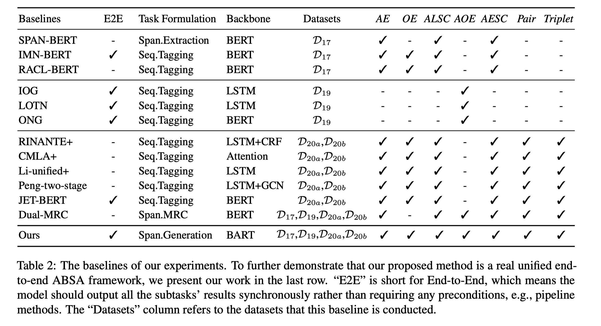

论文

- 19'ACL, Open-Domain Targeted Sentiment Analysis via Span-Based Extraction and Classification (Span-BERT)
    - 任务: 给定aspect, 1) 抽取opinion (一对多); 2) 情感分类.
    - 贡献: 1) 相较于序列标注方式, 首次提出了 span 格式的预测 (也即预测首尾); 模型采用 BERT, 分别进行span抽取和情感分类; 2) 尝试了三种策略 (Model Variants), 实验发现 pipeline形式比较好, 也即先抽取opinion然后进行情感分类.
    - code: <https://github.com/huminghao16/SpanABSA>
- 20'AAAI, Knowing What, How and Why: A Near Complete Solution for Aspect-based Sentiment Analysis (**ASTE-base**) (提出 ASTE 任务, 基准模型)
    - data: <https://github.com/xuuuluuu/SemEval-Triplet-data> 包括 SemEval 14 Laptop 和 14，15，16 Restaurant
    - 贡献: 1) 首次提出了 ASTE这个任务, 并给出了数据; 2) 两阶段模型: 首先用序列标注模型分别得到 1. aspect+polarity 和 2. opinion; 然后第二阶段两辆匹配算分数.
- 20'EMNLP, Position-Aware Tagging for Aspect Sentiment Triplet Extraction (**JET**)
    - 阿里
    - 贡献: 1) 提出了一种新的 position-aware tagging scheme, 可以感知到ABSA中三个成分之间的距离; 2) 提出了针对这种 tagging 的JET模型, 主要是对 CRF框架的修改.
    - 论证: 常用的序列标注的方法的标签设计（如 BIOES）只能标注本类实体，无法表达本实体和其他实体的关系; 这里引入的距离感知的标注方案能够表示 a/o 之间的对应关系. 但是文中提到的两种tagging策略仅能解决 一对多/多对一 的情况, 而无法解决多对多.
- 21'ACL, Learning Span-Level Interactions for Aspect Sentiment Triplet Extraction (**Span-ASTE**)
    - code: <https://github.com/chiayewken/Span-ASTE>
    - 贡献: 1) 基于词汇级别进行两个成分的抽取: 首先按照一定长度划分出一些span(词), 然后进行筛选分别找到 a/o, 最后两两组合筛选二元组, 并预测 polarity.
    - 论证: 此前的一些模型无法识别 span 之前的联系 (在 a/o是包含多个token 也即为span 的时候), 这里用 span 级别的联系来计算两者的交互, 从而「确保了情感极性的一致性」.
- 21'AAAI, A Joint Training Dual-MRC Framework for Aspect Based Sentiment Analysis (**Dual-MRC**)
    - 阿里
    - code: <https://github.com/xuuuluuu/Position-Aware-Tagging-for-ASTE>
    - BERT+MRC. 两次 MRC 分别进行抽取 a和o, 因此是分步的.
- 21'ACL, A Unified Generative Framework for Aspect-Based Sentiment Analysis (**BART-ABSA**)
    - 邱锡鹏
    - code: <https://github.com/yhcc/BARTABSA>
    - 贡献: 1) 汇总了ABSA的不同形式, 主要针对 (aspect, opinion, polarity) 三元组抽取; 2) 将两类任务都转化为生成任务, 利用BART来生成 a/o 的位置 (vocabulary 包括 token的index 和 情感极性)
    - 论证: 将两类任务定义在统一的 vocab 中, 然后用生成模型来完成比较有新意; 因为生成结果的多样性可以解决 ABSA的不同子任务 (包括给定aspect预测opinion等).

还没看的

- 21'Findings, A Multi-task Learning Framework for Opinion Triplet Extraction (OTE-MTL)

### (JET) 20'EMNLP, Position-Aware Tagging for Aspect Sentiment Triplet Extraction

论证: 常用的序列标注的方法的标签设计（如 BIOES）只能标注本类实体，无法表达本实体和其他实体的关系; 这里引入的距离感知的标注方案能够表示 a/o 之间的对应关系. 但是文中提到的两种tagging策略仅能解决 一对多/多对一 的情况, 而无法解决多对多.

「我们的模型是第一个采用端对端的方式直接避免了原有模型的采用分阶段导致提取出不完整特征的弊端，其次我们的模型主要根据三元之间的关系来计算每个词的标签，最后根据条件随机场的方式获得最佳的标签顺序。」

[贡献]

- 提出了一种新的 position-aware tagging scheme, 可以感知到ABSA中三个成分之间的距离
- 基于这个 tagging 策略, 提出 JET 模型 (Jointly Extract the Triplets)

[模型]

首先是提出的标注方案:

直接看下面的图, 也即用 BES来标记 opinion, 用两个下标表示对应的 aspect, 上标表示情感.

这里基于opinion进行标注, 可以解决 a/o 一对多的情况; 而对于 a/o 多对一的情况, 可以针对 aspect 进行标注 (但无法解决多对多?).

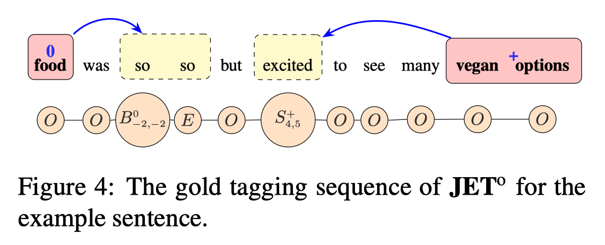

并证明了这样的编码方案有性质: There is a one-to-one correspondence between a tag sequence and a combination of aspect sentiment triplets within the sentence as long as the targets do not overlap with one another, and each has one corresponding opinion span. 也即在 1) opinion 没有overlap; 2) 每个aspect 只对应一个opinion时, 这种tagging策略和三元组的表示方式是等价的.

JET模型

对于一个序列 $\mathbf{x}$, 和可能的标注结果 $\mathbf{y}$, 定义y的概率分布

$$
p(\mathbf{y} \mid \mathbf{x})=\frac{\exp (s(\mathbf{x}, \mathbf{y}))}{\sum_{\mathbf{y}^{\prime} \in \mathbf{Y}_{\mathbf{x}, M}} \exp \left(s\left(\mathbf{x}, \mathbf{y}^{\prime}\right)\right)}
$$

其中 $\mathbf{Y}_{\mathbf{x}, M}$ 为所有可能的标注, M为下标的长度限制. 重点是打分函数

$$
s(\mathbf{x}, \mathbf{y})=\sum_{i=0}^{n} \psi_{\overline{\mathbf{y}}_{i}, \overline{\mathbf{y}}_{i+1}}+\sum_{i=1}^{n} \Phi_{\mathbf{y}_{i}}(\mathbf{x}, i)
$$

where $\overline{\mathbf{y}}_{i} \in\{B, I, O, E, S\}$ returns the sub-tag. 也即分成 1) BIOES序列的转移概率 (CRF即可); 2) 每一个单独的y的 factorized feature score.

每个位置的打分分解成四部分:

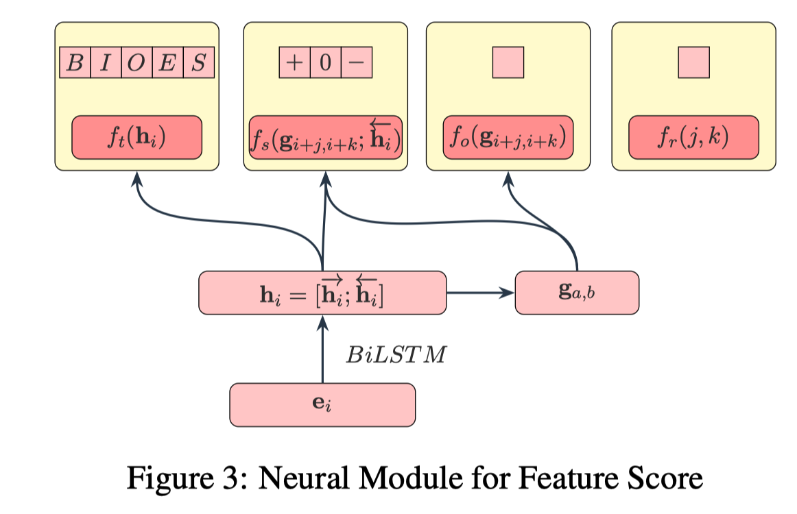

- $\Phi_{\mathbf{y}_{i}}(\mathbf{x}, i)=f_{t}\left(\mathbf{h}_{i}\right)_{\overline{\mathbf{y}}_{i}}$ 第一部分就是计算 BIOES 的概率分布; 对于 B和S有额外的上下表, 需要增加三部分
- $f_{s}\left(\left[\mathbf{g}_{i+j, i+k} ; \overleftarrow{\mathbf{h}_{i}}\right]\right)_{\epsilon}+f_{o}\left(\mathbf{g}_{i+j, i+k}\right)+f_{r}(j, k)$
    - 注意 jk 是相对距离.
    - fs 的输出为情感极性, 利用了 1) 当前词的隐状态和 2) jk所定义的一个span的表示; 也即计算了 opinion 的第一个token和aspect span 之间的相关性;
    - fo 对于 aspect span 进行打分;
    - fr 单独对于a/o 之间的距离进行打分.

### (Span-ASTE) 21'ACL, Learning Span-Level Interactions for Aspect Sentiment Triplet Extraction

[模型]

模型包括下面三个模块:

- sentence encoding, mention module, and triplet module.
    - 将序列转为 tokens 输入, 然后得到 span的表示;
    - 然后通过剪枝策略分别得到 a/o;
    - 两两组合 (一定的距离限制), 并判断情感;

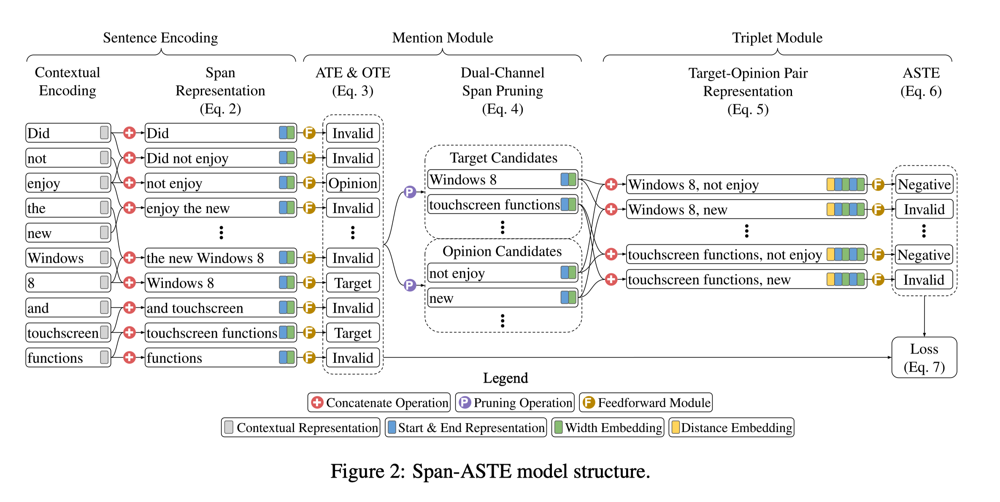

两种token表示方法: 1) GloVe+BiLSTM; 2) BERT

在第二个模块中, 对于每一个span进行三分类: `{Target, Opinion, Invalid }` (FFN). 这里强调的「双通道剪枝」其实就是针对 a/o 设置不同的阈值, 得到两个候选池.

第三个模块就更简单了, 拼接 a/o的向量表示基于一个表示两个 span的距离表示, 过FFN.

[实验]

baseline 分类

- Pipeline形式.
    - Peng et al. (2019) (ASTE-base) 第一步用两个序列标注分别得到 a/o; 第二阶段融合了 dependency relation information, 判断 a/o 之间的相关性
- End-to-end
    - JET (Xu et al., 2020b) 序列标注, 提出了一种新的标注方案

然后比较了单个词和多个词 (只要a/o其一是多个词的就算) 下的表现. 下面 图1 是这些数据集中单词span和多词span 出现的数量统计, 可以看到还是单个词的标注比较多.

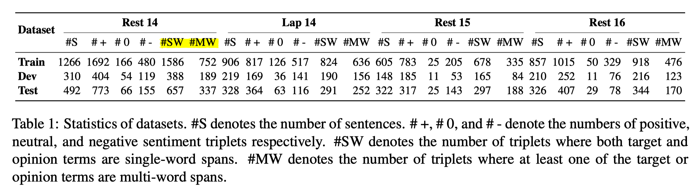

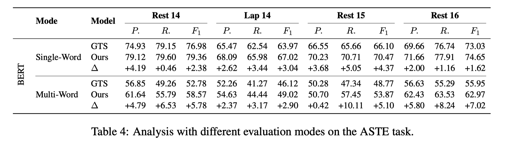

然后比较「双通道剪枝」是否有效. 比较对象是「单通道」, 也即在第二阶段不区分 a/o. 下图中, 发现当阈值设置得比较高的时候, 两者表现差不多.

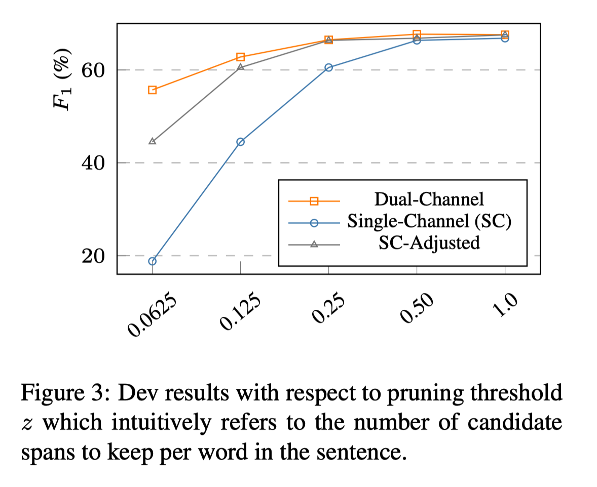

### (BART-ABSA) 21'ACL, A Unified Generative Framework for Aspect-Based Sentiment Analysis

[贡献]

- We formulate both the extraction task and classification task of ABSA into a unified index generation problem. Unlike previous unified models, our method needs not to design specific decoders for different output types. 将抽取和分类任务汇总成同一个生成任务
- With our re-formulation, all ABSA subtasks can be solved in sequence-to-sequence framework, which is easy-to-implement and can be built on the pre-trained models, such as BART.
- We conduct extensive experiments on four public datasets, and each dataset contains a subset of all ABSA subtasks. To the best of our knowledge, it is the first work to evaluate a model on all ABSA tasks.

[相关工作]

BART is a denoising autoencoder composed of several transformer (Vaswani et al., 2017) encoder and decoder layers.

去噪自编码器, 输入: 扰动的句子 (such as masking and permutation)

主要的贡献其实在于, 1) 总结了ASBA的各项任务形式; 2) 将 ASTE 任务形式化定义为了一个生成任务; 3) 然后用 BART来学习, 具体的模型就很简单.

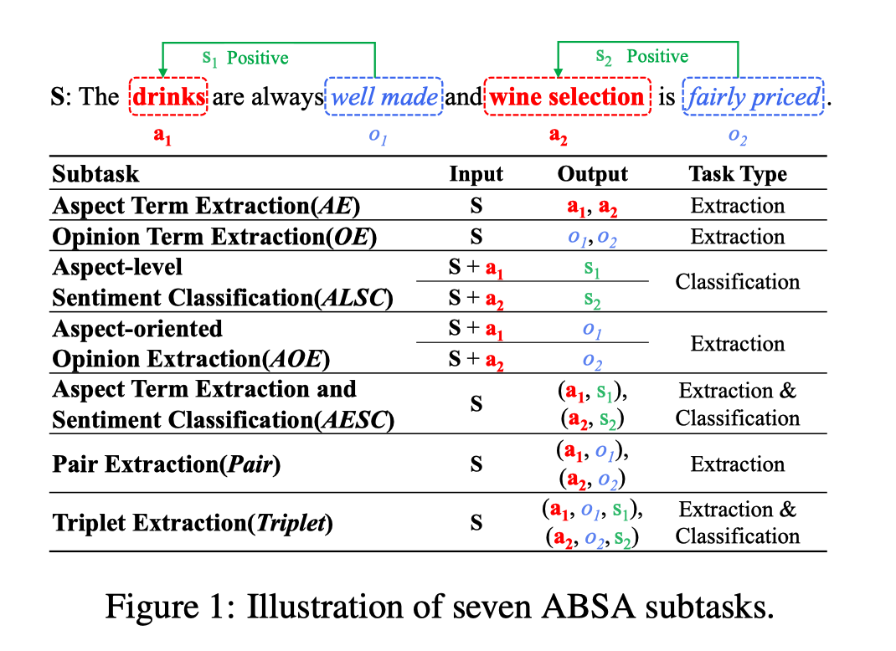

[模型]

模型主要就是要设计编码策略. 见下图.

- 生成模型的vocabulary包括三部分: 1) sos, eos; 2) 不同的情感极性; 3) 用token的index标识的 aspect和opinion 的首尾位置.
- 例如, 对于 ASTE 任务而言, 一个三元组就可以用 (aspect_start, aspect_end, opinion_start, opinion_end, polarity) 这样的形式表达.
- 对于生成模型结果decode策略任意, 论文中采用的策略是: 每遇到一个情感极性index范围内的输出字符, 就检查积累到现在的是否满足一个五元组, 并且span首尾是合法的, 就将该五元组作为结果.

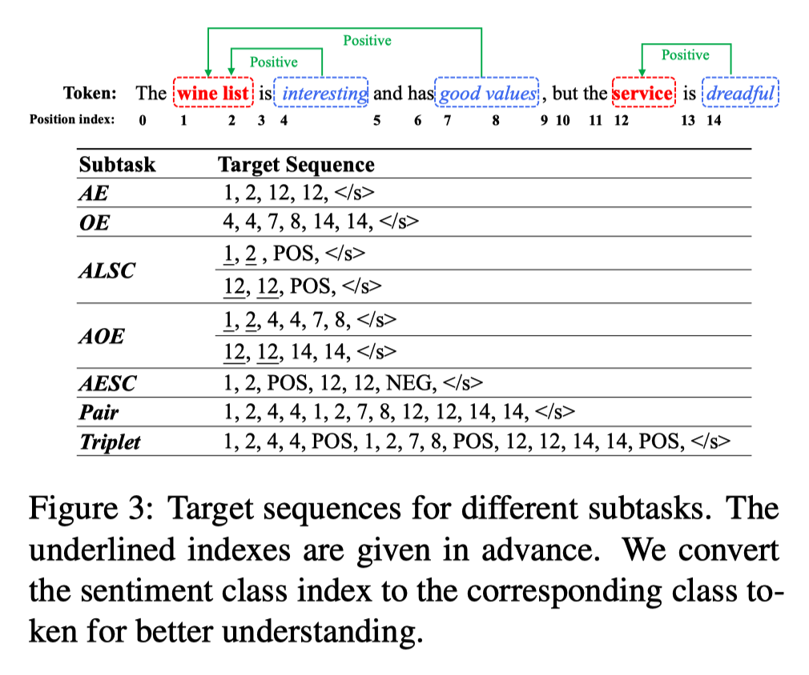

大体的模型见下, 主要看一下右上角的输出vocabulary定义.

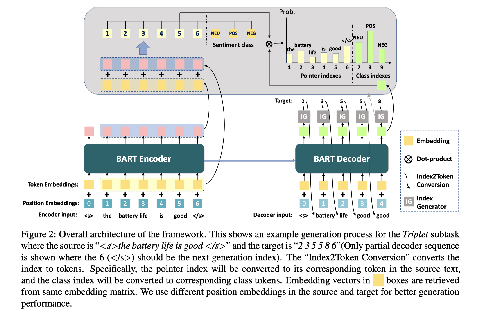

[数据]

- 都来源于 Semeval Challenges
- Wang et al. (2017): the unpaire opinion terms are labeled, 也即可能仅有opinion 但没有对应的aspect
- Fan et al. (2019), where they pair opinion terms with corresponding aspects.
- Peng et al. (2020). They refine the data in `<a, o, s>` triplet form.
- Peng et al. (2020), where the missing triplets with overlapping opinions are corrected.

[实验]

由于生成的结果可以比较多样, 所以对于不同的任务设置进行了实验; 这里最关心的是 a/o 的二元组抽取.

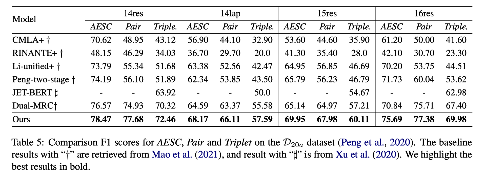

另外, 生成的序列有可能是非法的, 因此对于生成结果的质量进行分析. 下图中 1) invalid size 表示每一组的长度不为5; 2) invalid order 表示一个 span 的首尾不合法; 3) invalid token, 一个词经过 BART分词之后有多个token, 需要预测的所有 index 都是每一组token中的第一个.

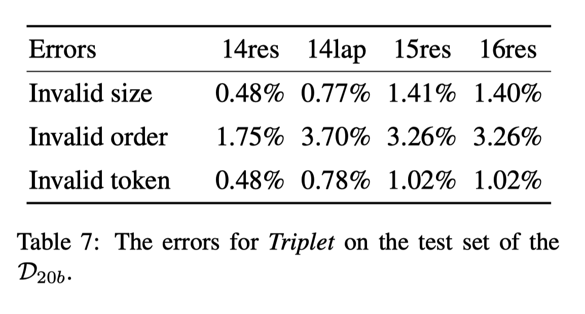
