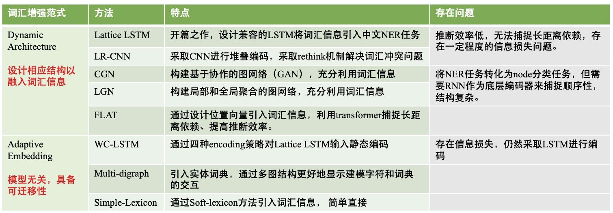
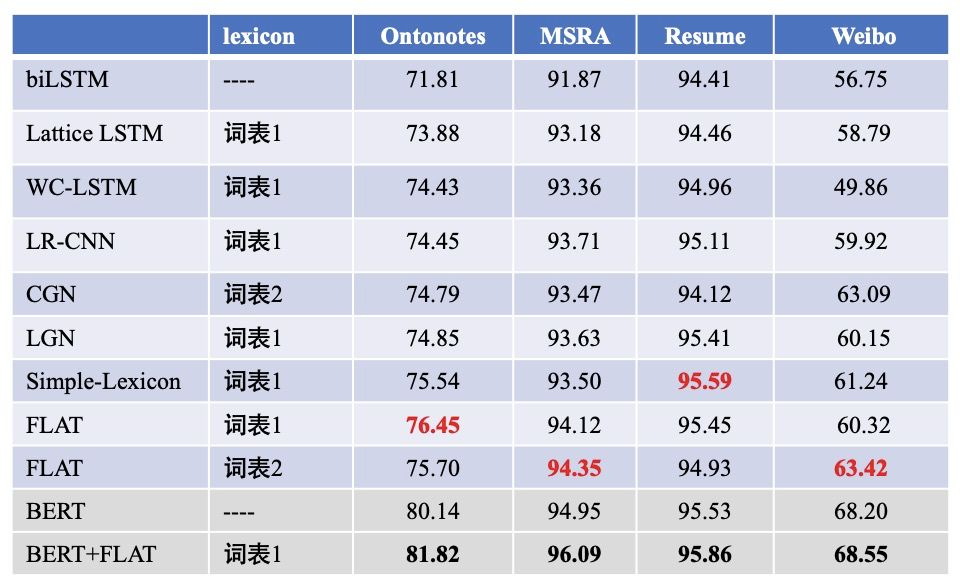
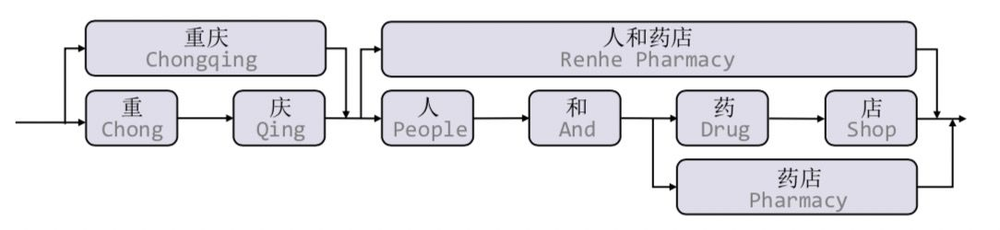
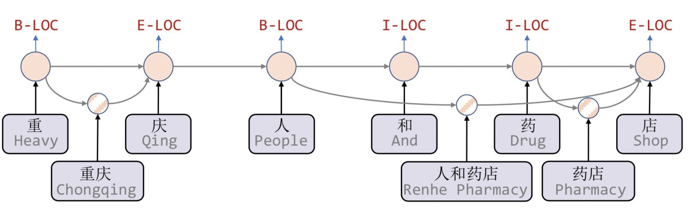
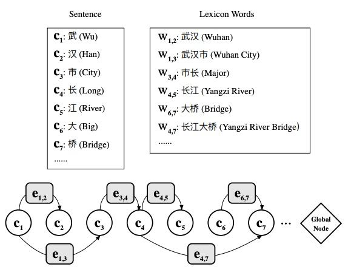
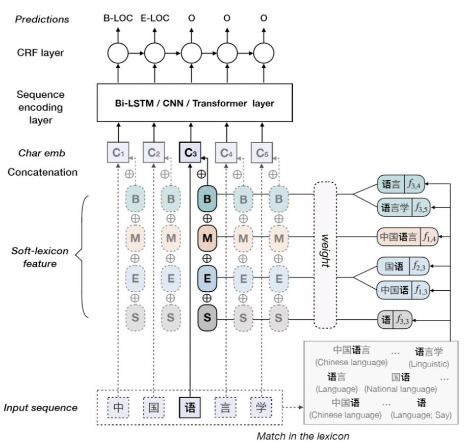
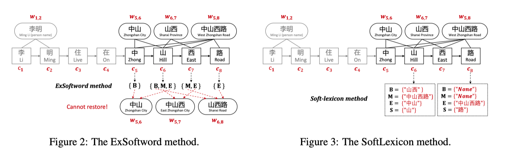
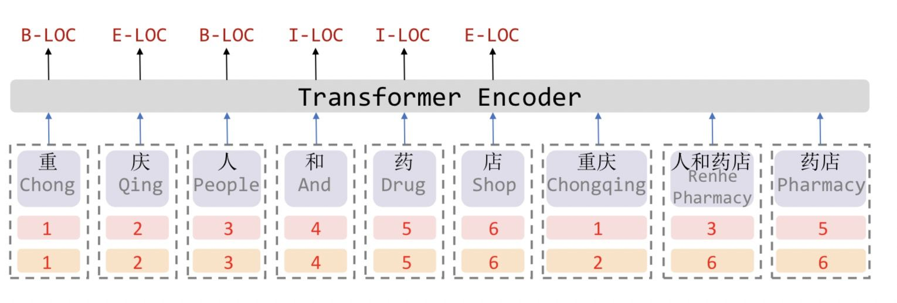
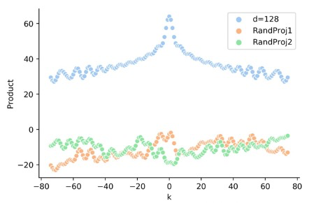

TODO:

- JayJay | [中文NER的正确打开方式: 词汇增强方法总结 (从Lattice LSTM到FLAT)](https://zhuanlan.zhihu.com/p/142615620) @2009
    - 本文对「词汇增强」的系列方法进行介绍，包括Lattice LSTM/LR-CNN/CGN/LGN/WC-LSTM/Multi-digraph/Simple-Lexicon/FLAT 等8个方法进行串讲
- JayJay | [如何解决Transformer在NER任务中效果不佳的问题？](https://zhuanlan.zhihu.com/p/137315695)
    - vanilla transformer 和 BERT 的区别?
    - 具体看看 距离计算方式; Attention的平滑缩放?
- 苏剑林 | [让研究人员绞尽脑汁的Transformer位置编码](https://kexue.fm/archives/8130) @2102

概要

- 两条主线:
    - Dynamic Architecture：设计一个动态框架，能够兼容词汇输入；
        - Dynamic Architecture范式通常需要设计相应结构以融入词汇信息。
        - 20‘ACL, FLAT: Chinese NER Using Flat-Lattice Transformer 邱锡鹏
    - Adaptive Embedding ：基于词汇信息，构建自适应Embedding；
        - Adaptive Embedding范式仅在embedding层对于词汇信息进行自适应，后面通常接入LSTM+CRF和其他通用网络，这种范式与模型无关，具备可迁移性。

通过第二部分对于「词汇增强」方法主要论文的介绍，我们可以发现无论是Dynamic Architecture还是Adaptive Embedding，都是想如何更好的融入词汇信息。这些方法的出发点无外于两点：1）如何更充分的利用词汇信息、最大程度避免词汇信息损失；2）如何设计更为兼容词汇的Architecture，加快推断速度。

CL2020中的两篇论文FLAT和Simple-Lexicon分别对应于Dynamic Architecture和Adaptive Embedding，这两种方法相比于其他方法：1）能够充分利用词汇信息，避免信息损失；2）FLAT不去设计或改变原生编码结构，设计巧妙的位置向量就融合了词汇信息；Simple-Lexicon对于词汇信息的引入更加简单有效，采取静态加权的方法可以提前离线计算。

可以看到

- 引入词汇信息的方法，都相较于baseline模型biLSTM+CRF有较大提升，可见引入词汇信息可以有效提升中文NER性能。
- 采用相同词表对比时，FLAT和Simple-Lexicon好于其他方法。
- 结合BERT效果会更佳。

下面具体读了四篇论文

- 18‘ACL, Chinese NER Using Lattice LSTM
    - Lattice-LSTM
    - 开篇之作, 设计兼容的LSTM将词汇信息引入中文NER任务中
    - 问题: 推断效率低; 捕捉长距离依赖; 存在一定程度的信息损失
- 19'EMNLP, A Lexicon-Based Graph Neural Network for Chinese NER
    - LGN
    - 构建局部和全局聚合的图网络, 充分利用词汇信息
    - 问题: 将NER任务转化为节点分类问题, 但需要RNN作为底层编码器来捕捉顺序性, 结构复杂
- 20‘ACL, FLAT- Chinese NER Using Flat-Lattice Transformer
    - FLAT
    - 通过设计位置向量引入词汇信息, 利用 transformer 捕捉长距离依赖、提高推断效率
- 20'ACL, Simplify the Usage of Lexicon in Chinese NER
    - Simple Lexicon
    - 通过 Soft-Lexicon方法引入词汇信息, 简单直接

另外的几篇工作

- 19'IJCAI, LR-CNN:CNN-Based Chinese NER with Lexicon Rethinking
    - Lexicon-Based CNNs: 堆叠多层CNN学习不同层级的信息
    - Refining Networks with Lexicon Rethinking: 对于词汇信息冲突的问题, 采取rethinking机制增加feedback layer来调整词汇信息的权值
- 19'EMNLP, CGN: Leverage Lexical Knowledge for Chinese Named Entity Recognition via Collaborative Graph Network
    - 构建了基于协作的图网络，由编码层、图网络层、融合层、解码层组成。在图网络层，构建了三种不同的建图方式
        - Word-Character Containing graph (C-graph)：字与字之间无连接，词与其inside的字之间有连接。
        - Word-Character Transition graph(T-graph)：相邻字符相连接，词与其前后字符连接。
        - Word-Character Lattice graph(L-graph)：相邻字符相连接，词与其开始结束字符相连。
    - 在这些图上过 GNN, 然后和基于字符的上下文表征加权融合
- NAACL'19, WC-LSTM: An Encoding Strategy Based Word-Character LSTM for Chinese NER Lattice LSTM
    - Lattice LSTM中每个字符只能获取以它为结尾的词汇数量是动态的、不固定的，这也是导致Lattice LSTM不能batch并行化的原因
    - WC-LSTM为改进这一问题，采取Words Encoding Strategy，将每个字符为结尾的词汇信息进行固定编码表示，即每一个字符引入的词汇表征是静态的、固定的，如果没有对应的词汇则用`<PAD>` 代替，从而可以进行batch并行化
    - WC-LSTM仍然存在信息损失问题，无法获得‘inside’的词汇信息，不能充分利用词汇信息。虽然是Adaptive Embedding范式，但WC-LSTM仍然采取LSTM进行编码，建模能力有限、存在效率问题。
- 19'ACL, Multi-digraph: A Neural Multi-digraph Model for Chinese NER with Gazetteers
    - 不同于其他论文引入词汇信息的方式是基于一个词表（由论文Lattice LSTM 提供，没有实体标签，通常需要提取对应的word embedding），本篇论文引入词汇信息的方式是利用实体词典（Gazetteers，含实体类型标签）。

## Models

### Lattice LSTM

- 18‘ACL, Chinese NER Using Lattice LSTM
- code <https://github.com/jiesutd/LatticeLSTM> @1904 Torch0.3 实现了一系列的 Baseline

具体而言

- 提出了 Lattice 结构: 对于匹配到字典中单词的一个段落, 连接头尾字, 从而构成了一个 DAG.
- **Lattice LSTM 将原本的 bi-LSTM 结构拓展到了这个 DAG 上**, 从而在字级别的基础上引入了词汇信息.
- 简单来说, 这里将原本字的 LSTM 结构 $\boldsymbol{h}_{i}, \boldsymbol{c}_{i}=f\left(\boldsymbol{h}_{j-1}, \boldsymbol{c}_{j-1}, \boldsymbol{x}_{j}^{c}\right)$ 替换成了
    - $\boldsymbol{h}_{j}, \boldsymbol{c}_{j}=f\left(\boldsymbol{h}_{j-1}, \boldsymbol{c}_{j-1}, \boldsymbol{x}_{j}^{c}, s_{<*, j>}, \boldsymbol{h}_{<*, j>}, \boldsymbol{c}_{<*, j>}\right)$
    - 这里的 $\boldsymbol{x}_{j}^{c}, s_{<*, j>}, \boldsymbol{h}_{<*, j>}, \boldsymbol{c}_{<*, j>}$ 分别是以第 j 个字结尾的匹配到的词的 序列、hidden state list、memory cell list.

两点好处:

- 保留了所有可能的词汇, 从而避免了分词的误差传播问题;
- 引入了 pre-trained word embeddings

缺点:

- 计算性能低下，不能batch并行化。究其原因主要是每个字符之间的增加word cell（看作节点）数目不一致；
- 信息损失：1）每个字符只能获取以它为结尾的词汇信息，对于其之前的词汇信息也没有持续记忆。如对于「药」，并无法获得‘inside’的「人和药店」信息。2）由于RNN特性，采取BiLSTM时其前向和后向的词汇信息不能共享。
- 可迁移性差：只适配于LSTM，不具备向其他网络迁移的特性。

#### 具体的 LSTM 形式

经典的针对序列的 LSTM 结构为
$$
\begin{aligned}\left[\begin{array}{c}\mathbf{i}_{j}^{c} \\ \mathbf{o}_{j}^{c} \\ \mathbf{f}_{j}^{c} \\ \widetilde{\boldsymbol{c}}_{j}^{c}\end{array}\right] &=\left[\begin{array}{c}\sigma \\ \sigma \\ \sigma \\ \tanh \end{array}\right]\left(\mathbf{W}^{c \top}\left[\begin{array}{c}\mathbf{x}_{j}^{c} \\ \mathbf{h}_{j-1}^{c}\end{array}\right]+\mathbf{b}^{c}\right) \\ \mathbf{c}_{j}^{c} &=\mathbf{f}_{j}^{c} \odot \mathbf{c}_{j-1}^{c}+\mathbf{i}_{j}^{c} \odot \widetilde{\boldsymbol{c}}_{j}^{c} \\ \mathbf{h}_{j}^{c} &=\mathbf{o}_{j}^{c} \odot \tanh \left(\mathbf{c}_{j}^{c}\right) \end{aligned}
$$

而在这里, 还需要引入 word 级别的表示 (注意到这里并不需要输出, 因此没有引入输出门 o 和隐状态 h)

$$
\begin{aligned}\left[\begin{array}{l}\mathbf{i}_{b, e}^{w} \\ \mathbf{f}_{b, e}^{w} \\ \widetilde{c}_{b, e}^{w}\end{array}\right] &=\left[\begin{array}{c}\sigma \\ \sigma \\ \tanh \end{array}\right]\left(\mathbf{W}^{w \top}\left[\begin{array}{c}\mathbf{x}_{b, e}^{w} \\ \mathbf{h}_{b}^{c}\end{array}\right]+\mathbf{b}^{w}\right) \\ \mathbf{c}_{b, e}^{w} &=\mathbf{f}_{b, e}^{w} \odot \mathbf{c}_{b}^{c}+\mathbf{i}_{b, e}^{w} \odot \widetilde{\boldsymbol{c}}_{b, e}^{w} \end{aligned}
$$

在 Lattice-LSTM 中, 需要综合字序列和词汇的信息, 因此, 对于第 j 个字而言, 其输入向量包括了 cell 信息 和所有以 j 结尾的词. 用输入门计算权重 $\mathbf{i}_{b, e}^{c}=\sigma\left(\mathbf{W}^{l \top}\left[\begin{array}{c}\mathbf{x}_{e}^{c} \\ \mathbf{c}_{b, e}^{w}\end{array}\right]+\mathbf{b}^{l}\right)$, 然后和字序列的输入门 $\mathbf{i}_j^c$ 进行归一化 (向量级别的), 综合在一起:

$$\mathbf{c}_{j}^{c}=\sum_{b \in\left\{b^{\prime} \mid w_{b^{\prime}, j}^{d} \in \mathbb{D}\right\}} \boldsymbol{\alpha}_{b, j}^{c} \odot \boldsymbol{c}_{b, j}^{w}+\boldsymbol{\alpha}_{j}^{c} \odot \widetilde{\boldsymbol{c}}_{j}^{c}$$

在 Decoding 部分, 直接利用标准的 CRF 解码; 利用 log-likelihood loss 作为损失进行训练.

#### 比较了此前的处理方案

此前的方法比较

- Character-Based Model
    - Char 级别的, 可以有变种
    - Char + bichar: (Chen et al., 2015; Yang et al., 2017a). 证明了在 word segmentation 领域Character bigrams 的有用性
    - Char + softword: 加入了 segmentation label 信息 (BMES标注方式; 也是用 bi-LSTM) 生成 emb
- Word-Based Model
    - 单词级别的, 一般要加上 char 信息 (效果更好)
    - Word + char LSTM
    - Word + char LSTM ′
    - Word + char CNN: CNN过一个单词中包括的char, 然后max池化
- Lattice Model

无论是上面的哪种方法, 最后都可以得到char级别的隐状态序列, Decoder 部分采用 CRF 即可.

### LGN

- 19'EMNLP, A Lexicon-Based Graph Neural Network for Chinese NER
- code <https://github.com/RowitZou/LGN/> @1912 Torch 手动实现了 GNN 框架

主要思路: 针对 Lattice LSTM 中顺序结构无法利用所有词汇信息的问题, 这里直接利用了 lexicon 信息构建图. 通过 GNN (Multi-Head Attention) 来融合 1. 局部的 bi-gram 信息和 2. 全局节点信息, 同样那最后的字表示通过 CRF 得到结果.

具体而言

- Lattice LSTM 这种 RNN结构的问题: 仅仅依靠前一步的信息输入，而不是利用全局信息, 例如「印度河流经印度」一句中, 字符 [流] 可以匹配到词汇 [河流] 和 [流经] 两个词汇信息，但Lattice LSTM却只能利用 [河流], 从而造成标注冲突问题.
- 这里通过采取 lexicon-based graph neural network (LGN)来解决上述问题。如上图所示，将每一个字符作为节点，匹配到的词汇信息构成边。通过图结构实现局部信息的聚合，并增加全局节点进行全局信息融入。聚合方式采取 Multi-Head Attention，具体计算公式可参考原论文。
- 图的构建: 1. 所有的character作为节点; 2. 单词的首尾用边相连; 3. 另外有一个全局节点连接所有的节点和边(词)
    - 注意, 这里虽然是有向图, 但用了**正反两个图**, 最后将两张图的表示拼接起来作为最后输出.

#### 图模型更新方式

总体上用 MultiAtt 来聚合邻居节点, 然后采用门机制更新表示.

具体而言:

- 在聚合阶段, 1. Char 节点用其所有的入度词汇; 2. Lexicon 用其包含的所有 char; 3. 其实也就是分别用了 char 和 lexicon 来做多头注意力
    - 字节点的更新 $e \rightarrow c: \hat{\mathbf{c}}_{i}^{t}=\operatorname{MultiAtt}\left(\mathbf{c}_{i}^{t},\left\{\forall_{k}\left[\mathbf{c}_{k}^{t} ; \mathbf{e}_{k, i}^{t}\right]\right\}\right)$
    - 词汇边的更新 $c \rightarrow e: \quad \hat{\mathbf{e}}_{b, e}^{t}=\operatorname{MultiAtt}\left(\mathbf{e}_{b, e}^{t}, \mathbf{C}_{b, e}^{t}\right)$, 注意这里的 $\mathbf{C}_{b, e}^{t}$ 包括了这个词中所有的字符
- 在更新阶段. 1. Char 节点有序列信息, 因此采用类似 LSTM 的机制融合 上一个字、当前字、全局 信息; 2. 而对于词节点和全局节点, 由于没有序列信息, 直接利用 遗忘、输入 这个门即可.
    - 最复杂的是这里字节点的更新:
    - $\boldsymbol{\xi}_{i}^{t}=\left[\mathbf{c}_{i-1}^{t-1} ; \mathbf{c}_{i}^{t-1}\right], \quad \boldsymbol{\chi}_{i}^{t}=\left[\hat{\mathbf{c}}_{i}^{t-1} ; \hat{\mathbf{g}}^{t-1}\right]$
$\hat{\boldsymbol{a}}_{i}^{t}=\sigma\left(\mathbf{W}_{i}^{a} \boldsymbol{\xi}_{i}^{t}+\mathbf{V}_{i}^{a} \boldsymbol{\chi}_{i}^{t}+\mathbf{b}_{i}^{a}\right), \quad \boldsymbol{a}=\{\boldsymbol{i}, \boldsymbol{f}, \boldsymbol{l}\}$
$\boldsymbol{u}_{i}^{t}=\tanh \left(\mathbf{W}_{c u} \boldsymbol{\xi}_{i}^{t}+\mathbf{V}_{c u} \boldsymbol{\chi}_{i}^{t}+\mathbf{b}_{c u}\right)$
$\boldsymbol{i}_{i}^{t}, \boldsymbol{f}_{i}^{t}, \boldsymbol{l}_{i}^{t}=\operatorname{softmax}\left(\hat{\boldsymbol{i}}_{i}^{t}, \hat{\boldsymbol{f}}_{i}^{t}, \hat{\boldsymbol{l}}_{i}^{t}\right)$
$\mathbf{c}_{i}^{t}=\boldsymbol{l}_{i}^{t} \odot \mathbf{c}_{i-1}^{t-1}+\boldsymbol{f}_{i}^{t} \odot \mathbf{c}_{i}^{t-1}+\boldsymbol{i}_{i}^{t} \odot \boldsymbol{u}_{i}^{t}$,
    - 这里的 $\boldsymbol{\xi}_{i}^{t}$ 拼接了上一个状态的字序列信息 (长度为2的 a context window), $\boldsymbol{\chi}_{i}^{t}$ 拼接了上一步聚合了词汇边的向量和全局向量, 因此可以分别看成**局部和全局信息**.
    - $\boldsymbol{u}_{i}^{t}$ 类似 LSTM 中的更新向量, 利用了归一化的三个门来融合前后两个字+全局输入信息; 没有采用 LSTM 中的输出门. [因为这里是图结构, GNN 是迭代的过程, 而 LSTM 本质上还是 RNN, 可以比较两者的更新公式]
    - 而对于词表示的更新就更清晰: $\boldsymbol{\chi}_{b, e}^{t}, \mathbf{e}_{b, e}^{t-1}$ 分别是全局信息和上一时刻的局部信息, 用两个门融合起来
    - $\boldsymbol{\chi}_{b, e}^{t}=\left[\hat{\mathbf{e}}_{b, e}^{t-1} ; \hat{\mathbf{g}}^{t-1}\right], \quad \boldsymbol{a}=\{\boldsymbol{i}, \boldsymbol{f}\}$
$\hat{\boldsymbol{a}}_{b, e}^{t}=\sigma\left(\mathbf{W}_{i}^{a} \mathbf{e}_{b, e}^{t-1}+\mathbf{V}_{i}^{a} \boldsymbol{\chi}_{b, e}^{t}+\mathbf{b}_{i}^{a}\right)$
$\boldsymbol{u}_{b, e}^{t}=\tanh \left(\mathbf{W}_{e u} \mathbf{e}_{b, e}^{t-1}+\mathbf{V}_{e u} \boldsymbol{\chi}_{b, e}^{t}+\mathbf{b}_{e u}\right)$
$\boldsymbol{i}_{b, e}^{t}, \boldsymbol{f}_{b, e}^{t}=\operatorname{softmax}\left(\hat{\boldsymbol{i}}_{b, e}^{t}, \hat{\boldsymbol{f}}_{b, e}^{t}\right)$
$\mathbf{e}_{b, e}^{t}=\boldsymbol{f}_{b, e}^{t} \odot \mathbf{e}_{b, e}^{t-1}+\boldsymbol{i}_{b, e}^{t} \odot \boldsymbol{u}_{b, e}^{t}$,

### Simple Lexicon

- 20'ACL, Simplify the Usage of Lexicon in Chinese NER
- code <https://github.com/v-mipeng/LexiconAugmentedNER>

主体的思路就是要将词汇信息引入到字的表达中. 对于 LatticeLSTM 速度慢和结构单一无法迁移的问题, 采用了更为直接的将词汇 embedding 融合后直接拼接到字表示后面的方式来进行增强.

- 针对 LatticeLSTM 的问题, 1. LSTM 训练和推理慢; 2. 结构单一, 无法迁移到 CNN或者Transformer 等网络结构中.
- 贡献: 1. 一种 simple but effective 的方式来 incorporating word lexicons into the character representations; 2. 该模型可以迁移到 different sequence-labeling architectures 以及 BERT 等预训练模型上

具体而言, 提出了三种融合词汇的方式

- Softword
    - Softword通过中文分词模型后，对每一个字符进行 BMESO 的embedding嵌入。
    - 问题: 这种Softword方式存在由分词造成的误差传播问题，同时也无法引入词汇对应word embedding。
- ExtendSoftword
    - ExtendSoftword则将所有可能匹配到的词汇结果对字符进行编码表示。
    - 例如, 在「小明住在中山西路」一句中, 字符「山」匹配到的词汇有中山、中山西、山西路，「山」隶属 {B,M,E}。论文对于字符对应的词汇信息按照BMESO编码构建5维二元向量，如「山」表示为[1,1,1,0,0].
    - 问题: 1）仍然无法引入词汇对应的word embedding；2）也会造成信息损失，无法恢复词汇匹配结果，例如，假设有两个词汇列表[中山，山西，中山西路]和[中山，中山西，山西路]，按照ExtendSoftword方式，两个词汇列表对应字符匹配结果是一致的；换句话说，当前ExtendSoftword匹配结果无法复原原始的词汇信息是怎样的，从而导致信息损失。
- Soft-lexicon
    - 为了解决Softword和ExtendSoftword存在的问题，Soft-lexicon对当前字符，依次获取BMES对应所有词汇集合，然后再进行编码表示.
    - 对于每一个词汇集合 S, 利用文本中词汇的出现频次计算综合表示
        - $\boldsymbol{v}^{s}(S)=\frac{4}{Z} \sum_{w \in S} z(w) \boldsymbol{e}^{w}(w)$
        - 其中归一化权重用了四组词汇的全部 $Z=\sum_{w \in B \cup M \cup E \cup S} z(w)$.
    - 例如, 在模型图中的「中国语言学」一句, 对于字符[语]，其标签B对应的词汇集合涵盖[语言，语言学]；标签M对应[中国语言]；标签E对应[国语、中国语]；标签S对应[语]。当前字符引入词汇信息后的特征表示为：
    - $\begin{aligned} \boldsymbol{e}^{s}(\mathrm{~B}, \mathrm{M}, \mathrm{E}, \mathrm{S}) &=\left[\boldsymbol{v}^{s}(\mathrm{~B}) ; \boldsymbol{v}^{s}(\mathrm{M}) ; \boldsymbol{v}^{\mathrm{s}}(\mathrm{E}) ; \boldsymbol{v}^{\mathrm{s}}(\mathrm{S})\right] \\ \boldsymbol{x}^{c} & \leftarrow\left[\boldsymbol{x}^{c} ; \boldsymbol{e}^{s}(\mathrm{~B}, \mathrm{M}, \mathrm{E}, \mathrm{S})\right] \end{aligned}$

综上可见，Soft-lexicon这种方法没有造成信息损失，同时又可以引入word embedding，此外，本方法的一个特点就是模型无关，可以适配于其他序列标注框架。

### FLAT

- 20‘ACL, FLAT- Chinese NER Using Flat-Lattice Transformer
- code <https://github.com/LeeSureman/Flat-Lattice-Transformer>

FLAT采取了全连接自注意力结构，可以直接字符与其所匹配词汇间的交互，同时捕捉长距离依赖。

[实验部分] 如果将字符与词汇间的attention进行masked，性能下降明显，可见引入词汇信息对于中文NER 的重要性。此外，相关实验表明，FLAT有效的原因是：新的相对位置encoding有利于定位实体span，而引入词汇的word embedding有利于实体type的分类。

此前方案的两种思路:

- Lattice-LSTM和LR-CNN采取的RNN和CNN结构无法捕捉长距离依赖，而动态的Lattice结构也不能充分进行GPU并行。
- 而CGN和LGN采取的图网络虽然可以捕捉对于NER任务至关重要的顺序结构，但这两者之间的gap是不可忽略的。其次，这类图网络通常需要RNN作为底层编码器来捕捉顺序性，通常需要复杂的模型结构。

具体思路:

- Transformer采取全连接的自注意力机制可以很好捕捉 **长距离依赖**，由于自注意力机制对位置是无偏的，因此Transformer引入 **位置向量** 来保持位置信息。
- 这里设计了一种 position encoding来融合Lattice 结构, 对于每一个字符和词汇都构建两个head position encoding 和 tail position encoding (可以证明，这种方式可以重构原有的Lattice结构, 因此没有信息损失).
- 因此，我们可以将Lattice结构展平，将其从一个有向无环图展平为一个平面的Flat-Lattice Transformer结构，由多个span构成：每个字符的head和tail是相同的，每个词汇的head和tail是skipped的。

然后直接将这个 FLAT 得到 字表示 输入到 CRF 即可.

#### 相对位置编码

- 对于 NER 任务绝对位置编码不适用, 参见 [如何解决Transformer在NER任务中效果不佳的问题？](https://zhuanlan.zhihu.com/p/137315695)
- 因此采取XLNet论文中提出相对位置编码计算 attention score $\begin{aligned} \mathbf{A}_{i, j}^{*} &=\mathbf{W}_{q}^{\top} \mathbf{E}_{x_{i}}^{\top} \mathbf{E}_{x_{j}} \mathbf{W}_{k, E}+\mathbf{W}_{q}^{\top} \mathbf{E}_{x_{i}}^{\top} \mathbf{R}_{i j} \mathbf{W}_{k, R} \\ &+\mathbf{u}^{\top} \mathbf{E}_{x_{j}} \mathbf{W}_{k, E}+\mathbf{v}^{\top} \mathbf{R}_{i j} \mathbf{W}_{k, R}, \end{aligned}$
- 这里的相对位置编码计算公式为 $R_{i j}=\operatorname{ReLU}\left(W_{r}\left(\mathbf{p}_{d_{i j}^{(h h)}} \oplus \mathbf{p}_{d_{i j}^{(t h)}} \oplus \mathbf{p}_{d_{i j}^{(h t)}} \oplus \mathbf{p}_{d_{i j}^{(t t)}}\right)\right)$, 其中 $d_{i j}^{(h h)}$ 等分别是两个词之间头尾的距离, 位置编码采用经典的
- $\mathbf{p}_{d}^{(2 k)}=\sin \left(d / 10000^{2 k / d_{\text {model }}}\right)$; $\mathbf{p}_{d}^{(2 k+1)}=\cos \left(d / 10000^{2 k / d_{\text {model }}}\right)$

以下来自上面的链接, 另外参考 [让研究人员绞尽脑汁的Transformer位置编码](https://kexue.fm/archives/8130)

- Sinusoidal position embedding
    - 不具备方向性: $P E_{t}^{T} P E_{t+k}=P E_{t-k}^{T} P E_{t}$
    - 位置的直接相乘有距离感知 (随着距离 $|k|$ 的减少点积增大), 但是这一特性也被后面的self-attention机制破坏了, 注意到在 vanilla transformer 中 $P E_{t}^{T} W_{q}^{T} W_{k} P E_{t+k}$, 下图展示了 $P E_{t}^{T} W P E_{t+k}$ 与 $P E_{t}^{T} P E_{t+k}$ 的差异, 这里的 $W$ 随机初始化

