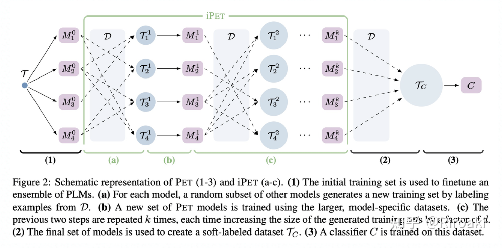
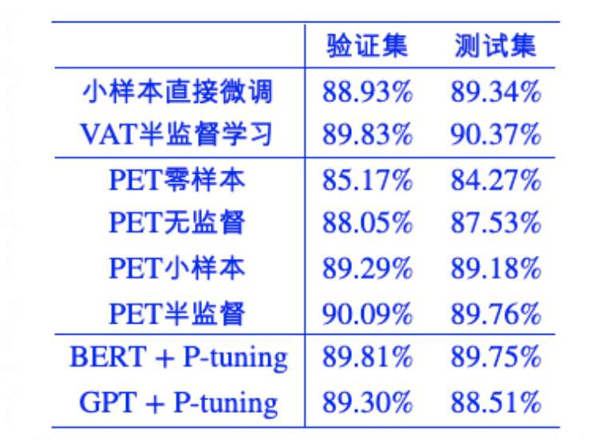
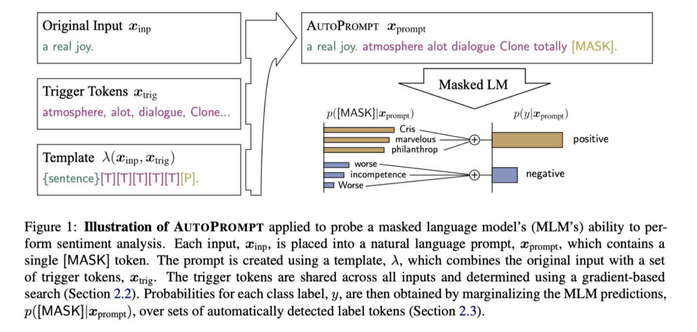

Prompt

TODO

- 20'ACL, Prefix-Tuning: Optimizing Continuous Prompts for Generation 修改了prompt做生成?

Links

- Thunlp | PromptPapers <https://github.com/thunlp/PromptPapers>
- Web survey | <http://pretrain.nlpedia.ai/>
    - CMU 刘鹏飞｜[NLP的第四范式](https://zhuanlan.zhihu.com/p/397004230) @2108
- Riroaki [Prompt-based Language Models：模版增强语言模型小结](https://zhuanlan.zhihu.com/p/366771566) @2106
- LM-BFF 作者高天宇的文章 [Prompting: 更好地将语言模型应用到NLP任务](https://zhuanlan.zhihu.com/p/386470305) 可以看成是 prompt, in-context learning, few-shot setting 方面的综述了!

涉及到的论文

- 21'EACL, Exploiting Cloze Questions for Few Shot Text Classification and Natural Language Inference (PET)
    - 介绍了一种基于模版和词遮盖将文本分类任务 **转换为完形填空（cloze）** 任务的半监督训练方法 (利用MLM模型做小样本学习和半监督学习); 仅使用 RoBERTa-base 模型就在多个半监督场景下取得了SOTA
- 21'NAACL, It’s Not Just Size That Matters- Small Language Models Are Also Few-Shot Learners (PET)
    - 通过将“小模型”（ALBERT）和 GPT-3 这一巨无霸在 SuperGLUE benchmark 上进行对比，进一步挖掘 PET 训练在 少样本场景 下的潜力
- 20'TACL, How Can We Know What Language Models Know? (LPAQA)
    - 提出了 1. 远程监督; 2. 回译 两种自动生成 prompt 的方法, 并利用一定的机制进行了筛选; 应用场景是在 LAMA 数据集上检测 LM 所学习的知识有多少
- 20'EMNLP, AUTOPROMPT: Eliciting Knowledge from Language Models with Automatically Generated Prompts (AutoPrompt)
    - 提出了一种基于梯度的模版搜索方案. 基本思路就是: 通过梯度进行粗筛, 然后代入模板基于效果精筛
- 21'ACL, Making Pre-trained Language Models Better Few-shot Learners (LM-BFF)
    - 陈丹琦组, 少样本下场景下, 基于谷歌的T5模型构建了一个自动化的pipeline 进行 prompt 搜索; 具体包括标签词的自动搜索、模版的搜索和样本实例的搜索
- 21', GPT Understands, Too (p-tuning)
    - 唐杰. 连续模板搜索. 同时使得GPT在 SuperGLUE 上的成绩首次超过了同等级别的BERT模型，这颠覆了一直以来“GPT不擅长NLU”的结论

Switch Transformers: Scaling to Trillion Parameter Models with Simple and Efficient Sparsity, 2021

## Papers

### Pattern-Exploiting Training (PET)

两篇论文

- 21'EACL2021, Exploiting Cloze Questions for Few Shot Text Classification and Natural Language Inference
    - 其中介绍了一种基于模版和词遮盖将文本分类任务转换为完形填空（cloze）任务的半监督训练方法，仅使用 RoBERTa-base 模型就在多个半监督场景下取得了SOTA。
- 21'NAACL, It’s Not Just Size That Matters: Small Language Models Are Also Few-Shot Learners
    - 通过将“小模型”（ALBERT）和 GPT-3 这一巨无霸在 SuperGLUE benchmark 上进行对比，进一步挖掘 PET 训练在 少样本场景 下的潜力。

两点启发/源头:

- GPT, 零样本下基于 任务描述（task description） 生成文本, 少样本;
- MLM, BERT 中 15%的输入词被选中 (大部分) 被替换为 [MASK]标签, 并在最终的hidden states中对被遮盖的词进行预测，通过还原遮盖词让模型学习单词级别的上下文信息

具体而言

- PET
    - 对有标签样本集设计不同的模版，然后对每一个模版，分别训练模型；因为有标签样本比较少，所以训练成本低于全量数据训练一个完整的模型；
    - 结合了完形填空的词分类loss和MLM Loss进行训练，其中MLM loss占较小比重（1e-4）
    - 使用上面训练得到的一堆模型，在无标签数据上进行预测，按不同pattern的模型acc对应权重对所有的预测进行归一化，作为 soft label 蒸馏一个最终模型； —— 模型融合, 用伪标签数据 Finetune一个常规的（非MLM的）模型。
    - 具体 PET 中模型集成的步骤, 参见 [here](https://zhuanlan.zhihu.com/p/375934846)

- iPET
    - 在PET的基础上，为了让不同模版训练出的模型互相学习，文中还提出了一种迭代式的PET训练（Iterative PET，iPET）。其实就是进行多代交叉的蒸馏，随机选取每一代的模型为无标签数据进行标记，并基于此进一步训练下一代模型。
- 在这一半监督场景工作的基础上，本文作者进一步在NAACL2021上发表了《**It’s Not Just Size That Matters: Small Language Models Are Also Few-Shot Learners**》，通过将“小模型”（ALBERT）和 GPT-3这一巨无霸在SuperGLUE benchmark 上进行对比，进一步挖掘PET训练在**少样本场景**下的潜力。

#### 实验

- 21'NAACL, It’s Not Just Size That Matters- Small Language Models Are Also Few-Shot Learners (PET)
- Code <https://github.com/timoschick/pet>
- 苏剑林 | [必须要GPT3吗？不，BERT的MLM模型也能小样本学习](https://kexue.fm/archives/7764) @2009
    - 实验 <https://github.com/bojone/Pattern-Exploiting-Training>
        - 1、直接利用现成的MLM模型效果如何？（**零样本学习1**）
        - 2、用“大量无标签数据”微调现成的MLM模型效果如何？（**零样本学习2**）
        - 3、用“小量标签数据”微调现成的MLM模型效果如何？（**小样本学习**）
        - 4、用“小量标签数据+大量无标签数据”微调现成的MLM模型效果如何？（**半监督学习**）

自己按照苏神代码尝试跑了几回，结果基本类似。

来看PET

1. 从零样本直接测试、在训练集上无监督调整、引入1%训练集做小样本、加入剩下的训练集半监督，模型的效果逐渐有提升；这里关于 **零样本、无监督、小样本、半监督** 的理解很全面；
2. 在零样本的场景下对于 prompt 的选择进行了尝试，结论是：prompt 前置的效果总体上要好于后置，并且不同的 prompt 对于结果的影响还是挺大的；
3. 训练技巧：对于小样本，每次训练可以多放几轮，收敛快一点，即设置 `steps_per_epoch=len(train_generator) * 50,`

### LM Prompt And Query Archive (LPAQA)

- 20'TACL, How Can We Know What Language Models Know? (LPAQA)
- code <https://github.com/jzbjyb/LPAQA>

这篇文章并不应用在前述的少样本场景，而是针对一个检测语言模型是否具有某些知识的探针任务（Language Models as Knowledge，LAMA Probe）—— 而这一任务的形式也是完形填空。LPAQA旨在改进LAMA的模版（换言之，让语言模型在这些新的queries上具有更好的预测表现），以为检测LM中的知识提供一个更严格的下界。

生成模板

- **Mining-based Generation**：基于远程监督的假设（即，**出现相同实体对的句子表达相同的关系**），在Wikipedia sentence中寻找包含头尾实体h、t的句子，然后进一步提出了两种prompt抽取方法：
    - Middle-word Prompts：对于h、t中间包含文本的句子形式，将h、t中间的文本当作prompt；
    - Dependency-based Prompts：对于其他句子，使用句法依赖解析来提取h和t最短的路径，并将路径上的词作为prompt；
- **Paraphrasing-based Generation**：类似查询拓展技术，在保持原prompt语义同时增加词汇的多样性。这种方法依赖反向翻译（back-translation），即翻译到另一种语言再翻译回来，构成多个样本后根据往返概率（round-trip probability）筛选prompt。

筛选模板，提出了selection和ensemble的方法

- **Top-1 Prompt Selection**：就是用LM测一测看看效果，取acc最高的prompt；
- **Rank-based Ensemble**：除了Top-1方案，有时候需要保持多个模版来增强效果，即选取前K个模版；
- **Optimized Ensemble**：通过LM的预测为不同的prompt赋权。

优点（Basic的方案）

- 看起来很复杂，实际上提出了一个比较basic的方案。
- 简单、可控，没有什么fancy操作，不需要调整什么模型参数（几乎是parameter-free的），实际操作和落地都很有价值

### AUTOPROMPT

- 20'EMNLP, AUTOPROMPT: Eliciting Knowledge from Language Models with Automatically Generated Prompts (AutoPrompt)

- 提出了一种基于梯度的模版搜索方案。方法很直观，将通过梯度找出的trigger word和mask拼接在文本中，形成一个语义上不通顺、但是对模型而言却具有合理提示的样本，并且将label预测转换为 masked token 的预测（即完形填空问题）。
- 方法的核心在于选取trigger word，这一方法基于本文作者之一的Wallace在EMNLP2019发表的对抗攻击文章《Universal Adversarial Triggers for Attacking and Analyzing NLP》：
    - 基本思路就是: 通过梯度进行粗筛, 然后代入模板基于效果精筛

### Better Few-shot Fine-tuning (LM-BFF)

- 21'ACL, Making Pre-trained Language Models Better Few-shot Learners (LM-BFF)
- code <https://github.com/princeton-nlp/LM-BFF> 400+
- 参见 作者高天宇的文章 [Prompting: 更好地将语言模型应用到NLP任务](https://zhuanlan.zhihu.com/p/386470305) 可以看成是 **prompt, in-context learning, few-shot setting** 方面的综述了!
- 具体参见 [GPT-3的最强落地方式？陈丹琦提出小样本微调框架LM-BFF，比普通微调提升11%～](https://zhuanlan.zhihu.com/p/341609647)

这一工作来自 Danqi Chen 陈丹琦 大佬的小组：《Making Pre-trained Language Models Better Few-shot Learners》，探究少样本场景下Prompt的作用，基于谷歌的T5模型构建了一个自动化的pipeline

具体方案包括标签词的自动搜索、模版的搜索和样本实例的搜索

- **标签词搜索**。用预训练模型为每个label找到预测最高的k个词，综合每个类的词进行训练找到效果最好的n个组合，再在dev微调找出最佳的一组；
- **模版搜索**。用T5进行不指定token数量的生成，这一点比普通的固定数量mask要自然；
- 实例搜索。考虑到GPT-3方案对样本长度的限制和不同样本不好训练，使用 `Sentence-BERT` 为输入样本在每一个类别寻找相似的样本作为demonstration。

一些结论

- 即使在零样本情况下，使用prompt的效果也很好。而GPT-3 模式的学习并没有持续改进零样本模型的结果，这表明微调还是必要的。
- 无论人工还是自动，**基于prompt的微调比标准微调要好得多**。在许多任务上，自动模板可以比手动模板获得更好的结果。
- **引入demonstration进一步带来了显著的提升**，这表明即使进行了微调，在上下文中添加demonstration也可以帮助few-shot任务。

### '21, GPT Understands, Too (p-tuning)

- Code <https://github.com/THUDM/P-tuning>
- 苏剑林｜ [P-tuning：自动构建模版，释放语言模型潜能](https://spaces.ac.cn/archives/8295)

> 最近Arxiv上的论文《GPT Understands, Too》提出了名为P-tuning的方法，成功地实现了模版的自动构建。不仅如此，借助P-tuning，GPT在SuperGLUE上的成绩首次超过了同等级别的BERT模型，这颠覆了一直以来“GPT不擅长NLU”的结论，也是该论文命名的缘由。

如何优化？根据标注数据的多少

- **第一种，标注数据比较少。** 这种情况下，我们固定整个模型的权重，只优化 [unused1]～[unused6]这几个token的Embedding，换句话说，其实我们就是要学6个新的Embedding，使得它起到了模版的作用。这样一来，因为模型权重几乎都被固定住了，训练起来很快，而且因为要学习的参数很少，因此哪怕标注样本很少，也能把模版学出来，不容易过拟合。
- **第二种，标注数据很充足。** 这时候如果还按照第一种的方案来，就会出现欠拟合的情况，因为只有6个token的可优化参数实在是太少了。因此，我们可以放开所有权重微调，原论文在SuperGLUE上的实验就是这样做的。读者可能会想：这样跟直接加个全连接微调有什么区别？原论文的结果是这样做效果更好，可能还是因为跟预训练任务更一致了吧。

此外，除了模板可以直接用向量来替代；事实上，目标的预测，例如，目标词汇如「很/不」等也可以用[unused*] 的token代替。

关于提升模板 token 序列的相关性

- 若直接训练连续 token, 它们之间没有相关性, 不符合自然语言, 还能防止局部最优.
- 原文中使用了 LSTM, 作者指出这样可以使得模型「使得模型收敛更快、效果更优」;
- 苏神认为, 可以在实验中, 增加 MLM 或者直接是 LM 的辅助任务, 从而使得模型本身学习到的序列就是符合自然语言的 (相关序列), 效果相较于没有的时候有提升.

关于prompt的理解

- 离散 vs 连续
- Adapter
    - 我们还可以从Adapter的角度来理解P-tuning。BERT出来后不久，Google在论文[《Parameter-Efficient Transfer Learning for NLP》](https://arxiv.org/abs/1902.00751)中提出了一种名为Adapter的微调方式，它并不是直接微调整个模型，而是固定住BERT原始权重，然后在BERT的基础上添加一些残差模块，只优化这些残差模块，由于残差模块的参数更少，因此微调成本更低。Adapter的思路实际上来源于CV的[《Learning multiple visual domains with residual adapters》](https://arxiv.org/abs/1705.08045)，不过这两年似乎很少看到了，也许是因为它虽然提高了训练速度，但是预测速度却降低了，精度往往还有所损失。
    - 在P-tuning中，如果我们不将新插入的token视为“模版”，是将它视为模型的一部分，那么实际上P-tuning也是一种类似Adapter的做法，同样是固定原模型的权重，然后插入一些新的可优化参数，同样是只优化这些新参数，只不过这时候新参数插入的是Embedding层。因此，从这个角度看，P-tuning与Adapter有颇多异曲同工之处。

## 相关数据集

- LAMA
    - **Knowledge probing**, or referred to as fact retrieval, evaluates how much real-world knowledge has language models gained from pre-training. The LAMA (Petroni et al., 2019) dataset evaluates it with cloze tests created from triples selected in the knowledge bases.
- SuperGLUE
    - (Wang et al., 2019a) benchmark. There are 8 natural language understanding (NLU) tasks in total, and we focus on 7 of them as (Schick & Schutze, 2020), since the other ReCoRD (Zhang et al., 2018) adopts no prompts, thus no P-tuning . Tasks include
        - question answering (BoolQ (Clark et al., 2019a) & MultiRC (Khashabi et al., 2018)),
        - textual entailment (CB (De Marneffe et al., 2019) & RTE (Dagan et al., 2005)),
        - co-reference resolution (WiC (Pilehvar & CamachoCollados, 2018)),
        - causal reasoning (COPA (Roemmele et al., 2011)),
        - and word sense disambiguation (WSC (Levesque et al., 2012)).

## 探讨与小结

### Prompt 探讨

from [Prompt-based Language Models：模版增强语言模型小结](https://zhuanlan.zhihu.com/p/366771566)

- 在 **低资源场景**（半监督、少样本以至于零样本）下，Prompt对LM的直接预测以及fine-tuning具有明显的增益（甚至，是否可以考虑不做tune只加prompt的方法）；
- 目前而言，不确定prompt对LM的增益主要来源于完形填空这一任务设置与其预训练MLM流程保持了形式的一致性，还是搜索到的提示词为预测带来的帮助；
- 现在有这么多种prompt（或者叫额外输入）：GPT-3的task description、完形填空的prompt、甚至连续的prompt以及额外样本demonstration，从本质上是不一样的，对模型效果的提升的相同之处和不同方面还有待研究 —— 为什么这个prompt效果好，为什么那个不好，是否有一种统一的最优方案，也是值得探索的问题；
- 目前来看prompt的优化搜索空间很大，但是它主要提升的少样本场景本身就缺少训练数据，自然需要人工的先验来帮助模型，这人工先验又不一定有效，是一个矛盾的点。

### 作为 NLP 的第四范式

- CMU 刘鹏飞｜[NLP的第四范式](https://zhuanlan.zhihu.com/p/397004230) @2108
- Survey web <http://pretrain.nlpedia.ai/> ⭐️

- NLP技术的四种范式

    - P1. 非神经网络时代的完全监督学习 （Fully Supervised Learning, Non-Neural Network）
    - P2. 基于神经网络的完全监督学习 (Fully Supervised Learning, Neural Network)
    - P3. 预训练，精调范式 (Pre-train, Fine-tune)
    - P4. 预训练，提示，预测范式（Pre-train, Prompt, Predict）

- 范式演变规律

    - 规律1：每个范式都会涉及繁琐的，需要人来参与 (人工先验) 的工程
        - **特征工程**（Feature Engineering）：我们要进行“无聊“的特征模板定义环节
        - **结构工程** （Architecture Engineering）：神经网络虽然解放手动配置特征模板所需要的人力，但是是以需要人工去设计合适网络结构为代价的。因此，在这样的研究范式下，研究人员花了很多时间在探究最适配下游任务的结构偏置（Structural Bias）。比如是使用“卷积循环变形金刚（Transformer）网络“，还是使用“卷积变形金刚（Transformer）循环网络”。
        - 目标函数挖掘（Objective Engineering）：这个过程研究者往往是通过引入额外的目标函数到预训练语言模型上，以便让其更适配下游任务。
            - 这个过程有时候也需要些网络结构的挖掘，但相比较而言，不是这个范式的主旋律，一个实际的原因在于：（1）预训练过程本身费时，过度的结构偏置（structural bias）探索开销过大；（2）精调的过程中，很多时候 预训练语言模型本身提供的知识已经可以让大家“忘记”使用卷积神经网络和循环神经网络的差异。
        - **Prompt挖掘工程**：在这个过程我们往往不对预训练语言模型改动太多，我们希望是通过对合适prompt的利用将下游任务建模的方式重新定义。
