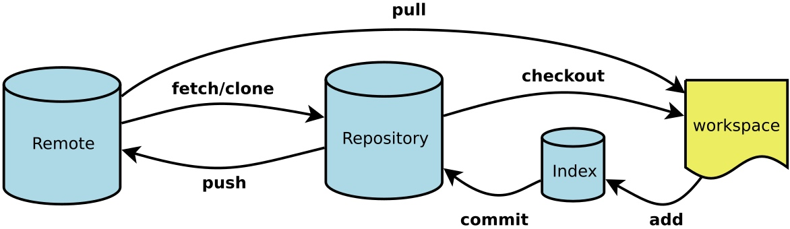

# Git note

* 图解 <https://marklodato.github.io/visual-git-guide/index-zh-cn.html> 利用图示讲解了 `checkout, reset, merge, cherry-pick, rebase` 等指令到底做了什么，可惜没有涉及到远程仓库的命令。Cheatsheet 性质的 👍
* Git Pro ebook: <http://iissnan.com/progit/> 写得非常详细，图示也很赞
    * 看了其中的远程分支和 [分支的rebase](http://iissnan.com/progit/html/zh/ch3_6.html) 章节，才算懂了 rebase 的使用。

* 来自廖雪峰的 [Git教程](https://www.liaoxuefeng.com/wiki/896043488029600)；
* 另外，官方还有个中文的文档，写得很细 <https://git-scm.com/book/zh/v2>
* 廖雪峰老师推荐的一张 [Cheatsheet](https://gitee.com/liaoxuefeng/learn-java/raw/master/teach/git-cheatsheet.pdf)；
* 再推荐一篇进阶的文章 [你可能不知道的 Git](https://blog.daraw.cn/2019/12/21/you-dont-know-git/)；

[Oh Shit, Git!?!](https://ohshitgit.com/zh)

<!-- more -->



* Workspace：工作区
* Index / Stage：暂存区
* Repository：仓库区（或本地仓库）
* Remote：远程仓库

工作流程

1. 将远程仓库克隆为本地仓库 git clone ssh://git@git.sankuai.com/dapp/poi_search_rerank.git
2. 在本地创建和远程分支对应的分支 git checkout -b <本地分支名> origin/<远程分支名>，本地和远程分支的名称最好一致
3. 在本地分支完成任务后，可以试图用git push <远程主机名> <本地分支名>推送自己的修改
4. 如果推送失败，则表明远程分支比本地更新，需要先用git pull试图合并；
5. 如果pull失败并提示“no tracking information”，则说明本地分支和远程分支的链接关系没有创建，用命令git branch --set-upstream-to=<远程主机名>/<远程分支名> <本地分支名>创建链接
6. 如果合并有冲突，则解决冲突，并在本地提交（add => commit）
7. 没有冲突或者解决掉冲突后，再用git push <远程主机名> <本地分支名>推送就能成功
8. 提交到远程仓库以后，就可以发出 Pull Request 到staging分支，然后请求别人进行代码review，确认可以合并到staging
    1. 操作之前务必获取staging/master最新代码（pull 或者 fetch+merge）

## 常用语法

```bash
######### status add commit rm diff log checkout reset ##########
git status 
git add file1.txt file2.txt # 添加指定文件到暂存区（需要和版本库区分）
git add -A      # 添加将当前目录下的所有修改
git add .       # 添加修改和新建到暂存区
git add -u      # 添加修改和删除文件到暂存区
git commit -m "commet" # -m表示注释，为提交时的说明，必须要有！
git rm file.txt     # 将文件从版本库中删除
git rm -r filebook  # 删除文件夹
git diff HEAD^           # 查看未提交修改
git diff HEAD -- readme.txt # 查看工作区和版本库里面最新版本的区别

git log     # 提交历史 (从 git init 到 当前head的修改历史, 回退的修改不在其中)
git reflog  # 查看命令历史 (所有的git命令, 包括回退修改等)

git reset --hard 提交id   # 回滚到某个具体历史版本，如git reset --hard e9efa77 回滚到e9efa77版本
git checkout --文件名      # 退回到最近一次add或者commit时的状态，类似‘一键还原’
git reset HEAD readme.txt   # 暂存区撤销，备注：git reset命令既可以回退版本，也可以把暂存区的修改回退到工作区。当我们用HEAD时，表示最新的版本

######### remote ##########
git remote -v       # 查看名称和详细地址
git remote show xxx # 查看远程资料库的分支， 本地库的分支， 以及二者之间分支的关联
git remote add xxx git@server-name:path/repo-name.git   # 添加远程仓库, 命名为xxx
git remote rm xxx   # 删除远程仓库xxx

######### clone ##########
git clone ssh://git@git.sankuai.com/dapp/poi_search_rerank.git  # 1. 不能用别名；2. 默认为master分支，要同步其他分支可以用
git checkout -b <本地分支名> <远程主机名>/<远程分支名>     # 可以取别名，但最好一致
git clone -b branch-name git@server-name:path/repo.git  # 将指定分支克隆到本地

######### pull ##########
git pull <远程主机名> <远程分支名>:<本地分支名>    # 例如下面的
git pull origin next:master
# git pull是git fetch后跟git merge FETCH_HEAD的缩写。更准确地说，git pull使用给定的参数运行git fetch，并调用git merge将检索到的分支头合并到当前分支中。 使用--rebase，它运行git rebase而不是git merge。
git fetch origin
git merge origin/next
# 手动建立追踪关系（tracking）
git branch --set-upstream-to=远程主机名/<远程分支名> <本地分支名>
git pull origin # 本地当前分支自动与对应的origin主机”追踪分支”(remote-tracking branch)进行合并。如果当前分支只有一个追踪分支，连远程主机名都可以省略。
git pull        # 上面命令表示，当前分支自动与唯一一个追踪分支进行合并。
# 如果合并需要采用rebase模式，可以使用–rebase选项。
git pull --rebase <远程主机名> <远程分支名>:<本地分支名>

######### push ##########
git push <远程主机名> <本地分支名>:<远程分支名>    # 如果省略远程分支名，则表示将本地分支推送与之存在“追踪关系”的远程分支（通常两者同名），如果该远程分支不存在，则会被新建。
# 如果当前分支与多个主机存在追踪关系，则可以使用-u选项指定一个默认主机，这样以后就可以不加任何参数使用git push。
git push -u origin master

######### branch checkout ##########
git branch      # 查看当前分支
git branch -a   # 查看远程分支
git branch <name>   # 创建
git checkout <name> # 切换
git checkout -b <name>    # 创建并切换到分支
git branch -d <name>      # 删除分支
# 如果分支没有合并，删除分支就表示会丢失修改，此时git无法使用-d删除，可使用-D强行删除

######### merge ##########
# git合并默认使用Fast forward模式，一旦删除分支，会丢掉分支信息，也就看不出来曾经做过合并
git merge       # 基于当前分支，合并另外一个分支，前提需要保证分支之间不冲突
# 如果强制禁用Fast forward模式，即普通模式，Git就会在merge时生成一个新的commit
git merge --no-ff -m "there is a comment"   # 因为本次合并要创建一个新的commit，所以加上-m参数，把commit描述写进去。
# 工作中，肯定需要不管有没有分支被删除，都要从分支历史上查看所有的历史分支信息，所以要使用普通模式合并。
```

## 具体应用

### 撤销修改

```bash
# 未add
git restore <file>...

# 已add
git restore --staged <file>...
git restore <file>
```

### 代码回滚：git reset、git checkout和git revert

【下面用了reset和checkout来恢复文件，但按照git的指示，应该restore才是更加规范的选择～参见gst】

git reset用于撤销未被提交到remote的改动，即撤销local的修改。除了移动当前分支的HEAD，还可以更改workspace和index：

--soft：修改HEAD，不修改index和workspace。
--mixed：修改HEAD和index，不修改workspace。默认行为。
--hard：修改HEAD、index、workspace。

```bash
# reset：修改HEAD和index
git checkout hotfix 
git reset HEAD~2    

# reset恢复文件
git reset HEAD filename     # 似乎只能是 mixed 的，也即修改 HEAD和index，不修改workspace
```

checkout作用于commit级别时，只是移动HEAD到不同的commit。如果有unstaged的文件，git会阻止操作并提示。如果使用commit id作为参数，可能会导致野指针。
git checkout -- file命令中的--很重要，没有--，就变成了“切换到另一个分支”的命令。

```bash
git checkout HEAD       # 只修改workspace去匹配某次commit。
git checkout HEAD filename      # 抹掉文件在workspace的修改（add了也行)

git checkout -- file    # 若add了则变为index结果，若未add则就是HEAD结果
```

git revert是用于“反做”某一个版本，以达到撤销该版本的修改的目的。比如，我们commit了三个版本（版本一、版本二、 版本三），突然发现版本二不行（如：有bug），想要撤销版本二，但又不想影响撤销版本三的提交，就可以用 git revert 命令来反做版本二，生成新的版本四，这个版本四里会保留版本三的东西，但撤销了版本二的东西。

```bash
git checkout hotfix
git revert HEAD^^
```

### 查看文件的修改记录

先查看在那些提交中修改了这个文件。
其中 `--pretty=oneline` 使得 log 更加简洁，`--` 可省略

```bash
git log --pretty=oneline -- 文件名
```

然后从 log 中找到要查看的那一次提交所对应的 id，用 `git show _id` 进行查看。

```bash
git show 356f6def9d -- 文件名
```

### 合并远程分支

有的时候我们需要跟别人合作进行开发，然后分别使用不同的Git分支，等项目完成时，需要进行代码合并，就需要知道Git如何合并远程分支。
假设你本地在使用的分支为a(master也是一样的)，需要合并的远程分支为b

```bash
# 在本地新建一个与远程的分支b相同(被合并的版本)的分支b
git checkout -b b origin/b
# 将远程代码pull到本地
git pull origin b

git checkout a
# 合并分支a与分支b
git merge b
```

### 删除文件恢复

```bash
# 若用 rm tt 并且已经提交了；尝试了用 git rm tt 是类似的
g reset HEAD^ tt    # 然后 gst 就可以找到这个文件了，按照指示即可
git restore --staged <file>
```

### 取消文件跟踪

一些需要加在 `.gitignore` 中的文件，若之前建立了索引，需要取消跟踪

```bash
# 单个文件
git rm --cached readme1.txt 

# 所有文件
git rm -r --cached . 　　//不删除本地文件
git rm -r --f . 　　//删除本地文件
```

> 以下 from 廖雪峰教程

## 版本库

### 创建版本库

初始化一个Git仓库，使用`git init`命令。

添加文件到Git仓库，分两步：

1. 使用命令`git add <file>`，注意，可反复多次使用，添加多个文件；
2. 使用命令`git commit -m <message>`，完成。

### 版本回退

* `HEAD`指向的版本就是当前版本，因此，Git允许我们在版本的历史之间穿梭，使用命令 `git reset --hard commit_id`。
* 穿梭前，用 `git log` 可以查看提交历史，以便确定要回退到哪个版本。
* 要重返未来，用 `git reflog` 查看命令历史，以便确定要回到未来的哪个版本。

#### 版本命名

首先，Git必须知道当前版本是哪个版本，在Git中，用`HEAD`表示当前版本，也就是最新的提交`1094adb...`（注意我的提交ID和你的肯定不一样），上一个版本就是`HEAD^`，上上一个版本就是`HEAD^^`，当然往上100个版本写100个`^`比较容易数不过来，所以写成`HEAD~100`。

### 工作区和暂存区

暂存区是Git非常重要的概念，弄明白了暂存区，就弄明白了Git的很多操作到底干了什么。

### 管理修改

注意，`git diff readme.txt` 是与暂存区的文件比较；而 `git diff HEAD -- readme.txt` 则是与 HEAD 版本下的文件进行比较。因此，若在修改 readme.txt 后，已经 add 而尚未 commit ，则前者不会显示差异后者会显示出修改内容。

### 撤销修改 checkout --

场景1：当你改乱了工作区某个文件的内容，想直接丢弃工作区的修改时，用命令 `git checkout -- file`。

场景2：当你不但改乱了工作区某个文件的内容，还添加到了暂存区时，想丢弃修改，分两步，第一步用命令 `git reset HEAD <file>`，就回到了场景1，第二步按场景1操作。

场景3：已经提交了不合适的修改到版本库时，想要撤销本次提交，参考[版本回退](https://www.liaoxuefeng.com/wiki/896043488029600/897013573512192)一节，不过前提是没有推送到远程库。

### 删除文件

命令 `git rm` 用于删除一个文件。如果一个文件已经被提交到版本库，那么你永远不用担心误删，但是要小心，你只能恢复文件到最新版本，你会丢失**最近一次提交后你修改的内容**。

为了恢复删除的文件，：

场景 1：删除了文件，但没有 `git rm test.txt`，这时可以用 `git checkout -- test.txt` 找回；

场景 2：删除文件并且执行了 rm 操作，但没有 commit（这时候缓存区已经没有该文件了），则可以用 `git reset  -- test.txt` 提取版本库中文件到缓存区，再使用 `git checkout -- test.txt` 从缓存区取回工作区；

场景 3：删除文件并且已经提交到版本库，可以用 `git reset HEAD^ -- test.txt` 提取该文件到缓存区；再使用 `git checkout -- test.txt` 提取回本地。

## 远程仓库

【总结一下】在 GitHub 上新建一个 repo，然后 1. clone 下来；2. 或者用类似 `git remote add origin git@github.com:michaelliao/learngit.git` 的命令。（这里的 origin 只是定义了远程仓库的名字）

### 案例：类似 GitHub 提示

首先需要现在远程创建一个分支，比如地址为 `https://xxxxxxx/wangdong/helloworld.git`

```bash
# 从本地新建一个分支，关联到 remote
touch README.md
git init
git add README.md
git commit -m "first commit"
git branch -M main
git remote add origin https://xxxxxxx/wangdong/helloworld.git
git push -u origin main

# 本来就有了，直接关联 remote
git remote add origin https://xxxxxxx/wangdong/helloworld.git
git branch -M main
git push -u origin main

# 若已有一个关联的 remote，则可取消后重新关联一个新的远程分支
git remote remove origin
git remote add origin https://dev.33.cn/wangdong/alioss-file.git
```

### 添加远程库

要关联一个远程库，使用命令`git remote add origin git@server-name:path/repo-name.git`；

关联后，使用命令`git push -u origin master`第一次推送master分支的所有内容；

此后，每次本地提交后，只要有必要，就可以使用命令`git push origin master`推送最新修改；

分布式版本系统的最大好处之一是在本地工作完全不需要考虑远程库的存在，也就是有没有联网都可以正常工作，而SVN在没有联网的时候是拒绝干活的！当有网络的时候，再把本地提交推送一下就完成了同步，真是太方便了！

### 从远程库克隆

要克隆一个仓库，首先必须知道仓库的地址，然后使用`git clone`命令克隆。

Git支持多种协议，包括`https`，但`ssh`协议速度最快。

## 分支管理

### 创建与合并

Git鼓励大量使用分支：

查看分支：`git branch`

创建分支：`git branch <name>`

切换分支：`git checkout <name>`或者`git switch <name>`

创建+切换分支：`git checkout -b <name>`或者`git switch -c <name>`

合并某分支到当前分支：`git merge <name>`

删除分支：`git branch -d <name>`

### 解决冲突

当Git无法自动合并分支时，就必须首先解决冲突。解决冲突后，再提交，合并完成。

解决冲突就是把Git合并失败的文件手动编辑为我们希望的内容，再提交。

用`git log --graph`命令可以看到分支合并图。

### 分支管理策略

Git分支十分强大，在团队开发中应该充分应用。

合并分支时，加上`--no-ff`参数就可以用普通模式合并，合并后的历史有分支，能看出来曾经做过合并，而`fast forward`合并就看不出来曾经做过合并。

在实际开发中，我们应该按照几个基本原则进行分支管理：

* 首先，`master`分支应该是非常稳定的，也就是仅用来发布新版本，平时不能在上面干活；
* 那在哪干活呢？干活都在`dev`分支上，也就是说，`dev`分支是不稳定的，到某个时候，比如1.0版本发布时，再把`dev`分支合并到`master`上，在`master`分支发布1.0版本；
* 你和你的小伙伴们每个人都在`dev`分支上干活，每个人都有自己的分支，时不时地往`dev`分支上合并就可以了。

### Bug 分支

修复bug时，我们会通过创建新的bug分支进行修复，然后合并，最后删除；

当手头工作没有完成时，先把工作现场`git stash`一下，然后去修复bug，修复后，再`git stash pop`，回到工作现场；

在master分支上修复的bug，想要合并到当前dev分支，可以用`git cherry-pick <commit>`命令，把bug提交的修改“复制”到当前分支，避免重复劳动。

### Feature 分支

开发一个新feature，最好新建一个分支；

如果要丢弃一个没有被合并过的分支，可以通过`git branch -D <name>`强行删除。

### 多人协作

* 查看远程库信息，使用`git remote -v`；
* 本地新建的分支如果不推送到远程，对其他人就是不可见的；
* 从本地推送分支，使用`git push origin branch-name`，如果推送失败，先用`git pull`抓取远程的新提交；
* 在本地创建和远程分支对应的分支，使用`git checkout -b branch-name origin/branch-name`，本地和远程分支的名称最好一致；
* 建立本地分支和远程分支的关联，使用`git branch --set-upstream branch-name origin/branch-name`；
* 从远程抓取分支，使用`git pull`，如果有冲突，要先处理冲突。

因此，多人协作的工作模式通常是这样：

  1. 首先，可以试图用`git push origin <branch-name>`推送自己的修改；
  2. 如果推送失败，则因为远程分支比你的本地更新，需要先用`git pull`试图合并；
  3. 如果合并有冲突，则解决冲突，并在本地提交；
  4. 没有冲突或者解决掉冲突后，再用`git push origin <branch-name>`推送就能成功！

如果`git pull`提示`no tracking information`，则说明本地分支和远程分支的链接关系没有创建，用命令`git branch --set-upstream-to <branch-name> origin/<branch-name>`。

## 标签管理

* 命令`git tag <tagname>`用于新建一个标签，默认为`HEAD`，也可以指定一个commit id；
* 命令`git tag -a <tagname> -m "blablabla..."`可以指定标签信息；
* 命令`git tag`可以查看所有标签。

* 命令`git push origin <tagname>`可以推送一个本地标签；
* 命令`git push origin --tags`可以推送全部未推送过的本地标签；
* 命令`git tag -d <tagname>`可以删除一个本地标签；
* 命令`git push origin :refs/tags/<tagname>`可以删除一个远程标签。

> 以下 from 美团

### git状态含义

M 表示改动
A 表示添加
D 表示删除
R 表示重命名
C 表示拷贝
U 表示已更新到索引区但是未合并
? 表示还没添加到git库中的文件
! 表示已被忽略的文件
AU 我们添加了文件
UD 他们删除了文件
DD 双方都删除了文件
UU 双方都修改了文件

### 配置别名

命令可以简写，用git st表示git status

```bash
git config --global alias.co checkout
git config --global alias.ci commit
git config --global alias.br branch
git config --global alias.last 'log -1'
git config --global alias.lg "log --color --graph --pretty=format:'%Cred%h%Creset -%C(yellow)%d%Creset %s %Cgreen(%cr) %C(bold blue)<%an>%Creset' --abbrev-commit"
```

当前用户的Git配置文件存放在 `～/.gitconfig` 文件中；当前仓库的配置文件在 `.git/config`

### 设置UI颜色

```bash
git config --global color.ui true
```
