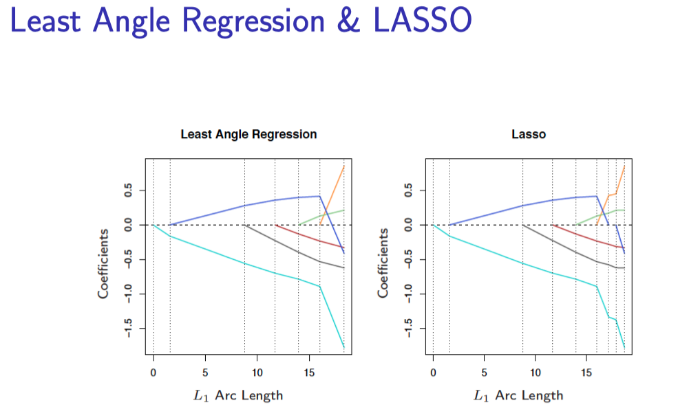
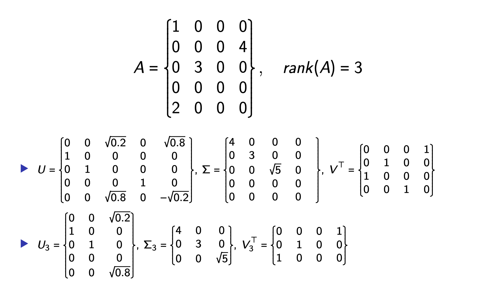

# ASL note

参见

- ESL, [中文版](https://esl.hohoweiya.xyz/) ⭐️
- [Jozee's技术博客|机器学习](https://jozeelin.github.io/categories/%E6%9C%BA%E5%99%A8%E5%AD%A6%E4%B9%A0/) ⭐️

其他

- [机器学习（六）贝叶斯分类器](https://baidinghub.github.io/2020/04/03/%E6%9C%BA%E5%99%A8%E5%AD%A6%E4%B9%A0%EF%BC%88%E5%85%AD%EF%BC%89%E8%B4%9D%E5%8F%B6%E6%96%AF%E5%88%86%E7%B1%BB%E5%99%A8/)；Blog <https://baidinghub.github.io/> 很赞
- [叶斯线性回归与贝叶斯逻辑回归](https://weirping.github.io/blog/Bayesian-Probabilities-in-ML.html)
- PRML 笔记 <http://www.datakit.cn/category/#PRML>
- [贝叶斯模型比较(Bayesian Model Comparison)](https://keson96.github.io/2017/04/07/2017-04-07-Bayesian-Model-Comparison/)

## Introduction

Outline

- Variable Types and Terminology
- Two Simple Approaches to Prediction
    - Least Squares
    - Nearest-Neighbour Methods
    - Comparison
- Statistical Decision Theory
- Curse of Dimensionality
- Statistical Models, Supervised Learning \& Function Approximation
- Class of Restricted Estimators
- Bias Variance Tradeoff

### 引入

Cases:

- Email spam
- Prostate Cancer (continuous)
- Handwritten Digit Recognition
- DNA Expression Microarrays (cluster)

### Regression \& Classification

Inputs - predictors, independent variables, features...
Outputs - outcome, response, dependent variable, label...

- Regression problems - outputs being quantitative measurement
    - Measurements close in value are also close in nature
    - Prostate cancer example
- Classification problems - outputs being qualitative
    - No explicit ordering in the outputs
    - Email spam, Handwritten digits recognition
- Special case - ordered categorical outputs
    - e.g., \{small, medium, large\}
    - difference between medium and small need not be the same as that between large and medium

### 两种简单的预测方法

#### Least Squares

Given a vector of inputs $X^{\top}=\left(X_{1}, X_{2}, \ldots, X_{P}\right)$, predict the output $Y$ (scalar) by

$$
\hat{Y}=X^{\top} \hat{\beta}
$$

Note: in this course, we will always assume $X$ includes a constant variable $1, \beta$ include the intercept $\beta_{0}$

Question: How do we fit the linear model to a set of training data $\left\{\left(X_{1}, y_{1}\right),\left(X_{2}, y_{2}\right), \ldots,\left(X_{N}, y_{N}\right)\right\} ?$

Answer: Many different methods, most popular - least squares

- Pick $\beta$ that minimize the residual sum of squares (RSS)
- $R S S(\beta)=\sum_{i=1}^{N}\left(y_{i}-x_{i}^{\top} \beta\right)^{2}$
- In matrix notation $R S S(\beta)=(y-X \beta)^{\top}(y-X \beta)$
- Quandratic function of $\beta$, so its minimum always exists (but may not be unique!)
- Differentiating w.r.t. $\beta \rightarrow X^{\top}(y-X \beta)=0$
- If $X^{\top} X$ is nonsingular, the unique solution $\hat{\beta}=\left(X^{\top} X\right)^{-1} X^{\top} y$

Fitted value at $x_{i}: \hat{y}_{i}=x_{i}^{\top} \hat{\beta}$

Predicted value at an arbituary input $x_{0}: \hat{y}_{0}=x_{0}^{\top} \hat{\beta}$

#### Nearest-Neighbour Methods

Given a vector of inputs $X^{\top}=\left(X_{1}, X_{2}, \ldots, X_{p}\right)$, predict the output $Y$ (scalar) by

$$
\hat{Y}(x)=\frac{1}{k} \sum_{x_{i} \in N_{k}(x)} y_{i}
$$

where $N_{k}(x)$ is the neighborhood of $x$ defined by the $k$ closest points $x_{i}$ in the training sample

Question: How to define "closest"?

- Can be defined on different metrics.
- For the moment, assume Euclidean distance

#### Least Square vs KNN (都可以完成分类和回归任务)

比较线性模型和kNN

- Linear
    - Smooth and stable decision boundry
    - Linear assumption
    - High bias and low variance
- kNN
    - Wiggly and unstable decision boundry
    - Assumption free
    - Low bias and high variance (kNN 的有效参数数量为 $N/k$, 一般大于线性模型的参数量)

这里展示了在一个数据集上(更适合 kNN)的表现, 紫色为 Bayes 错误率, 两个方块是线性模型的表现, 而两条折线则是 kNN 在选择不同参数时的表现.

#### Variants of $L S$ and KNN

- Kernal methods
    - Weights decrease smoothly as distance further from the target point
    - In high-dimensional space, distance kernels are modified to emphasize on some variables more than others
- Local regression
    - Fit linear models by locally weighted least squares
- Basis expansion
    - Allow more complex inputs

### Statistical Decision Theory

#### Loss Function

- Squared loss
    - $\mathcal{L}(Y, f(x))=(Y-f(x))^{2}$
    - $f(x)=\operatorname{argmin}_{c}\left(E_{Y \mid X}(Y-c)^{2} \mid X=x\right)=E(Y \mid X=x)$
- L1 loss
    - $\mathcal{L}(Y, f(x))=|Y-f(x)|$
    - $\rightarrow f(x)=\operatorname{median}(Y \mid X=x)$
- 0-1 loss
    - $\rightarrow \mathcal{L}(G, G(x))=\sum_{k} \mathcal{L}\left(G_{k}-\hat{G}(x)\right) \operatorname{Pr}\left(G_{k} \mid X\right)$
    - $\hat{G}(x)=\operatorname{argmax}_{G \in \mathcal{G}} \operatorname{Pr}(G \mid X=x)$

#### Squared Loss

- **Expected prediction error**
    - $E P E(f)=E(Y-f(x))^{2}=\int(y-f(x))^{2} \operatorname{Pr}(d x, d y)$
    - 注意这里是对于 X 和 Y 都取期望
- By conditioning on $X$, we can write EPE as $E P E(f)=E_{X} E_{Y \mid X}\left[(y-f(x))^{2} \mid x\right]$
- It suffices to minimize $E P E$ pointwise
    - $f(x)=\operatorname{argmin}_{c} E_{Y \mid X}\left[(Y-c)^{2} \mid X=x\right]$
    - 我们只需要预测函数 **逐点最小** 即可
- The solution is 条件期望
    - $f(x)=E(Y \mid X=x)$
    - 也被称作 回归 (regression) 函数

For least squares

$$
\begin{aligned}
f(x) &=E(Y \mid X=x)=X \beta \\
f(x) &=X \hat{\beta}
\end{aligned}
$$

For k-nearest-neighbour

$$
\hat{f}(x)=\operatorname{Ave}\left(y_{i} \mid x_{i} \in N_{k}(x)\right)
$$

- Expectation is approximated by averaging over sample data
- Conditioning at a point is relaxed to conditioning on some region "close" to the target point
- For large training set and large $k$, approximation works better (但正如下一节所说, 会有维度灾难的问题)

#### 0-1 LOSS

- Expected prediction error for categorical output $G$
- $E P E=E[L(G, \hat{G}(x))]$, where $L(k, l)$ denotes the price paid for classifying an observation belonging to $k$ as $l$.
- By conditioning on $X$, we can write EPE as

$$
E P E=E_{x} \sum_{k=1}^{k} L\left[G_{k}, \hat{G}(x)\right] \operatorname{Pr}\left(G_{k} \mid X=x\right)
$$

- 同样也是逐点最小化, So $\hat{G}(x)=\operatorname{argmin}_{G \in \mathcal{G}} \sum_{k=1}^{k} L\left(G_{k}, g\right) \operatorname{Pr}\left(G_{k} \mid X=x\right)$
- For 0-1 loss, $\hat{G}(X)=G_{k}$ if $\operatorname{Pr}\left(G_{k} \mid X=x\right)=\max _{g} \operatorname{Pr}(g \mid X=x)$
- In words, classify to the most probable class.

当条件分布已知的情况下, 理想情况就是按照后验概率进行估计, 称为 **贝叶斯分类器** (Bayes classifier); 贝叶斯分类的误差率被称作 贝叶斯率 (Bayes rate).

For least squares (indicator variable regression)

- $G(x)$ is approximated by $X \hat{\beta}$
- in practice problems can occur

For k-nearest-neighbour

- $\hat{G}(x)$ - majority vote in a neighbourhood
- Conditional probability at a point is relaxed to conditional probability within a neighborhood of a point
- Probabilities are estimated by training-sample proportions.

### Curse of Dimensionality

对维数灾难的直观理解

- 数据分布稀疏: 考虑在 p 维宽度为 1 立方体中均匀分布的情况, 如果在一个小的立方体中包括 10% 的数据, 当 p=10 时需要的立方体大小为 0.8 (其实就是, 要覆盖 p 维的数据点要很大)
- 数据很多会出现在边界附近: 例子是在一个 p 维球体中, 各数据点距离球心的平均距离随着维度的增加而增加, 也即多考虑边界; 这样, 就不能采用内差而需要外推. (也可理解为数据稀疏?)

### 统计模型，监督学习和函数逼近

我们的目标是寻找函数 $f(x)$ 的一个有用的近似 $\hat{f}(x)$, 函数 $f(x)$ 蕴含着输入与输出之间的预测关系. 在前面统计判别理论的章节的理论准备中, 对于定量的响应, 我们看到平方误差损失引导我们得到了回归函数 $f(X)=\mathrm{E}(Y \mid X=x)$. 最近邻方法可以看成是对条件期望的直接估计, 但是我们可以看到至少在两个方面它们不起作用

- 如果输入空间的维数高, 则最近邻不必离目标点近, 而且可能导致大的误差
- 如果知道存在特殊的结构, 可以用来降低估计的偏差与方差.

我们预先用了关于 $f(X)$ 的其它类别的模型, 在很多情形下是为了解决维数问题而特别设计的, 现在我们讨论把它们合并进一个预测问题的框架.

#### Statistical Models

- Goal
    - Predict the relationship between inputs and outputs with $f(x)$
    - Approximate $f(x)$ using $\hat{f}(x)$
- Quantitative output
    - Squared error loss $\rightarrow f(x)=E(Y \mid X=x)$
    - Choice for $\hat{f}(x)$ : additive error model, nearest neighbour, ...
- Qualitative output
    - Additive error models typically not used (additive 误差模型: 在实际的 f 中有一个误差项) 在分类问题中一般不做这个假设, 因此直接对于条件概率建模
    - Directly model $\operatorname{Pr}(G \mid X)$ : logistic regression, probit regression, $\ldots$

#### Function Approximation

一些基本的模型

Common approximations ( $\theta$ denotes parameters)

- Linear model $f(x)=X^{\top} \beta$
- Basis expansion $f_{\theta}(x)=\sum_{k=1}^{K} h(x) \theta_{k}$
    - $h(x)$ are transformations of $x$
    - Polynomial and trigonometric expansions $x_{1}^{2}, x_{1} x_{2}^{2}, \cos \left(x_{1}\right)$
    - Sigmoid transformation $\frac{1}{1+\exp \left(-x^{\top} \beta_{k}\right)}$

Parameter estimate

- Least squares
    - Closed form for linear model
    - May require iterative methods or numerical optimization
- Maximum likelihood estimation - more general
    - $\mathcal{L}(\theta)=\sum_{i=1}^{N} \log P r_{\theta}\left(y_{i}\right)$ $\hat{\theta}=\operatorname{argmax}_{\theta} \mathcal{L}(\theta)$

##### 例子: MLE - Normal Distribution

Normal distribution

$$
f\left(x \mid \mu, \sigma^{2}\right)=\frac{1}{\sqrt{2 \pi \sigma^{2}}} e^{-\frac{(x-\mu)^{2}}{2 \sigma^{2}}}
$$

Normal likelihood

- Assume $\operatorname{Pr}(Y \mid X, \beta)=\mathcal{N}\left(X \beta, \sigma^{2}\right)$
- $I(\beta)=-\frac{N}{2} \log (2 \pi)-N \log (\sigma)-\frac{1}{2 \sigma^{2}} \sum_{i=1}^{N}\left(y_{i}-X_{i} \beta\right)^{2}$
- Maximizing $I(\theta)$ only involves the last term $-\frac{1}{2 \sigma^{2}} \sum_{i=1}^{N}\left(y_{i}-f_{\theta}\left(x_{i}\right)\right)^{2}$, which is equivalent to minimizing RSS

结论: 在正态分布条件下, MLE 等价于 最小化RSS.

##### 例子: MLE - Multinomial Distribution

Multinomial distribution

$$
P\left(X_{1}=x_{1}, \ldots, X_{m}=x_{m}\right)=\frac{n !}{\prod_{i=1}^{m} x_{i} !} \prod_{i=1}^{m} \theta_{i}^{x_{i}}
$$

Multinomial likelihood

- Assume $X_{1}, \ldots, X_{m}$ are counts in cells up to $m$, each cell has a different probability $\theta_{1}, \ldots, \theta_{m}$
- constraints: $\sum_{i=1}^{m} X_{i}=n, \sum_{i=1}^{m} \theta_{i}=1$
- The joint probability of $\left(X_{1}, \ldots, X_{m}\right)$ is multinomial
- $I\left(\theta_{1}, \ldots, \theta_{m}\right)=\log n !-\sum_{i=1}^{m} \log x_{i}+\sum_{i=1}^{m} x_{i} \log \theta_{i}$
- Introduce Lagrange multipliers, $I\left(\theta_{1}, \ldots, \theta_{m}\right)=\log n !-\sum_{i=1}^{m} \log x_{i}+\sum_{i=1}^{m} x_{i} \log \theta_{i}+\lambda\left(1-\sum_{i=1}^{m} \theta_{i}\right)$
- solution $\hat{\theta}_{i}=\frac{x_{i}}{n}$, that is, the sample proportion

### 限制性估计 Restricted Estimators

介绍了三类方法

#### Roughness Penalty and Bayesian Methods

$$
P R S S(f ; \lambda)=R S S(f)+\lambda J(f)
$$

- $\mathrm{J}(\mathrm{f})$ will be large for functions $\mathrm{f}$ that vary too rapidly over small regions of input space.
- smoothing parameter $\lambda$ controls the amount of penalty
- e.g., $P R S S(f ; \lambda)=\sum_{i=1}^{N}\left(y_{i}-f\left(x_{i}\right)\right)^{2}+\lambda \int\left[f(x)^{\prime \prime}\right]^{2}$
    - Solution - cubic smoothing spline 上面惩罚项的解是 **三次光滑样条**
    - $\lambda=0$ 时, 没有惩罚, 可以使用任意插值函数; $\lambda$ 为无穷时, 仅仅允许 x 的线性函数.

$J(f)$ reflects our **prior belief** that $f$ exhibit a certain type of smooth behavior

- Bayesian analogy 正则项表达了我们的 prior belief, 确实可以套进贝叶斯的模型中
- Penalty J - log-prior
- PRSS $(f ; \lambda)$ - log-posterior distribution
- Minimizing $P R S S(f ; \lambda)$ - finding the posterior mode.
- 我们将在 `第 5 章` 中讨论粗糙惩罚方法并在 `第 8 章` 中讨论贝叶斯范式

#### Kernel Methods and Local Regression

这些方法可以认为是通过确定局部邻域的本质来显式给出回归函数的估计或条件期望，并且属于局部拟合得很好的规则函数类．

The local neighborhood is specified by a kernel function $K_{\lambda}\left(x_{0}, x\right)$

- Assign weight $K_{\lambda}\left(x_{0}, x\right)$ to points $x$ in a region around $x_{0}$
- e.g., **Gaussian kernal** $K_{\lambda}\left(x_{0}, x\right)=\frac{1}{\lambda} \exp \left[-\frac{\left\|x-x_{0}\right\|^{2}}{2 \lambda}\right]$ 高斯核
- Weights die exponentialy with squared Euclidean distance from $x_{0}$.

$$
R S S\left(f_{\theta}, x_{0}\right)=\sum_{i=1}^{N} K_{\lambda}\left(x_{0}, x_{i}\right)\left(y_{i}-f_{\theta}\left(x_{i}\right)\right)^{2}
$$

- $f_{\hat{\theta}}\left(x_{0}\right)$ is the local regression estimate of $f\left(x_{0}\right)$
- $\hat{\theta}$ minimizes $R S S\left(f_{\theta}, x_{0}\right)$
- $f_{\theta}(x)=\theta_{0} \rightarrow$ **Nadaraya-Watson estimate**
- $f_{\theta}(x)=\theta_{0}+\theta_{1} x \rightarrow$ local linear regression model. 局部线性回归

最近邻方法可以看成是某个更加依赖数据的度量的核方法. Nearest Neighbour 所对应的核为 $K_{\lambda}\left(x_{0}, x\right)=I\left(\left\|x-x_{0}\right\| \leqslant\left\|x_{k}-x_{0}\right\|\right)$

为了避免维数灾难，这些方法在高维情形下要做修正．将在 `第 6 章` 讨论不同的改编．

#### Basis Functions and Dictionary Methods

Linear basis expansion $f_{\theta}(x)=\sum_{m=1}^{M}\left(\theta_{m} h_{m}(x)\right)$

- Piecewise polynomial of degree $K$ at $M-K$ knots (见 5.2 节)
- 径向基函数 **Radial basis functions** $f_{\theta}(x)=\sum_{m=1}^{M} K_{\lambda_{m}}\left(\mu_{m}, x\right) \theta_{m}$, where $\mu_{m}$ are centroids (见 6.7 节)

Neural Network

- 单层的向前反馈的带有线性输出权重的神经网络模型可以认为是一种自适应的基函数方法
- $f_{\theta}(x)=\sum_{i=1}^{M} \beta_{m} \sigma\left(\alpha_{m}^{\top} x+b_{m}\right)$
- $\sigma(x)=\frac{1}{1+e^{(-x)}}$ activation function
- Direction $\alpha$ and bias $b$ need to be computed

Dictionary methods

- Functions are adaptively chosen 这些自适应选择基函数的方法也被称作 字典 (dictionary) 方法
- A possibly infinite set or dictionary $\mathcal{D}$ of candidate basis functions models employ some kind of search mechanism.

### Model Selection and the Bias–Variance Tradeoff

#### Model complexity

上面讨论的所有模型以及其他将要在后面章节讨论的模型都有一个 光滑 (smoothing) 或 复杂性 (complexity) 参数需要确定

- The multiplier of the penalty $\lambda$
- Width of the kernel
- Number of basis functions

Decomposition of EPE (expected prediction error) 这里假设了 x 是固定的而非随机的 (也即 pointwise 最小)

$$
\begin{aligned}
E P E\left(x_{0}\right)&=E\left[\left(y_{0}-\hat{f}\left(x_{0}\right)\right)^{2} \mid X=x_{0}\right] \\
&=E\left[\left(y_{0}-f\left(x_{0}\right)+f\left(x_{0}\right)-E \hat{f}\left(x_{0}\right)+E \hat{f}\left(x_{0}\right)-\hat{f}\left(x_{0}\right)\right)^{2} \mid X=x_{0}\right] \\
&=E\left[y_{0}-f\left(x_{0}\right)\right]^{2}+E\left[f\left(x_{0}\right)-E\left(\hat{f}\left(x_{0}\right)\right) \right]^{2}+E\left[\hat{f}\left(x_{0}\right)-E\left(\hat{f}\left(x_{0}\right)\right)\right]^{2}.
\end{aligned}
$$

- $E\left[y_{0}-f\left(x_{0}\right)\right]^{2}$ irreducible error, beyond our control 不可约减的
- $E\left[f\left(x_{0}\right)-E\left(\hat{f}\left(x_{0}\right)\right)\right]^{2}$ Bias squared, decrease with complexity 偏差部分
- $E\left[\hat{f}\left(x_{0}\right)-E\left(\hat{f}\left(x_{0}\right)\right)\right]^{2}$ Variance, increase with complexity 方差部分

后面的两项构成了 **均方误差** (mean squared error)

一般地, 我们选择模型复杂度使偏差与方差达到均衡从而使测试误差最小。测试误差的一个明显的 估计是 训练误差 (training error) $\frac{1}{N} \sum_{i}\left(y_{i}-\hat{y}_{i}\right)^{2}$. 不幸的是, 训练误差不是测试误差的良好估计, 因为这不能解释模型复杂度.

在 `第 7 章` (7.2, 7.3) 中，我们考虑估计预测方法的测试误差的各种方式，并因此在给定的预测方法和训练集下，估计出最优的模型复杂度．

## Linear Methods for Regression

Outline

- Intro
- Linear Regression \& Least Squares
- Subset Selection
- Shrinkage methods
- Methods Using Derived Input Directions

### Introduction of Linear Methods

Advantages of Linear Models

- Simple and often provide an adequate and interpretable description of how the inputs affect the output.
- Sometimes outperform fancier nonlinear models, especially in situations with small numbers of training cases, low signal-to-noise ratio or sparse data.
- Can be applied to transformations of the inputs and this considerably expands their scope.

### Recap of Linear Regression

$$
f(X)=\beta_{0}+\sum_{j=1}^{p} X_{j} \beta_{j}
$$

- $\beta_{j}$ unknown parameter
- Sources of $X_{j}$
    - quantitative inputs
    - transformations
    - basis expansions
    - dummy coding of qualitative variables
    - interactions between variables
- Model is linear in $\beta$

#### Estimation

Training data:

$$
\left(x_{1}, y_{1}\right), \ldots,\left(x_{N}, y_{N}\right)
$$

Feature measurements for the $i_{t h}$ case: $x_{i}=\left(x_{i 1}, x_{i 2}, \ldots, x_{i p}\right)^{\top}:$
Least squares:
choose $\beta=\left(\beta_{0}, \beta_{1}, \ldots, \beta_{p}\right)^{\top}$ to minimize the Residual Sum of Squares.
$R S S=\sum_{i=1}^{N}\left(y_{i}-\beta_{0}-\sum_{j=1}^{p} x_{i j} \beta_{j}\right)^{2}$

#### Matrix notation

记为矩阵形式, 可以得到解析解. (在 X 列满秩的情况下)

- $X: N \times(p+1)$ matrix
- $Y: N$ vector

$$
R S S(\beta)=(y-X \beta)^{\top}(y-X \beta)
$$

- Quadratic function of $\beta$
- Differentiating w.r.t. $\beta$

$\frac{\partial R S S}{\partial \beta}=-2 X^{\top}(y-X \beta)$
$\frac{\partial^{2} R S S}{\partial \beta \partial \beta^{\top}}=2 X^{\top} X$

$$
\hat{\beta}=\left(X^{\top} X\right)^{-1} X^{\top} y
$$

- Assume $X$ has full column rank
- Fitted value $\hat{y}=X \hat{\beta}=X\left(X^{\top} X\right)^{-1} X^{\top} y$
- Hat matrix $H=X\left(X^{\top} X\right)^{-1} X^{\top}$

#### Sampling Properties of $\hat{\beta}$

$$
\hat{\beta}=\left(X^{\top} X\right)^{-1} X^{\top} y
$$

- 参数估计的协方差矩阵(covariance matrix, variance-covariance matrix, dispersion matrix 这些名字都是) $\operatorname{Var}(\hat{\beta})=\left(X^{\top} X\right)^{-1} \sigma^{2}$
- 估计方差 $\hat{\sigma}^{2}=\frac{1}{N-p-1} \sum_{i=1}^{N}\left(y_{i}-\hat{y}_{i}\right)^{2}$

Additional assumptions 加上正态性假设

- $y=\beta_{0}+\sum_{j=1}^{p} X_{j} \beta_{j}+\epsilon$
- $\epsilon \sim \mathcal{N}\left(0, \sigma^{2}\right)$

在这一假设下, 我们可以得到参数估计的分布: Sampling distribution of $\hat{\beta}, \hat{\sigma}^{2}$

- $\hat{\beta} \sim \mathcal{N}\left(\beta,\left(X^{\top} X\right)^{-1} \sigma^{2}\right)$
- $(N-p-1) \hat{\sigma}^{2} \sim \sigma^{2} \chi_{N-p-1}^{2}$

从而之后可以进行假设检验和置信区间.

#### Hypothesis Testing - single parameter

When $\sigma^{2}$ is known (rare)

- $v_{j}$ is the $j_{t h}$ diagonal element of $\left(X^{\top} X\right)^{-1}$
- $z_{j}=\frac{\hat{\beta}_{j}}{\sigma \sqrt{v_{j}}}$
- Under $H_{0}, z_{j} \sim \mathcal{N}(0,1)$

When $\sigma^{2}$ is unknown (most common)

- $z_{j}=\frac{\hat{\beta}_{j}}{\hat{\sigma} \sqrt{v_{j}}}$
- Under $H_{0}, z_{j} \sim t(N-p-1)$

The differences between $t(N-p-1)$ and standard normal become negligible as the sample size increases

#### Hypothesis Testing - group of coefficients

Bigger model

- residual sum-of-squares for the least squares fit $R S S_{1}$
- $p_{1}+1$ parameters

Nested smaller model

- residual sum-of-squares for the least squares fit $R S S_{0}$
- $p_{0}+1$ parameters

$$
F=\frac{\left(R S S_{0}-R S S_{1}\right) /\left(P_{1}-P_{0}\right)}{R S S_{1} /\left(N-P_{1}-1\right)}
$$

- **Measures the change in RSS per additional parameter** in the bigger model 衡量了大模型中每个增加的系数对于RSS的改变, 并且用方差的估计值进行标准化
- Under $H_{0}, F \sim \mathcal{F}_{p_{1}-p_{0}, N-p_{1}-1}$

#### Confidence Interval / Region

$\beta_{j}: 1-2 \alpha$ confidence interval 其中 $z^{1-\alpha}$ 为正态分布的 ${1-\alpha}$ 分位数

$$
\left(\hat{\beta}_{j}-z^{1-\alpha} v_{j}^{1 / 2} \hat{\sigma}, \hat{\beta}_{j}+z^{1-\alpha} v_{j}^{1 / 2} \hat{\sigma}\right)
$$

Entire parameter vector $\beta: 1-2 \alpha$ confidence region

$$
\mathcal{C}_{\beta}=\left\{\beta \mid(\hat{\beta}-\beta)^{\top} X^{\top} X(\hat{\beta}-\beta) \leqslant \hat{\sigma}^{2} {\chi_{p+1}^{2}}^{1-2 \alpha}\right\}
$$

#### Gauss Markov Theorem

Why least squares?

**Gauss Markov Theorem**: least squares estimates of the parameters $\beta$ have the smallest variance among all linear unbiased estimates

**Gauss-Markov 定理**: 在参数 $\beta$ 的所有无偏估计中, 最小二乘估计是其中方差最小的.

In mathematical term: suppose $\theta=\alpha^{\top} \beta$

- $\hat{\theta}=\alpha^{\top} \hat{\beta}$ is unbiased for $\theta$
- Consider any other linear estimator $\tilde{\theta}=c^{\top} y$ such that $E\left(c^{\top} y\right)=\alpha^{\top} \beta$
- According to Gauss Markov Theorem $\operatorname{Var}\left(\alpha^{\top} \hat{\beta}\right)<\operatorname{Var}\left(c^{\top} y\right)$

虽然 Gauss-Markov 定理 说明了参数估计在无偏估计中是最好的, 但根据下面的估计值的均方误差分解, 可知其由估计的方差和估计偏差共同决定 —— 因此引入了下面的 shrink 方法.

**Mean squared error** of an estimator $\tilde{\theta}$ in estimating $\theta$ :

$$
\operatorname{MSE}(\tilde{\theta})=E(\tilde{\theta}-\theta)^{2}=E(\tilde{\theta}-E(\tilde{\theta})+E(\tilde{\theta})-\theta)^{2}=\operatorname{Var}(\tilde{\theta})+\operatorname{Bias}(\tilde{\theta})^{2}
$$

How about biased estimator (best subset, shrinkage)?

- Might have smaller MSE by trading a little bias for a larger reduction in variance.

"All models are wrong, some are useful"

- Picking the right model amounts to creating the right balance between bias and variance.

#### Multiple Linear Regression

多元线性回归和一元的关系: 当所有自变量都是正交的情况下, 得到的系数都是一样的. 而对于不正交的情况, 可以采用 Gram-Schmidt 正交化, 当然在两个变量相关性较高的情况下, 估计会不稳定.

$y_{i}=\beta_{0}+\sum_{j=1}^{p} x_{i j} \beta_{j}$ where $p>1$

When $x_{1}, x_{2}, \ldots, x_{p}$ are orthogonal $\left(\left\langle x_{j}, x_{k}\right\rangle=0\right.$ for all $\left.j \neq k\right)$

- $\hat{\beta}_{j}=\frac{\left\langle x_{j}, y\right\rangle}{\left\langle x_{j}, x_{j}\right\rangle}$, same as univariate solution

When $x_{1}, x_{2}, \ldots, x_{p}$ are not orthogonal

- Orthogonalize $x_{j}$ to get residual vector $z_{j}, j=1, \ldots, p$
- Regress $y$ on the residual $z_{p}$ to give the estimate $\beta_{p}$
- Also known as **Gram-Schmidt** procedure
- Note: if $x_{j}$ is highly correlated with $x_{k}, z_{j}$ will be close to zero, and $\beta_{j}$ will be very unstable.

#### Multiple Outputs $Y_{1}, Y_{2}, \ldots, Y_{K}$

对于多元的输出而言, 若随机项相互独立, 则和一元Y一致.

$$
Y_{k}=\beta_{0 k}+\sum_{j=1}^{p} X_{j} \beta_{j k}+\epsilon_{k}=f_{k}(X)+\epsilon_{k}
$$

or in matrix notation $Y=X B+E$

If errors $\epsilon=\left(\epsilon_{1}, \epsilon_{2}, \ldots, \epsilon_{k}\right)$ are i.i.d.
不同的 $y_i$ 之间误差项独立, 也即可分别看成独立的 LR.

- $R S S(B)=\sum_{k=1}^{K} \sum_{i=1}^{N}\left(y_{i k}-f_{k}\left(x_{i}\right)\right)^{2}=\operatorname{tr}\left[(Y-X B)^{\top}(Y-X B)\right]$
- $\hat{B}=\operatorname{argmin}_{B} R S S(B)=\left(X^{\top} X\right)^{-1} X^{\top} Y$
- Same form as univariate output

If errors $\epsilon=\left(\epsilon_{1}, \epsilon_{2}, \ldots, \epsilon_{k}\right)$ are correlated

- $R S S(B, \Sigma)=\sum_{i=1}^{N}\left(y_{i}-f\left(x_{i}\right)\right)^{\top} \Sigma^{-1}\left(y_{i}-f\left(x_{i}\right)\right)$ 注意这里用了误差的协方差矩阵进行设置不同估计误差之间的系数, 叫做 「多重变量加权准则」, 可由「多变量高斯定理」推出.
- $\hat{B}=\operatorname{argmin}_{B} R S S(B, \Sigma)=\left(X^{\top} X\right)^{-1} X^{\top} Y$ 注意这里的形式和上面误差项独立时一致
- Note: If $\Sigma_{i}$ vary among observations, results no longer hold

### Subset Selection

两点理由: 预测精确性, 模型的可解释性

- Prediction accuracy
    - least squares estimates often have low bias but large variance.
    - Prediction accuracy can sometimes be improved by shrinking or setting some coefficients to zero.
- Interpretability
    - Determine a smaller subset that exhibit the strongest effects.
    - Sacrifice some of the small details in order to get the ”big picture”

#### Forward, Backward, Stepwise Selection

相较于采用F统计量来选择「显著性」项然后删除非显著项, 它的问题在于没有考虑「多重检验」问题, 因此 Forward/Backward-stepwise selection 更好.

有理想的情况, 自然是从所有可能的子集中选择最优的, 但是计算量过大.

- Forward
    - Starts with the intercept
    - Sequentially adds the predictor that most improves the fit
    - Must determine model size k
    - 前向选择可以理解为一种贪心算法. 1. 在 computational上代价较小; 2. 前向逐步是一种有「更多约束」的搜索, 会有更低的方差, 但可能会有更高的误差.
- backward
    - Starts with the full model
    - Sequentially deletes the predictor that has the least impact on fit
    - Candidate for dropping is the variable with the smallest Z-score
- Stepwise
    - Consider both forward and backward moves at each step
    - Select the “best” of the two
    - R `step` function: at each step add or drop based on AIC

优缺点

- Pros
    - Interpretable
    - Possibly lower prediction error than the full model.
- Cons
    - Discrete process - variables either retained or discarded 相较于下面的 shrink 方法
    - Often exhibits high variance 由于变量少了, 并且是离散约束

### Shrinkage methods

上面的自己选择可以得到一个解释性更强的模型, (预测误差可能比全模型好); 然而由于这是一个离散的过程(变量选入或者丢弃), 因此可能表现为高方差; 而这里的shrinkage 方法, 更加连续, 因此不会受到 high variability 的影响.

#### Ridge Regression

Shrinks the regression coefficients by imposing a penalty on their size.

$$
\hat{\beta}^{\text {ridge }}=\operatorname{argmin}_{\beta}\left\{\sum_{i=1}^{N}\left(y_{i}-\beta_{0}-\sum_{j=1}^{p} x_{i j} \beta_{j}\right)^{2}+\lambda \sum_{j=1}^{p} \beta_{j}^{2}\right\}
$$

which is equivalent to (利用 Lagrange 乘子法)

$$
\hat{\beta}^{\text {ridge }}=\operatorname{argmin}_{\beta} \sum_{i=1}^{N}\left(y_{i}-\beta_{0}-\sum_{j=1}^{p} x_{i j} \beta_{j}\right)^{2}
 \text{subject to} \sum_{j=1}^{p} \beta_{j}^{2} \leqslant t
$$

- $\beta_{0}$ is **left out** of the penalty term
- **Normalize** inputs before solving for solutions. 注意, 对于岭回归, 对输入按照比例进行缩放, 得到的结果是不同的, 因此在上面的求解前需要见进行标准化. 可以证明, 经过对于变量中心化之后, 可以分解为求截距和其他系数两部分, 因此可以写成下面的形式(这里的参数维度为 p 而非 p+1 了).
- In matrix notation $R S S(\lambda)=(y-X \beta)^{\top}(y-X \beta)+\lambda \beta^{\top} \beta$
- $\hat{\beta}^{\text {ridge }}=\left(X^{\top} X+\lambda I\right)^{-1} X^{\top} y$

##### Estimation - Gaussian

$$
\hat{\beta}^{\text {ridge }}=\left(X^{\top} X+\lambda I\right)^{-1} X^{\top} y
$$

- $\hat{\beta}^{\text {ridge }}$ is again a linear function of $\mathrm{y}$
- Makes it nonsingular even if $X^{\top} X$ is not of full rank
- When $X$ are orthogonal, $\hat{\beta}^{\text {ridge }}$ are just a scaled version of $\hat{\beta}^{O L S}$ 在正交输入的情形下，岭回归估计仅仅是最小二乘估计的缩小版本, 即 $\hat{\beta}^{\text {ridge}}=\frac{1}{1+\lambda}\hat{\beta}^{O L S}$
- Equivalent Bayesian context - **Gaussian prior** for $\beta$ 可以证明岭回归等价于参数在高斯先验下的后验估计, 且满足关系 $\lambda = \sigma^2 / \tau^2$, 其中 $\sigma^2$ 为噪声项方差, $\tau^2$ 为prior高斯方差.

$$
X \hat{\beta}^{\text {ridge }}=\sum_{j=1}^{p} \mu_{j} \frac{d_{j}^{2}}{d_{j}^{2}+\lambda} \mu_{j}^{\top} y
$$

- $u_{j}$ are the columns of $U$ where $X=U D V^{\top}$
- $d_{j}$ are the singular values of $X$
- Greater amount of shrinkage is applied to the coordinates of basis vectors with smaller $d_{j}$ 对于方差越小的主成分, ridge 的收缩越厉害
- effective degrees of freedom $d f(\lambda)=\sum_{j=1}^{p} \frac{d_{j}^{2}}{d_{j}^{2}+\lambda}$

观察上面的式子, $\mu_{j}^{\top} y$ 将y投影到 X 的各个奇异向量(主成分), 然后根据对应的奇异值($X^TX$的特征值) 进行收缩, 根据分式可知奇异值越小的收缩越厉害.

$$
\begin{aligned} \mathrm{df}(\lambda) &=\operatorname{tr}\left[\mathbf{X}\left(\mathbf{X}^{\mathbf{T}} \mathbf{X}+\lambda \mathbf{I}\right)^{-1} \mathbf{X}^{T}\right] \\ &=\operatorname{tr}\left(\mathbf{H}_{\lambda}\right) \\ &=\sum_{j=1}^{p} \frac{d_{j}^{2}}{d_{j}^{2}+\lambda} \end{aligned}
$$

是岭回归的有效自由度, $\lambda$ 的递减函数.

#### The LASSO

$L_{2}$ penalty $\sum_{j=1}^{p} \beta_{j}^{2}$ is replaced by $L_{1}$ penalty $\sum_{j=1}^{p}\left|\beta_{j}\right|$.
$\hat{\beta}^{\text {lasso }}=\operatorname{argmin}_{\beta}\left\{\frac{1}{2} \sum_{i=1}^{N}\left(y_{i}-\beta_{0}-\sum_{j=1}^{p} x_{i j} \beta_{j}\right)^{2}+\lambda \sum_{j=1}^{p}\left|\beta_{j}\right|\right\}$
Which is equivalent to
$\hat{\beta}^{\text {lasso }}=\operatorname{argmin}_{\beta} \frac{1}{2} \sum_{i=1}^{N}\left(y_{i}-\beta_{0}-\sum_{j=1}^{p} x_{i j} \beta_{j}\right)^{2}$ subject to $\sum_{j=1}^{p}\left|\beta_{j}\right| \leqslant t$

- Non-linear in y
- No closed form expression
- $\hat{\beta}^{\text {lasso }}$ becomes $\hat{\beta}^{\text {OLS }}$ when $t>\sum_{j=1}^{p}\left|\beta_{j}^{\text {OLS }}\right|$
- $\hat{\beta}^{\text {lasso }}=0$ when $t \rightarrow 0$
- Continuous subset selection.

#### Comparisons - Orthonormal Inputs

在 X 正交的情况, 三者都有显式解.

- Best Subset
    - Drop all variables with coefficients smaller than the M-th
    - "hard-thresholding.
- Ridge
    - Proportional shrinkage
- LASSO
    - translates by a constant factor $\lambda$, truncating at zero.
    - "soft thresholding"

#### Comparisons - Nonorthogonal Inputs

#### Generalization of Ridge and LASSO

$$
\tilde{\beta}=\operatorname{argmin}_{\beta}\left\{\sum_{i=1}^{N}\left(y_{i}-\beta_{0}-\sum_{j=1}^{p} x_{i j} \beta_{j}\right)^{2}+\lambda \sum_{j=1}^{p}\left|\beta_{j}\right|^{q}\right\}, q \geqslant 0
$$

- $q=0$, subset selection
- $0 \leqslant q<1$, non-convex constraint regions, difficult optimization $q=1$, LASSO
- $1<q<2$ : "compromise" between Ridge and LASSO, but not desirable
- $q=2$, ridge

Elastic net: $\lambda \sum_{j=1}^{p}\left(\alpha \beta_{j}^{2}+(1-\alpha)\left|\beta_{j}\right|\right), 0 \leqslant \alpha \leqslant 1$

#### Least Angle Regression

参见 [最小角回归算法（LARS）](https://blog.csdn.net/guofei_fly/article/details/103845342) 图示很清楚

LAR（Least angle regression，最小角回归），由Efron等（2004）提出。这是一种非常有效的求解LASSO的算法，可以得到LASSO的解的路径。

Similar to forward stepwise, but only enters "as much" of a predictor as it deserves.

- Identifies the variable most correlated with the response
- Moves the coef continuously toward its least-squares value
- As soon as another variable "catches up", stop
- The second variable joins the active set
- Repeat...

Least Angle Regression - Algorithm

- **Standardize** the predictors to have mean zero and unit norm. Start with the residual $r=y-\bar{y}, \beta_{1}, \beta_{2}, \ldots, \beta_{p}=0$.
- Find the predictor $x_{j}$ most **correlated** with $r$
- Move $\beta_{j}$ from 0 towards its least-squares coefficient $\left\langle x_{j}, r\right\rangle$ , until some other competitor $x_{k}$ has as much correlation with the current residual as does $x_{j}$
- Move $\beta_{j}$ and $\beta_{k}$ in the direction defined by their **joint least squares coefficient** of the current residual on $\left(x_{j}, x_{k}\right)$ until some other competitor $x_{l}$ has as much correlation with the current residual
- Continue in this way until all $p$ predictors have been entered. After $\min (N-1, p)$ steps, we arrive at the full least-squares solution.

### Methods Using Derived Input Directions

图 3.18 显示了不同方法下当它们惩罚参数改变时的系数曲线．上图 ρ = 0.5，下图 ρ = −0.5．岭回归和 lasso 的惩罚参数在一个连续的区域内变化，而最优子集，PLS 和 PCR 只要两个离散的步骤便达到了最小二乘解．在上面的图中，从零点开始，岭回归整体收缩参数直到最后收缩到最小二乘．尽管 PLS 和 PCR 是离散 的且更加极端，但它们显示了类似岭回归的行为．最优子集超出解然后回溯． **lasso 的行为是其他方法的过渡**．当相关系数为负数时（下图），PLS 和 PCR 再一次大致地跟随岭回归的路径，而所有的方法都更加相似．

比较不同方法的收缩行为是很有趣的．岭回归对所有方向都有收缩但在低方差方向收缩程度更厉害．主成分回归将 M 个高方差的方向单独取出来，然后丢掉剩下的．有趣的是，可以证明**偏最小二乘也趋向于收缩低方差的方向**，但是实际上会使得某些高方差方向膨胀．这使得 PLS 稍微不太稳定，因此相比于岭回归会有较大的预测误差．整个研究由 Frank and Friedman (1993) 给出．他们总结到**对于最小化预测误差，岭回归一般比变量子集选择、主成分回归和偏最小二乘更好**．然而，相对于后两种方法的提高只是很小的．

总结一下，PLS，PCR 以及岭回归趋向于表现一致．岭回归可能会更好，因为它收缩得很光滑，不像离散步骤中一样．**Lasso 介于岭回归和最优子集回归中间，并且有两者的部分性质**．

#### Principle Components Regression 主成分回归 PCR

Eigen decomposition of $X^{\top} X: X^{\top} X=V D^{2} V^{\top}$

- Eigen vector $v_{j}$ (column of $V$ ): principal components directions
- $z_{j}=X v_{j}:$ principle components
- $z_{1}$ has the largest sample variance amongst all normalized linear combinations of the columns of $X$.
- Derived input columns $\left(z_{1}, z_{2}, \ldots, z_{M}\right)$, where $M \leqslant p$
- $\hat{y}_{(M)}^{p c r}=\bar{y} \mathbb{I}+\sum_{m=1}^{M} \hat{\theta}_{m} z_{m}$

- 当 $M=p$ 时就是一般的最小二乘估计, 而对于 $M<p$ 我们得到一个降维的回归问题.
- 类似上面的 Ridge, 都是对于 PC 进行操作. Ridge 中对于主成分系数进行了收缩, 而PCR丢掉了 p-M 个最小的特征值分量.

#### Partial Least Squares 偏最小二乘

基本的思路就是, 计算每一个 $x_i$ 方向上的回归系数, 然后将这些方向汇总起来得到一个虚拟的变量进行回归; 然后将所有的 $x_i$ 去除该方向上的分量(正交化), 继续, 直到找到 M 个.

Use the output $Y$ (in addition to $X$ ) in construction of the derived input

- Compute $\hat{\phi}_{1 j}=\left\langle x_{j}, y\right\rangle$ for each $j=1, \ldots, p$
- $z_{1}=\sum_{j} \hat{\phi}_{1 j} x_{j}$ : **first partial least squares direction**
- Output $y$ is regressed on $z_{1}$ giving coefficient $\hat{\theta}_{1}$ 所谓「y is regressed on x」就是用x来预测y
- Orthogonalize $x_{1}, \ldots, x_{p}$ w.r.t. $z_{1}$
- Continue until $M \leqslant p$ directions have been obtained

Note: Each $z_{m}$ is weighted by the strength of their univariate effect on $y$

Partial Least Squares - Algorithm

- Standardize each $x_{j}$ to have mean zero and variance one. Set $\hat{y}^{(0)}=\bar{y}, x_{j}^{(0)}=x_{j}, j=1, \ldots, p .$
- For $m=1,2, \ldots, p$
  1. $z_{m}=\sum_{j=1}^{p} \hat{\phi}_{m j} x_{j}^{(m-1)}$, where $\hat{\phi}_{m j}=\left\langle x_{j}^{(m-1)}, y\right\rangle$
  2. $\hat{\theta}_{m}=\frac{z_{m, y}}{z_{m}, z_{m}}$
  3. $\hat{y}^{(m)}=\hat{y}^{(m-1)}+\hat{\theta}_{m} z_{m}$
  4. Orthogonalize each $x_{j}^{(m-1)}$ w.r.t. $z_{m}: x_{j}^{(m)}=x_{j}^{(m-1)} - \frac{z_{m}, x_{j}^{(m-1)}}{z_{m}, z_{m}} z_{m}$, $j=1, \ldots, p$
- Output the sequence of fitted vectors $\left\{\hat{y}^{(m)}\right\}$, recover coef $\hat{y}^{(m)}=X \hat{\beta}^{P L S}(m)$

#### Comparison - PCR \& PLS

PCR: seeks directions that have high variance

- The $m_{\text {th }}$ principal component direction $\nu_{m}$ solves
- $\max _{\alpha} \operatorname{Var}(X \alpha)$
- subject to $\|\alpha\|=1, \alpha^{\top} S \nu_{l}=0, I=1, \ldots, m-1$

PLS: seeks directions that have high variance \& high correlation with the output

- The $m_{t h}$ PLS direction $\hat{\phi}_{m}$ solves
- $\max _{\alpha} \operatorname{Corr}^{2}(y, X \alpha) \operatorname{Var}(X \alpha)$
- subject to $\|\alpha\|=1, \alpha^{\top} S \hat{\phi}_{1}=0, I=1, \ldots, m-1$

Note: the variance aspect tends to dominate, so PLS behaves much like ridge and $P C R$

## Some Algebra

关于奇异值分解, 参见 [奇异值分解的揭秘（一）：矩阵的奇异值分解过程](https://zhuanlan.zhihu.com/p/26306568)

- 方阵的对角化分解/特征分解 $A=U\Lambda U^{-1}$, 其中U的每一列是特征向量
    - 实对称阵的特征值都是实数, 且有N个线性无关的特征向量, 并且这些特征向量可以**正交单位化**为一组正交单位向量, 因此可分解为 $A=Q\Lambda Q^{-1}= Q\Lambda Q$ 其中Q为正交阵 (矩阵A的 **对称对角化分解**)
- 奇异值分解 $A=P\Sigma Q$
    - 这里的P和Q分别是左奇异向量, 分别是 $AA^T=P\Lambda_1 P^T, A^TA=Q\Lambda_2 Q^T$, 这里两个特征值对角阵中, 非零特征值相同 (注意到 AB 和 BA 的特征值相同)
    - 奇异值和特征值关系: $AA^T=P\Sigma^2 P^T$, 因此有 $\Sigma^2=\Lambda_1$, 也即奇异值是 $AA^T$ 的特征值的平方根 (注意 $AA^T$ 一定是**正定**的)
- 附: 「正定阵」是在实对称阵的基础上定义的

### Eigen decomposition (square matrix)

- A: eigenvalues $\lambda_{1}, \ldots, \lambda_{k}$, eigenvectors $\nu_{1}, \ldots, \nu_{k}$
- Let $D \equiv\left[\begin{array}{c}\lambda_{1}, 0, \ldots, 0 \\ 0, \lambda_{2}, \ldots, 0 \\ \ldots, \ldots, \ldots, \ldots \\ 0,0, \ldots, \lambda_{k}\end{array}\right], P \equiv\left[\nu_{1}, \nu_{2}, \ldots, \nu_{k}\right]$
- $A=P D P^{-1}, A^{2}=P D^{2} P^{-1}, \ldots, A^{n}=P D^{n} P^{-1}$

### Singular value decomposition (any matrix $m \times n$ )

- $A=U \Sigma V^{\top}$, where $U_{m \times n}, \Sigma_{n \times n}$ and $V_{n \times n}$
- $U$ is orthonormal and span the column space of $A$,
- $\Sigma$ is diagonal with singular values of $A$
- $V$ has eigen vectors of $A^{\top} A$ in the column

也可以写成下面的形式:

- $U \in \mathbb{R}^{m \times m}$ orthonormal, $U U^{\top}=I$
- $V \in \mathbb{R}^{n \times n}$ orthonormal, $V V^{\top}=I$
- $\Sigma \in \mathbb{R}^{m \times n}$ rectangular diagonal, $\Sigma=\operatorname{diag}\left(\sigma_{1}, \sigma_{2}, \ldots, \sigma_{p}\right)$ with $\sigma_{1} \geq \sigma_{2} \geq \ldots \geq \sigma_{p} \geq 0, p=\min (m, n)$
- ( $U$ : left singular vector, $V$ : right singular vector, $\sigma$ 's: singular values)

**Theorem**: **给定一个实数矩阵, 总能找到其 SVD 分解**, 满足 $\Sigma$ 为对角阵并且对角线元素非负. (Proof is not required)
If $A \in \mathbb{R}^{m \times n}$ is a real matrix, $\exists$ orthonormal matrix $U \in \mathbb{R}^{m \times m}$, orthornormal matrix $V \in \mathbb{R}^{n \times n}$ and rectangular diagonal matrix $\Sigma \in \mathbb{R}^{m \times n}$ with descending and non-negative diagonal elements, such that

$$
A=U \Sigma V^{\top}
$$

#### Compact SVD

If $A \in \mathbb{R}^{m \times n}$ is a real matrix with $\operatorname{rank}(A)=r \leq \min (m, n)$, compact SVD:

$$
A=U_{r} \Sigma_{r} V_{r}^{\top}
$$

$U_{r} \in \mathbb{R}^{m \times r}:$ first $r$ columns of $U \in \mathbb{R}^{m \times m}$
$V_{r} \in \mathbb{R}^{n \times r}:$ first $r$ columns of $V \in \mathbb{R}^{n \times n}$
$\Sigma_{r} \in \mathbb{R}^{r \times r}:$ first $r$ diagonal elements of $\Sigma \in \mathbb{R}^{m \times n}$
$\operatorname{rank}\left(\Sigma_{r}\right)=\operatorname{rank}(A)$

#### Truncated SVD

If $A \in \mathbb{R}^{m \times n}$ is a real matrix with $\operatorname{rank}(A)=r \leq \min (m, n), 0<k<r$, truncated SVD:

$$
A \approx U_{k} \Sigma_{k} V_{k}^{\top}
$$

$U_{k} \in \mathbb{R}^{m \times k}$ : first $k$ columns of $U \in \mathbb{R}^{m \times m}$
$V_{k} \in \mathbb{R}^{n \times k}$ : first $k$ columns of $V \in \mathbb{R}^{n \times n}$
$\Sigma_{k} \in \mathbb{R}^{k \times k}:$ first $k$ diagonal elements of $\Sigma \in \mathbb{R}^{m \times n}$
$\operatorname{rank}\left(\Sigma_{k}\right)<\operatorname{rank}(A)$

#### Geometry of SVD

$A \in \mathbb{R}^{m \times n}:$ a linear transformation from $\mathbb{R}^{n}$ to $\mathbb{R}^{m}$

$$
T: \quad x \rightarrow A x \quad\left(U \Sigma V^{\top} x\right)
$$

- $x \in \mathbb{R}^{n}, A x \in \mathbb{R}^{m}$
- A linear transformation can be decomposed into 3 steps: rotation, stretch/scale, rotation again
    - coordinates rotated by $V^{\top}$ (orthonormal basis in $\mathbb{R}^{n}$ )
    - coordinates stretched or scaled by $\Sigma\left(\sigma_{1}, \sigma_{2}, \ldots, \sigma_{n}\right)$
    - coordinates rotated by $U$ (orthonormal basis in $\mathbb{R}^{m}$ )

#### Characteristics of SVD

- $\begin{aligned} A^{\top} A &=\left(U \Sigma V^{\top}\right)^{\top}\left(U \Sigma V^{\top}\right)=V\left(\Sigma^{\top} \Sigma\right) V^{\top}, \\ A A^{\top} &=\left(U \Sigma V^{\top}\right)\left(U \Sigma V^{\top}\right)^{\top}=U\left(\Sigma \Sigma^{\top}\right) U^{\top} \end{aligned}$
- $A V=U \Sigma U^{\top} V=U \Sigma$, i.e., $A \nu_{j}=\sigma_{j} \mu_{j}, j=1,2, \ldots, n$
- $A^{\top} U=V \Sigma^{\top}$, i.e., $A^{\top} \mu_{j}=\sigma_{j} \nu_{j}, j=1,2, \ldots, n$ and $A^{\top} \mu_{j}=0$, $j=n+1, n+2, \ldots, m$
- $\sigma_{1}, \sigma_{2}, \ldots, \sigma_{n}$ is unique, but $U$ and $V^{\top}$ is not 注意到, 奇异向量是不唯一的
- $\operatorname{rank}(A)=\operatorname{rank}(\Sigma)=\mathbb{I}\left(\sigma_{i}>0\right)$

#### Matrix Approximation and SVD

SVD和矩阵近似: 对于一个矩阵A, 要求其在F范数意义下的 rank-k 的近似, 这种近似的下界为 $\left(\sigma_{k+1}^{2}+\sigma_{k+2}^{2}+\ldots+\sigma_{n}^{2}\right)^{\frac{1}{2}}$, 并且可以通过SVD的前 k 个奇异值算出来.

$A=\left[a_{i j}\right]_{m \times n}$ with $\|A\|_{F}=\left(\sum_{i=1}^{m} \sum_{j=1}^{n}\left(a_{i j}\right)^{2}\right)^{\frac{1}{2}}=\left(\sigma_{1}^{2}+\sigma_{2}^{2}+\ldots+\sigma_{n}^{2}\right)^{\frac{1}{2}}$, if $\operatorname{rank}(A)=r$ and $A=U \Sigma V^{\top}$, denote $\mathcal{M}$ the set of all matrix in $\mathbb{R}^{m \times n}$ with rank at most $k, 0<k<r$, if $X$ with $\operatorname{ran} k(X)=k$ satisfies

$$
\|A-X\|_{F}=\min_{S \in \mathcal{M}}\|A-S\|_{F}
$$

then

$$
\|A-X\|_{F}=\left(\sigma_{k+1}^{2}+\sigma_{k+2}^{2}+\ldots+\sigma_{n}^{2}\right)^{\frac{1}{2}}
$$

Specifically, if $A^{\prime}=U \Sigma^{\prime} V^{\top}$, where $\Sigma^{\prime}=\left\{\begin{array}{cc}\Sigma_{k} & 0 \\ 0 & 0\end{array}\right\}$, then

$$
\left\|A-A^{\prime}\right\|_{F}=\left(\sigma_{k+1}^{2}+\sigma_{k+2}^{2}+\ldots+\sigma_{n}^{2}\right)^{\frac{1}{2}}=\min _{S \in \mathcal{M}}\|A-S\|_{F}
$$

### PCA (Principle Component Analysis)

参见 [PCA主成分分析](https://jozeelin.github.io/2019/08/28/pca/)

- 首先对给定数据进行规范化，使得数据每一变量的平均值为0，方差为1
- 对数据进行正交变换。原来由线性相关变量表示的数据，通过正交变换变成由若干个线性无关的新变量表示的数据。新变量是可能的正交变换中变量的方差的和(信息保存)最大的，方差表示在新变量上的信息的大小。

数据集合中的样本由实数空间(正交坐标系)中的点表示，空间的一个坐标轴表示一个变量，规范化处理后得到的数据分布在原点附近。对原坐标系中的数据进行主成分分析等价于进行坐标系旋转变换，将数据投影到新坐标系的坐标轴上；新坐标系的第一坐标轴、第二坐标轴等分别表示第一主成分、第二主成分等。数据在每一轴上的坐标值的平方表示相应变量的方差；并且，这个坐标系是在所有可能的新的坐标系中，坐标轴上的方差的和最大的。

- 在数据总体上进行主成分分析称为总体主成分分析。
- 在有限样本上进行主成分分析称为样本主成分分析。

#### Population PCA

Suppose $x=\left(x_{1}, x_{2}, \ldots, x_{m}\right)^{\top}$ is a $\mathrm{m}$-dim random vector, with

$$
\begin{aligned}
&\mu=E(x)=\left(\mu_{1}, \mu_{2}, \ldots, \mu_{m}\right)^{\top} \\
&\Sigma=\operatorname{cov}(x, x)=E\left[(x-\mu)(x-\mu)^{\top}\right]
\end{aligned}
$$

Consider a linear transformation from $x$ to $y=\left(y_{1}, y_{2}, \ldots, y_{m}\right)^{\top}$, with $\alpha_{i}^{\top}=\left(\alpha_{1 i}, \alpha_{2 i}, \ldots, \alpha_{m i}\right), i=1,2, \ldots, m$

$$
y_{i}=\alpha_{i}^{\top} x=\alpha_{1 i} x_{1}+\alpha_{2 i} x_{2}+\ldots+\alpha_{m i} x_{m}
$$

Then we know that

- $E\left(y_{i}\right)=\alpha_{i}^{\top} \mu$
- $\operatorname{var}\left(y_{i}\right)=\alpha_{i}^{\top} \Sigma \alpha_{i}$
- $\operatorname{cov}\left(y_{i}, y_{j}\right)=\alpha_{i}^{\top} \Sigma \alpha_{j}$

问题定义:

Given a linear transformation

$$
y_{i}=\alpha_{i}^{\top} x=\alpha_{1 i} x_{1}+\alpha_{2 i} x_{2}+\ldots+\alpha_{m i} x_{m}
$$

if

- $\alpha_{i}^{\top} \alpha_{i}=1$
- $\operatorname{cov}\left(y_{i}, y_{j}\right)=0$ for $i \neq j$
- $y_{1}$ has the largest variance among all linear transformations of $x$; $y_{2}$ has the largest variance among all linear transformations that are uncorrelated with $y_{1}, \ldots$

Then, we call $y_{1}, y_{2}, \ldots, y_{m}$ the first, second, ..., $m$-th principle component of $x$.

#### Theorem of PCA

**定理**: 对于随机向量x来说, 其第 k 个PC正是由其协方差矩阵的第 k 个奇异向量 (对称半正定阵的特征和奇异值分解应该是一样的), 并且这个 PC 的方差正是第 k 个奇异值(特征值).

Suppose $x$ is $m$-dim random variable with **covariance matrix** $\Sigma$, $\lambda_{1} \geq \lambda_{2} \geq \ldots \geq \lambda_{m} \geq 0$ are the eigenvalues of $\Sigma$, and $\alpha_{1}, \alpha_{2}, \ldots, \alpha_{m}$ are the corresponding eigenvectors, then the $k$-th principle component of $x$ is given by

$$
y_{k}=\alpha_{k}^{\top} x=\alpha_{1 k} x_{1}+\alpha_{2 k} x_{2}+\ldots+\alpha_{m k} x_{m}
$$

for $k=1,2, \ldots, m$, and the variance of $y_{k}$ is given by (the $k$-th eigen value of $\Sigma$ )

$$
\operatorname{var}\left(y_{k}\right)=\alpha_{k}^{\top} \Sigma \alpha_{k}=\lambda_{k}
$$

若特征值有重根，对应的特征向量组成m维空间 $\mathcal{R}^m$ 的一个子空间，子空间的维数等于重根数，在子空间任取一个正交坐标系，这个坐标系的单位向量就可作为特征向量。这是坐标系取法不唯一。

[m维随机变量 $y=(y_1,y_2,…,y_m)^T$ 的分量依次是x 的第一主成分到第m主成分的充要条件是]

The components of $m$-dim random variable $y=\left(y_{1}, y_{2}, \ldots, y_{m}\right)^{\top}$ are the first, second, ..., $m$-th principle component of $x$ iff

- $y=A^{\top} x$, where $A$ is orthogonal with $A=\left\{\begin{array}{cccc}a_{11} & a_{12} & \ldots & a_{1 m} \\ a_{21} & a_{22} & \ldots & a_{2 m} \\ \ldots & \ldots & \ldots & \ldots \\ a_{m 1} & a_{m 2} & \ldots & a_{m m}\end{array}\right\}$
- $\operatorname{cov}(y)=\Lambda=\operatorname{diag}\left(\lambda_{1}, \lambda_{2}, \ldots, \lambda_{m}\right)$, with $\lambda_{1} \geq \lambda_{2} \geq \ldots \geq \lambda_{m}$
- $\lambda_{k}$ is the $k$-th eigenvalue of $\Sigma_{1}$, $\alpha_{k}$ is the corresponding eigenvector, for $k=1,2, \ldots, m$

#### Characteristics of PCA

- $\operatorname{cov}(y)=\Lambda=\operatorname{diag}\left(\lambda_{1}, \lambda_{2}, \ldots, \lambda_{m}\right)$ 各个PC的方差就是协方差阵的各个奇异值/特征值
- $\sum_{i=1}^{m} \lambda_{i}=\sum_{i=1}^{m} \sigma_{i i}$, where $\sigma_{i i}$ is the variance of $x_{i}$  总体主成分y的方差之和等于随机变量x的方差之和
    - $\sum_{i=1}^{m} \operatorname{var}\left(x_{i}\right) = \operatorname{tr}\left(\Sigma^{\top}\right)=\operatorname{tr}\left(A \Lambda A^{\top}\right)=\operatorname{tr}\left(A^{\top} \Lambda A\right) =\operatorname{tr}(\Lambda)=\sum_{i=1}^{m} \lambda_{i}=\sum_{i=1}^{m} \operatorname{var}\left(y_{i}\right)$
- factor loading: correlation coefficient between $y_{k}$ and $x_{i}$, $\rho\left(y_{k}, x_{i}\right)=\frac{\sqrt{\lambda_{k}} \alpha_{i k}}{\sqrt{\sigma_{i i}}}$ 第k个主成分 $y_k$ 与变量xi的相关系数 $ρ(y_k,x_i)$ 称为**因子负荷量**(factor loading)，它表示第k个主成分 $y_k$ 与变量 $x_i$ 的相关性
    - 注意到 $\operatorname{cov}(y_k, x_i) = \operatorname{cov}\left(\alpha_{k}^{\top} x, e_{i}^{\top} x\right)=\alpha_{k}^{\top} \Sigma e_{i}=e_{i}^{\top} \Sigma \alpha_{k}=\lambda_{k} e_{i}^{\top} \alpha_{k}=\lambda_{k} \alpha_{i k}$
- sum of factor loading for $y_{k}$ over $x: \sum_{i=1}^{m} \sigma_{i i} \rho^{2}\left(y_{k}, x_{i}\right)=\lambda_{k}$ 第k个主成分 $y_k$ 与m个变量的因子负荷量
    - $\sum_{i=1}^{m} \sigma_{i i} \rho^{2}\left(y_{k}, x_{i}\right)=\sum_{i=1}^{m} \lambda_{k} \alpha_{i j}^{2}=\lambda_{k} \alpha_{k}^{\top} \alpha_{k}=\lambda_{k}$
    - 也即, 以x的各个分量的方差作为系数, 可以得到**第 k 个PC的方差和因子负荷量**的关系
- sum of factor loading for $x_{i}$ over $y: \sum_{k=1}^{m} \rho^{2}\left(y_{k}, x_{i}\right)=1$
    - m个主成分与第i个变量 $x_i$ 的因子负荷量, 也即所有的主成分可以解释 $x_i$ 的全部方差

How many principle components to choose?

- variance contribution of $y_{k}: \eta_{k}=\frac{\lambda_{k}}{\sum_{i=1}^{m} \lambda_{i}}$
- cumulative variance contribution of $y_{1}, y_{2}, \ldots, y_{k}: \frac{\sum_{i=1}^{k} \lambda_{i}}{\sum_{i=1}^{m} \lambda_{i}}$
    - 通常取k使得累计**方差贡献率**达到某个阈值，比如70%～80%以上。累计方差贡献率反映了主成分保留信息的比例。
    - usually choose $k$ such that $\frac{\sum_{i=1}^{k} \lambda_{i}}{\sum_{i=1}^{m} \lambda_{i}}>70 \%$ or $80 \%$
    - cumulative variance contribution reflects the contribution of $y_{1}, \ldots, y_{k}$ to $x$ but not specifically to $x_{i}$
- contribution to $x_{i}: \nu_{i}=\rho^{2}\left(x_{i},\left(y_{1}, \ldots, y_{k}\right)\right)=\sum_{j=1}^{k} \frac{\lambda_{j} \alpha_{i j}^{2}}{\sigma_{i i}}$

Note: **normalize variables before PCA** 在进行PCA之前需要先进行归一化

- 在实际问题中，不同变量可能有不同的量纲，直接求主成分有时会产生不合理的结果。为了消除这个影响，需要对各个随机变量实施规范化，使其均值为0，方差为1.
    - 显然，**规范化随机变量的协方差矩阵就是相关矩阵R**。
    - 对照总体主成分的性质, 可以得到规范化随机变量的总体主成分分析的类似性质
    - 注意到此时的 $\sigma_{ii}=1$

#### PCA 例子

- 对于 correlation matrix 进行特征分解
- 根据因子负荷量选取合适的 k, 对应的特征向量就是 PC 的权重
- 然后还可以计算对于x的各分量的 Factor loading

## Linear Methods for Classification

### Linear Regression of an Indicator Matrix

就是用线性回归来解决分类问题. 通过对于 0-1 指标进行回归, 得到各个类别下的激活值, 然后取其中最大的(或者归一化为分布).

Training data $\left\{\left(x_{i}, g_{i}\right)\right\}_{i=1}^{n}$, where each $x_{i} \in \mathbb{R}^{p}$ and $g_{i} \in\{1, \ldots, K\}$
For each $k$ construct a linear discriminant $\delta_{k}(x)$ via:

1. For $i=1, \ldots, n$, set

$$
y_{i k}= \begin{cases}0, & \text { if } g_{i} \neq k \\ 1, & \text { if } g_{i}=k\end{cases}
$$

2. Compute $\left(\hat{\beta}_{0 k}, \hat{\beta}_{k}\right)=\operatorname{argmin}_{\beta_{0 k}, \beta_{k}} \sum_{i=1}^{n}\left(y_{i k}-\beta_{0 k}-\beta_{k}^{\top} x_{i}\right)^{2}$
3. Define $\delta_{k}(x)=\hat{\beta}_{0 k}+\hat{\beta}_{k}^{\top} x$
Classify a new point $x$ with
$G(x)=\operatorname{argmax}_{k} \delta_{k}(x)$

反思: 这里是用来估计条件概率 $E(Y_k∣ X = x) = Pr(G = k ∣ X = x)$

- 这里的近似好吗?
- 比如线性回归的输出范围不在 [0, 1] 中

下面给了一个反例, 注意到由于线性回归得到的结果不能很好得近似后验分布, 会屏蔽掉一些类别.

下面的图是各个线性回归的输出值(坐标进行了变换), 可以看到第二没有显著的概率. 而右图加入了二次项, 效果得到了提升. 然而这只是类别数 3 的情况, 对于 k分类而言会出现交叉项指数增长的情况.

### Linear Discriminant Analysis (LDA)

Model each $f_{k}(x)$ as a multivariate Gaussian

$$
f_{k}(x)=\frac{1}{(2 \pi)^{p / 2} \sqrt{\left|\Sigma_{k}\right|}} \exp \left\{\frac{1}{2}\left(x-\mu_{k}\right)^{\top} \Sigma_{k}^{-1}\left(x-\mu_{k}\right)\right\}
$$

Linear Discriminant Analysis (LDA) arises in the special case when

$$
\Sigma_{k}=\Sigma \text { for all } k
$$

考虑两个类别 k和l

$\log \frac{\operatorname{Pr}(G=k \mid X=x)}{\operatorname{Pr}(G=l \mid X=x)}=\log \frac{f_{k}(x)}{f_{l}(x)}+\log \frac{\pi_{k}}{\pi_{l}}=$
$\log \frac{\pi_{k}}{\pi_{l}}-\frac{1}{2}\left(\mu_{k}+\mu_{l}\right)^{\top} \Sigma^{-1}\left(\mu_{k}-\mu_{l}\right)+x^{\top} \Sigma^{-1}\left(\mu_{k}-\mu_{l}\right)$
The equal covariance matrices allow $x^{\top} \Sigma_{k}^{-1} x$ and $x^{\top} \Sigma_{l}^{-1} x$ cancel out

上式定义了两个类别的分类边界. 实际上, 对于一个类别 k, 可以算出一个「分数」, 分类器的输出就是分数最高的那一个.

From the log odds, we see that the linear discriminant functions

$$
\delta_{k}(x)=x^{\top} \Sigma^{-1} \mu_{k}-\frac{1}{2} \mu_{k}^{\top} \Sigma^{-1} \mu_{k}+\log \pi_{k}
$$

are an equivalent description of the decision rule with

$$
G(x)=\operatorname{argmax}_{k} \delta_{k}(x)
$$

### LDA Practicalities

In practice we do not know the parameters of the Gaussian distributions, and will need to estimate them using our training data

实际上, 我们需要通过数据来估计上面的样本均值和协方差矩阵. (注意这里是「多分类」的样本方差, 所以分母为 $n-K$?)

Let $n_{k}$ be the number of class $k$ observations then

$$
\begin{aligned}
\hat{\pi}_{k} &=\frac{n_{k}}{n} \\
\hat{\mu}_{k} &=\sum_{g_{i}=k} \frac{x_{i}}{n_{k}} \\
\hat{\Sigma} &=\sum_{k=1}^{K} \sum_{g_{i}=k} \frac{\left(x_{i}-\hat{\mu}_{k}\right)\left(x_{i}-\hat{\mu}_{k}\right)^{\top}}{n-K}
\end{aligned}
$$

Note: for $k=2$ there is a simple correspondence between LDA and linear regression of indicator matrix, which is not true for $k>2$.

#### When $\Sigma_{k}$ Not Equal: QDA (Quadratic Discriminant Analysis)

LDA 是假设了各类别有相同的方差

If the $\Sigma_{k}$ are not assumed to be equal, then the quadratic terms remain and we get quandratic discriminant functions $Q D A$

$$
\delta_{k}(x)=-0.5 \log \left|\Sigma_{k}\right|-0.5\left(x-\mu_{k}\right)^{\top} \Sigma_{k}^{-1}\left(x-\mu_{k}\right)+\log \pi_{k}
$$

In this case, the decision boundary between classes are described by a **quadratic equation** $\left\{x: \delta_{k}(x)=\delta_{l}(x)\right\}$

#### RDA: Regularized Discriminant Analysis

平衡LDA和QDA

$\hat{\Sigma}_{k}(\alpha)=\alpha \hat{\Sigma}_{k}+(1-\alpha) \hat{\Sigma}, \alpha \in[0,1]$

- $\hat{\Sigma}_{k}(\alpha)$ Regularized covariance matrices
- $\hat{\Sigma}$: pooled covariance matrix

Can also replace $\hat{\Sigma}$ by $\hat{\Sigma}(\gamma)=\gamma \hat{\Sigma}+(1-\gamma) \hat{\sigma}^{2} I, \gamma \in[0,1]$

#### Computations for LDA & QDA

Diagonalizing $\hat{\Sigma}$ or $\hat{\Sigma}_{k}$ by eigen decomposition $\hat{\Sigma}_{k}=U_{k} D_{k} U_{k}^{\top}$, where $U_{k}$ is $p \times p$ orthornormal, and $D_{k}$ is a diagonal matrix of positive eigenvalues $d_{k l}$. The ingredients for $\delta_{k}(x)$ are

$$
\begin{aligned}
&(x-\hat{\mu}_{k})^{\top} \hat{\Sigma}_{k}^{-1}\left(x-\hat{\mu}_{k}\right)=\left[U_{k}^{\top}\left(x-\hat{\mu}_{k}\right)\right]^{\top} D_{k}^{-1}\left[U_{k}^{\top}\left(x-\hat{\mu}_{k}\right)\right] \\
&\log \left|\hat{\Sigma}_{k}\right|=\sum_{l} \log d_{k l}
\end{aligned}
$$

Therefore, LDA can be implemented by:

- **Sphere** the data with respect to the common covariance estimate $\hat{\Sigma}: X^{\star} \leftarrow D^{-\frac{1}{2}} U^{\top} X$, where $\hat{\Sigma}=U D U^{\top}$. The common covariance estimate of $X^{\star}$ will now be the identity 球面化? 从而使得变换后的 $X^*$ 协方差为单位阵
- Classify to the closet class **centroid** in the transformed space, modulo the effect of the class prior probabilities $\pi_{k}$

#### Reduced Rank LDA

对于在p维空间的数据, K个类别的中心至多张成 K-1 维子空间; 而我们在进行判定的时候, 其实看的是到这些类别中心的距离, 因此其实可以 **降维** 到这个子空间上.

- $\mathrm{K}$ **centroids** in $\mathrm{p}$-dimensional input space lie in an affine subspace of dimension $\leqslant K-1$
- if $p \gg K$, there is a big drop in dimension
- To locate the closest centroid can ignore the directions orthogonal to this subspace.
- Therefore, can project $X^{*}$ onto this centroid-spanning subspace $H_{K-1}$ and make comparisons there
- LDA thus performs dimensionality reduction and one need only consider the data in a subspace of dimension at most K-1.

进一步, What About a Subspace of Dim $L<K-1$

Which subspace of $\operatorname{dim} L<K-1$ should we project onto for optimal LDA?

Finding the sequences of optimal subspaces for LDA involves:

- Compute the $K \times p$ matrix of class centroids $M$ and the common covariance matrix $W$ (for **within-class covariance**)
- Compute $M^{*}=M W^{-\frac{1}{2}}$
- Compute $B^{\star}$, the covariance matrix of $M^{\star}$ (B for **between-class covariance**), and its eigen-decomposition $B^{\star}=V^{\star} D_{B} V^{* \top}$
- The columns $v_{1}^{\star}$ of $V^{*}$ in sequence from first to last define the coordinates of the optimal subspaces.
- $D_{\text {th }}$ discriminant variable $Z_{l}=v_{l}^{\top} X, v_{l}=W^{-\frac{1}{2}} v_{l}^{\star}$

(看上去好复杂, 「主要思想是先求 $W^{-\frac{1}{2}}BW^{-\frac{1}{2}}$ 的特征向量 $v_l^*$, 则 $W^{-1}B$ 的特征向量为 $W^{-\frac{1}{2}}v_l^*$」, 结合 Ex4.1 的证明过程 <https://github.com/szcf-weiya/ESL-CN/issues/142>)

#### Fisher Criterion 另一个角度

Fisher 的准则: 寻找线性组合 $Z = a^T X$ 使得组间方差相对于组内方差最大化．

- W: pooled covariance about the means
- B: covariance of the class means
- Then for the projected data $Z$ 组内和组间方差
    - The between-class variance of $Z$ is $a^{\top} B a$
    - The within-class variance of $Z$ is $a^{\top} W a$

补充: 下面是 **组内和组间方差** 的定义. B, W, T 的自由度分别为 K-1, N-K, N-1. 易证 $T=B+W$

$\begin{aligned} \mathbf{B} &=\sum_{i=1}^{K} n_{i}\left(\bar{x}_{i}-\bar{x}\right)\left(\bar{x}_{i}-\bar{x}\right)^{\prime} \\ \mathbf{W} &=\sum_{i=1}^{K} \sum_{j=1}^{n_{i}}\left(x_{i j}-\bar{x}_{i}\right)\left(x_{i j}-\bar{x}_{i}\right)^{\prime} \\ \mathbf{T} &=\sum_{i=1}^{K} \sum_{j=1}^{n_{i}}\left(x_{i j}-\bar{x}\right)\left(x_{i j}-\bar{x}\right)^{\prime} \end{aligned}$

**Fisher's criterion**:

$$
\max _{a} \frac{a^{\top} B a}{a^{\top} W a}
$$

or equivalently

- $\max _{a} a^{\top} B a$ subject to $a^{\top} W a=1$

$a$ is given by the largest eigenvalue of $W^{-1} B$, which is identical to $v=W^{-1 / 2} v_{1}^{*}$ defined before. (参考上面的 Ex4.1)

#### LDA总结

To summarize the developments so far:

- Gaussian classification with common covariances leads to linear decision boundaries. Classification can be achieved by sphering the data with respect to $\mathbf{W}$, and classifying to the **closest centroid** (modulo $\left.\log \pi_{k}\right)$ in the sphered space.
- Since only the relative distances to the centroids count, one can confine the data to **the subspace spanned by the centroids** in the sphered space.
- This subspace can be further **decomposed into successively optimal subspaces** in term of centroid separation. This decomposition is identical to the decomposition due to **Fisher**. 子空间可以进一步分解为关于形心分离的最优子空间．这个分解与 Fisher 的 分解相同．

### Logistic Regression

参见 [逻辑斯蒂回归模型与最大熵模型](https://jozeelin.github.io/2019/06/14/%E9%80%BB%E8%BE%91%E6%96%AF%E8%92%82%E5%9B%9E%E5%BD%92%E6%A8%A1%E5%9E%8B%E4%B8%8E%E6%9C%80%E5%A4%A7%E7%86%B5%E6%A8%A1%E5%9E%8B/)

回顾经典的二分类逻辑回归. 其 logit/对数几率为

$$
\log \frac{P(Y=1|x)}{1-P(Y=1|x)} = w'x
$$

也即在逻辑斯蒂回归模型中，输出Y=1的对数几率是输入x的线性函数。

换个角度来看，logit函数的值域是实数域，通过逻辑斯蒂回归模型可以把logit函数的实数域映射为[0,1]，相当于概率。

多分类: Directly model the posterior probabilities of the $K$ classes

$\log \frac{\operatorname{Pr}(G=1 \mid X=x)}{\operatorname{Pr}(G=K \mid X=x)}=\beta_{10}+\beta_{1}^{\top} x$
$\log \frac{\operatorname{Pr}(G=2 \mid X=x)}{\operatorname{Pr}(G=K \mid X=x)}=\beta_{20}+\beta_{2}^{\top} x$
$\log \frac{\operatorname{Pr}(G=K-1 \mid X=x)}{\operatorname{Pr}(G=K \mid X=x)}=\beta_{(K-1) 0}+\beta_{K-1}^{\top} x$

Class $K$ as reference level, all probabilities sum to 1.
Each probability lie in $[0,1]$

分别用第K个类别作为基准, 计算其他类别相较于它的 log-odd, 然后进行归一化

For $k=1, \ldots, K-1$
$\operatorname{Pr}(G=k \mid X=x)=\frac{\exp \left(\beta_{k 0}+\beta_{k}^{\top} x\right)}{1+\sum_{l=1}^{K-1} \exp \left(\beta_{10}+\beta_{1}^{\top} x\right)}$
For $k=K-1$
$\operatorname{Pr}(G=k \mid X=x)=\frac{1}{1+\sum_{l=1}^{K-1} \exp \left(\beta_{10}+\beta_{1}^{\top} x\right)}$

可知分类边界是线性的. Linear decision boundary between classes

$$
x: \operatorname{Pr}(G=k \mid X=x)=\operatorname{Pr}(G=1 \mid X=x)
$$

which is the same as

$$
\left\{x:\left(\beta_{k 0}-\beta_{10}\right)+\left(\beta_{k}-\beta_{l}\right)^{\top} x=0\right\}
$$

for $k=1, \ldots, K-1$ and $1=1, \ldots, K-1$

#### Logistic Regression Model Estimation

参数估计, 看二分类, 对数似然

**Two-class case**, log likelihood can be written as

- $l(\beta)=\sum_{i=1}^{N}\left\{y_{i} \log p\left(x_{i} ; \beta\right)+\left(1-y_{i}\right) \log \left(1-p\left(x_{i} ; \beta\right)\right)\right\}$
- logit $p\left(x_{i} ; \beta\right)=\log \frac{p\left(x_{i} ; \beta\right)}{1-p\left(x_{i} ; \beta\right)}=\beta^{\top} x_{i}, \beta=\left(\beta_{0}, \beta_{1}\right)$

To maximize the log likelihood, obtain the first and second derivative

- $\frac{\partial(\beta)}{\partial \beta}=\sum_{i=1}^{N} x_{i}\left(y_{i}- p\left(x_{i} ; \beta\right)\right)$
- $\frac{\partial^{2}(\beta)}{\partial \beta \partial \beta^{\top}}=-\sum_{i=1}^{N} x_{i} x_{i}^{\top} p\left(x_{i} ; \beta\right)\left(1-p\left(x_{i} ; \beta\right)\right)$

Iteratively update the initial value by **Newton-Raphson algorithm**

- $\beta^{\text {new }}=\beta^{\text {old }}-\left\{\frac{\partial l(\beta)}{\partial \beta \partial \beta^{\top}}\right\}^{-1} \frac{\partial(\beta)}{\partial \beta}$
- Derivatives evaluated at $\beta^{\text {old }}$

In **matrix notation**, let $W$ be $N \times N$ weight matrix with $i_{t h}$ diagonal element $p\left(x_{i} ; \beta^{\text {old }}\right)\left(1-p\left(x_{i} ; \beta^{\text {old }}\right)\right)$
Then the first and second derivatives can be express as

- $\begin{aligned}
&\frac{\partial l(\beta)}{\partial \beta}=X^{\top}(y-p) \\
&\frac{\partial^{2} l(\beta)}{\partial \beta \partial \beta^{\top}}=-X^{\top} W X
\end{aligned}$

Newton-Raphson updates

- $\begin{aligned}
&\beta^{\text {new }}=\beta^{\text {old }}+\left(X^{\top} W X\right)^{-1} X^{\top}(y-p)= \\
&\left(x^{\top} W X\right)^{-1} X^{\top} W\left(X \beta^{\text {old }}+W^{-1}(y-p)\right)=\left(X^{\top} W X\right)^{-1} X^{\top} W z
\end{aligned}$
- $z=X \beta^{\text {old }}+W^{-1}(y-p)$, also called **adjusted response** 调整后的响应变量
- **Iteratively reweighted least squares** 也被叫做「加权迭代最小二乘」IRLS, 因为每次都是求解下面的问题:
- At each iteration $\beta^{\text {new }} \leftarrow \operatorname{argmin}_{\beta}(z-X \beta)^{\top} W(z-X \beta)$

#### 例子: South African Heart Disease

这里给出了一个缺血性心脏病的一个逻辑回归结果(二分类). 表中的 Z scores 是系数比上标准差, 不显著的话可以从模型中剔除. 这里是 **Wald test**, null假设为 the coefficient in question is zero, while all the others are not. 在 5% 置信度下 Z score greater than approximately 2 是显著的.

这里发现 Systolic blood pressure (sbp) 不显著, obesity 也不显著甚至是负的 (但做这两个的回归, 结果都是显著为正的)

这是因为变量之间的相关性, 可以进行模型选择或 偏差分析 (analysis of deviance).

参数的**解释**: 例如对 a coefficient of 0.081 (Std. Error = 0.026) for tobacco, 可以解释为 an increase of 1kg in lifetime tobacco usage accounts for an increase in the odds of coronary heart disease of exp(0.081) = 1.084 or 8.4%  结合残差可以得到 an approximate 95% **confidence interval** of exp(0.081 ± 2 × 0.026) = (1.03, 1.14).

#### L1 Regularized Logistic Regression

Maximize a penalized version of the log likelihood $\max _{\beta_{0}, \beta}\left\{\sum_{i=1}^{N}\left[y_{i}\left(\beta_{0}+\beta^{\top} x_{i}\right)-\log \left(1+e^{\beta_{0}+\beta^{\top} x_{i}}\right)\right]-\lambda \sum_{j=1}^{p}\left|\beta_{j}\right|\right\}$

- Standardize predictors first, don't penalize intercept (和lasso一样)
- Penalized likelihood surface is concave, solutions can be found by **nonlinear programming methods** 非线性规划方法
- Quadratic approximation using Newton-Raphson by repeated application of a weighted lasso algorithm

#### Logistic Regression or LDA?

LDA decision boundary

$$
\begin{aligned}
&\log \frac{\operatorname{Pr}(G=k \mid X=x)}{\operatorname{Pr}(G=K \mid X=x)}= \\
&\log \frac{\pi_{K}}{\pi_{K}}-\frac{1}{2}\left(\mu_{k}+\mu_{K}\right)^{\top} \Sigma^{-1}\left(\mu_{k}-\mu_{K}\right)+x^{\top} \Sigma^{-1}\left(\mu_{k}-\mu_{K}\right)=\alpha_{k 0}+\alpha_{k}^{\top} x
\end{aligned}
$$

Logistic regression

$$
\log \frac{\operatorname{Pr}(G=k \mid X=x)}{\operatorname{Pr}(G=K \mid X=x)}=\beta_{k 0}+\beta_{k}^{\top} x
$$

Difference? $\operatorname{Pr}(X, G=k)=\operatorname{Pr}(X) \operatorname{Pr}(G=k \mid X)$

- LDA is fit by maximizing the full likelihood $\operatorname{Pr}(X, G=k)=\phi\left(X ; \mu_{k}, \Sigma\right) \pi_{k}$
- Logistic regression leaves the marginal density of $X$ as an arbitrary, and is fit by maximizing the conditional likelihood $\operatorname{Pr}(G=k \mid X)$

The marginal density in LDA: $\operatorname{Pr}(X)=\sum_{k=1}^{k} \pi_{k} \phi\left(X ; \mu_{k}, \Sigma\right)$

尽管它们确实有相同的形式，区别在于它们系数估计的方式. **逻辑斯蒂回归模型更加一般，因为它做了更少的假设**.

If $f_{k}(x) \sim \mathcal{N}$

- LDA gives more info about the parameters
- LDA can estimate parameters more efficiently (lower variance). 通过以来额外的模型假设, 可以得到更多的参数信息, 因此方差更低

Bad things about LDA...

- Less robust to gross outliers
- Observations far from decision boundary influence $\hat{\Sigma}$
- Observations without class labels have information about the parameters
- **Quanlitative** variables in $X$

### Naive Bayes

参见 [朴素贝叶斯法](https://jozeelin.github.io/2019/06/14/%E6%9C%B4%E7%B4%A0%E8%B4%9D%E5%8F%B6%E6%96%AF%E6%B3%95/)

- 朴素贝叶斯法是基于贝叶斯定理与特征条件独立假设的分类方法。
- 朴素贝叶斯法实际上学习到生成数据的机制，所以属于**生成模型**。
- **条件独立假设**等于是说用于分类的特征在类确定的条件下都是条件独立的。这一假设使得条件概率分布的学习难度降低了，但会牺牲一定的分类准确率。
- 朴素贝叶斯法分类时，对给定的输入x，通过学习到的模型计算后验概率分布 $P(Y=c_k|X=x)$，将后验概率最大的类作为x的类输出。
    - 为什么将后验概率最大的类作为x的输出？因为**后验概率最大化等效于期望风险最小化**。

#### 补充: 后验概率最大化等效于期望风险最小化

设选择 $0-1$ 损失函数:

$$
L(Y, f(X))=\left\{\begin{array}{l}
1, Y \neq f(X) \\
0, Y=f(x)
\end{array}\right.
$$

式中 $f(X)$ 是分类决策函数。这时, 期望风险函数为:

$$
R_{\exp }(f)=E[L(Y, f(X))]
$$

期望是对联合分布 $P(X, Y)$ 取的。由此可得关于条件概率 $P(Y \mid X)$ 的期望(损失函数关于条件概率的期望):

$$
R_{\exp }(f)=E_{X} \sum_{k=1}^{K}\left[L\left(c_{k}, f(X)\right)\right] P\left(c_{k} \mid X\right)
$$

为了使得期望风险最小化, 只需对 $X=x$ 逐个极小化(遍历所有的样本), 由此得到:

$$
\begin{aligned}
f(x) &=\arg \min_{y \in \mathcal{Y}} \sum_{k=1}^{K} L\left(c_{k}, y\right) P\left(c_{k} \mid X=x\right) \\
&=\arg \min_{y \in \mathcal{Y}} \sum_{k=1}^{K} P\left(y \neq c_{k} \mid X=x\right) \\
&=\arg \min _{y \in \mathcal{Y}}\left(1-P\left(y=c_{k} \mid X=x\right)\right) \\
&=\arg \max _{y \in \mathcal{Y}} P\left(y=c_{k} \mid X=x\right)
\end{aligned}
$$

这样一来, 根据期望风险最小准则就得到了后验概室最大化准则:

$$
f(x)=\arg \max _{c_{k}} P\left(y=c_{k} \mid X=x\right)(4.8)
$$

#### NB 推导

From Bayes Theorem

$$
P\left(Y=k \mid x_{1}, \ldots, x_{p}\right) \propto \pi_{k} P\left(x_{1}, \ldots, x_{p} \mid Y=k\right)
$$

Naive Bayes assumption: conditional independence of $x_{j}$ 's given $y$

$$
P\left(x_{1}, \ldots, x_{p} \mid Y=k\right)=\prod_{j=1}^{p} P\left(x_{j} \mid Y=k\right)
$$

The relationship is thus simplified to

$$
P\left(y \mid x_{1}, \ldots, x_{p}\right) \propto \pi_{k} \prod_{j=1}^{p} P\left(x_{j} \mid y\right)
$$

Therefore, the classification rule is

$$
\hat{y}=\operatorname{argmax}_{k} \pi_{k} \prod_{j=1}^{p} P\left(x_{j} \mid Y=k\right)
$$

Despite apparently over-simplified assumptions, naive Bayes classifiers have worked quite well in many real-world situations (document classification and spam filtering)

Note: Naive Bayes is known as **a decent classifier, but a bad estimator** (probability outputs are not to be taken too seriously).

#### Gaussian Naive Bayes

对于连续变量, 假设分布为 Gaussian, MLE估计.
The likelihood of the feature is assumed to be Gaussian

$$
P\left(X_{j} \mid Y=k\right)=\frac{1}{\sqrt{2 \pi \sigma_{k}^{2}} \exp \left(-\frac{\left(x_{j}-\mu_{k}\right)^{2}}{2 \pi \sigma_{k}^{2}}\right)}
$$

Parameters $\sigma_{k}$ and $\mu_{k}$ are estimated using maximum likelihood method.

#### Multinomial Naive Bayes

Often used in **text classification**

- Data are typically represented as word vector counts

Parameter vector $\theta_{k}=\left(\theta_{k 1}, \ldots, \theta_{k p}\right)$ for each class $k$

- $p:$ the number of features (the size of vocabulary)
- $\theta_{k j}: P\left(x_{j} \mid Y=k\right)$, the probability of feature $j$ appearing in a sample belonging to class $k$

$\theta_{k}$ can be estimated by **smooth version of maximum likelihood**

$$
\hat{\theta}_{k j}=\frac{N_{k j}+\alpha}{N_{k}+\alpha p}
$$

- $N_{k j}:$ number of times feature $j$ appears in class $k$ in the training set
- $N_{k}$ : total count of all features for class $k$ in the training set
- $\alpha>0:$ smoothing priors, prevent zero probabilities for feature not present in the training set
- $\alpha=1$ : Laplace smoothing
- $\alpha<1$ : Lidstone smoothing

#### Complement Naive Bayes

- Adaptation of the standard Multinomial Naive Bayes algorithm
- Suited for **imbalanced data sets** 类别不均衡
- Uses statistics from the complement of each class to compute model's weights
- Parameter estimates of CNB are more stable than those for MNB
- CNB regularly outperforms MNB on text classification

$$
\hat{\theta}_{k j}=\frac{\alpha_{j}+\sum_{i: y_{i} \neq k} d_{i j}}{\alpha+\sum_{i: y_{i} \neq k} \sum_{l} d_{i l}}
$$

- $d_{i j}$ : count of term $j$ in document $i$
- $\alpha=\Sigma_{j} \alpha_{j}$
- summation over all documents $i$ not in class $k$

$$
\begin{gathered}
w_{k j}=\frac{\log \hat{\theta}_{k j}}{\sum_{l} \log \hat{\theta}_{k l}} \\
\hat{k}=\operatorname{argmin}_{k} \sum_{j} t_{j} w_{k j}
\end{gathered}
$$

i.e., Classification rule: assign document to the class that is the poorest complement match

### Seprating Hyperplanes 略

#### Rosenblatt's Perceptron Learning Algorithm 感知机

参见 [感知机](https://jozeelin.github.io/2019/06/13/%E6%84%9F%E7%9F%A5%E6%9C%BA/)

- 感知机是二分类的线性分类模型。
    - 模型：感知机对应于将输入空间(特征空间)中的实例划分为正负两类的分离超平面，属于**判别模型**。
    - 策略：基于误分类的损失函数
    - 算法：利用梯度下降法对损失函数进行极小化。
- 感知机学习算法分为原始形式和对偶形式。
- 感知机于1957年Rosenblatt提出，是神经网络与支持向量机的基础。

Find a separating hyperplane by minimizing the distance of misclassified points to the decision boundary

$$
D\left(\beta, \beta_{0}\right)=-\sum_{i \in \mathcal{M}} y_{i}\left(\beta_{0}+X_{i}^{\top} \beta\right)
$$

- If $y_{i}=1$ is misclassified, $\beta_{0}+X_{i}^{\top} \beta<0$
- If $y_{i}=-1$ is misclassified, $\beta_{0}+X_{i}^{\top} \beta>0$
- $\mathcal{M}$ indexes the set of misclassified points (assumed fixed)

The quantity $D\left(\beta, \beta_{0}\right)$ is non-negative and proportional to the distance of the misclassified points to the decision boundary defined by $\beta_{0}+X_{i}^{\top} \beta=0$

#### Parameter Estimation for Perceptron

Gradient is given by

$$
\begin{aligned}
&\quad \frac{\partial D\left(\beta, \beta_{0}\right)}{\partial \beta}=-\sum_{i \in \mathcal{M}} y_{i} x_{i} \\
&\quad \frac{\partial D\left(\beta, \beta_{0}\right)}{\partial \beta_{0}}=-\sum_{i \in \mathcal{M}} y_{i}
\end{aligned}
$$

Stochastic gradient descent

$$
\left[\begin{array}{c}
\beta \\
\beta_{0}
\end{array}\right] \leftarrow\left[\begin{array}{c}
\beta \\
\beta_{0}
\end{array}\right]+\rho\left[\begin{array}{c}
y_{i} x_{i} \\
y_{i}
\end{array}\right]
$$

- A step is taken after **each observation is visited**
- Along the negative gradient direction
- Repeat until no points are misclassified
- Step size $\rho$
- More efficient than regular Gradient Descent

#### 感知机的 Problems

Details summarized in Ripley (1996)

- All separating hyperplanes are considered equally valid
- When the data are separable, there are many solutions, and which one is found depends on the starting values
- The "finite" number of steps can be very large. The smaller the gap, the longer the time to find it
- When the data are not separable, the algorithm will not converge, and cycles develop. The cycles can be long and therefore hard to detect
