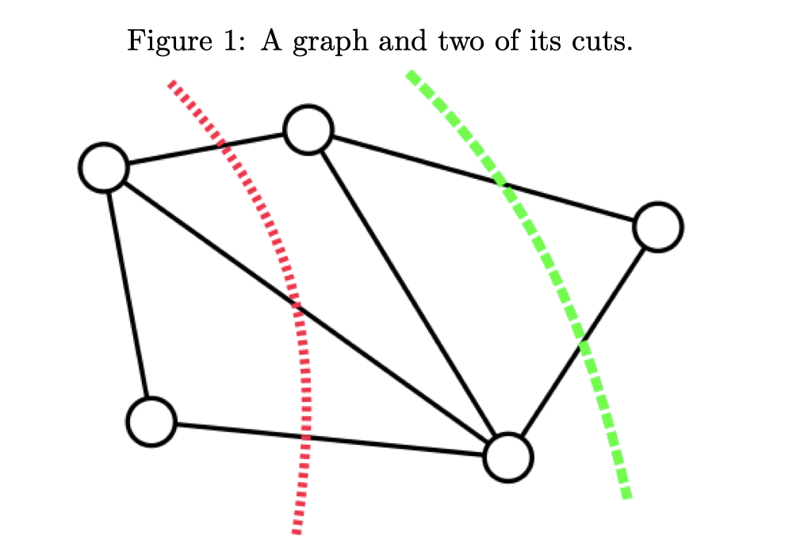
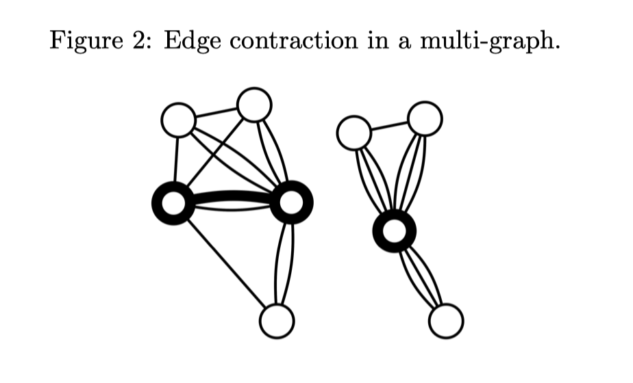
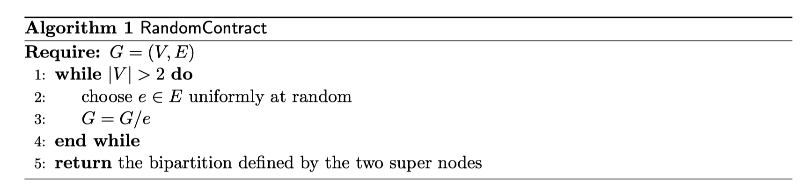
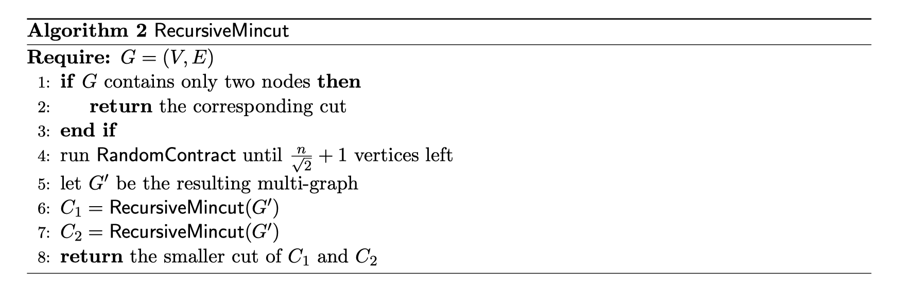
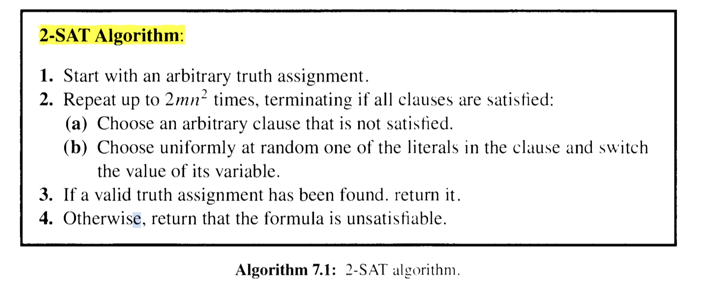
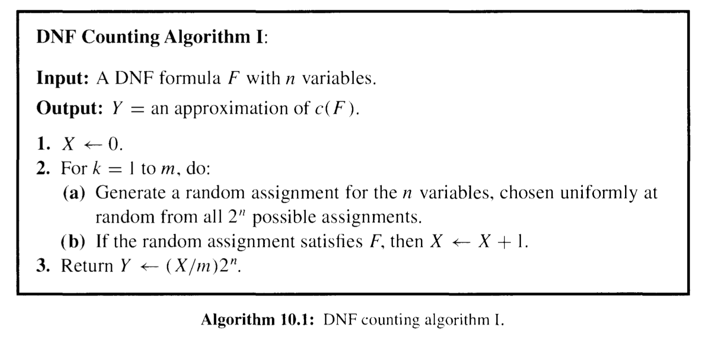
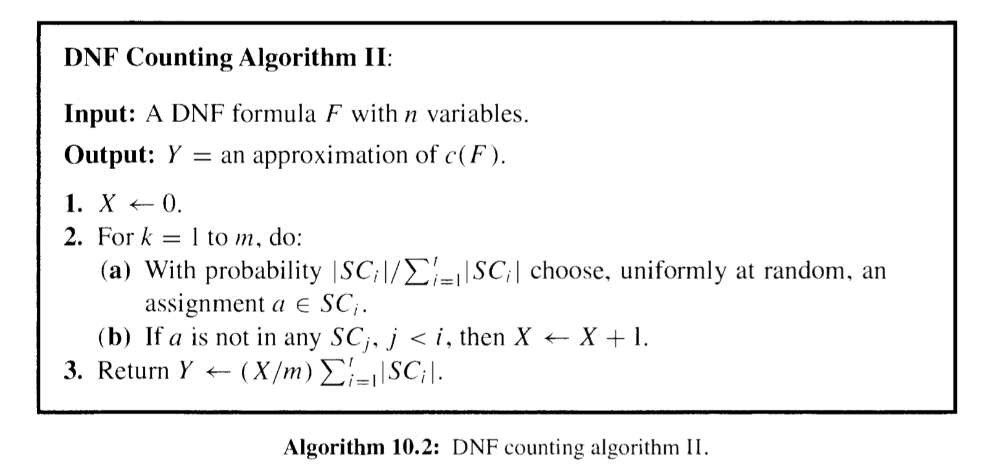

## 相关定理

**Theorem 3.1** [Markov's Inequality]: Let $X$ be a random variable that assumes only nonnegative values. Then, for all $a>0$,
$$
\operatorname{Pr}(X \geq a) \leq \frac{\mathbf{E}[X]}{a}
$$
**Theorem 4.5** (泊松实验得到期望的概率): Let $X_{1}, \ldots, X_{n}$ be independent Poisson trials such that $\operatorname{Pr}\left(X_{i}\right)=p_{i}$. Let $X=\sum_{i=1}^{n} X_{i}$ and $\mu=\mathbf{E}[X]$. Then, for $0<\delta<1$ :
$$
\begin{gathered}
\operatorname{Pr}(X \leq(1-\delta) \mu) \leq\left(\frac{\mathrm{e}^{-\delta}}{(1-\delta)^{(1-\delta)}}\right)^{\mu}
\end{gathered} \tag{4.4}
$$
$$
\begin{gathered}
\operatorname{Pr}(X \leq(1-\delta) \mu) \leq \mathrm{e}^{-\mu \delta^{2} / 2}
\end{gathered} \tag{4.5}
$$

Again, the bound of Eqn. (4.4) is stronger than Eqn. (4.5). but the latter is generally easier to use and sufficient in most applications.

**Corollary 4.6**: Let $X_{1}, \ldots, X_{n}$ be independent Poisson trials such that $\operatorname{Pr}\left(X_{i}\right)=p_{i}$. Let $X=\sum_{i=1}^{n} X_{i}$ and $\mu=\mathbf{E}[X] .$ For $0<\delta<1$,
$$
\operatorname{Pr}(|X-\mu| \geq \delta \mu) \leq 2 \mathrm{e}^{-\mu \delta^{2} / 3} . \tag{4.6}
$$
In practice we often do not have the exact value of $\mathbf{E}[X]$. Instead we can use $\mu \geq \mathbf{E}[X]$ in Theorem $4.4$ and $\mu \leq \mathbf{E}[X]$ in Theorem $4.5$ (see Exercise 4.7).

## MinCut (Minimum Cut)

参见 [here](https://cfonheart.github.io/2017/09/08/%E9%AB%98%E7%BA%A7%E7%AE%97%E6%B3%95%E4%B9%8BMin-Cut%E9%97%AE%E9%A2%98%E6%B1%82%E8%A7%A3/)

问题定义: 求一个无向图的最小割 (代价为边的数量).

遍历的复杂度为边的exp级别

### Karger’s Algorithm

- Edge Contraction 边收缩

去掉一条边, 两个节点合一, 两点相连边之外的其他边保持不变

- Random Contraction Algorithm

每次都随机 contract 一条边, 直到只剩下两个节点 (每次点数-1, 因此会迭代 n-2 次).

- Karger–Stein Algorithm

## 2-SAT (CNF conductive normal form)

- 《Probability and Computing》ch.7

The general SAT problem is NP-hard. We analyze here a simple randomized algorithm for 2-SAT, a restricted case of the problem that is solvable in polynomial time. 来个例子:
$$
\left(x_{1} \vee \overline{x_{2}}\right) \wedge\left(\overline{x_{1}} \vee \overline{x_{3}}\right) \wedge\left(x_{1} \vee x_{2}\right) \wedge\left(x_{4} \vee \overline{x_{3}}\right) \wedge\left(x_{4} \vee \overline{x_{1}}\right) \tag{7.2}
$$
需要满足一组 clause (与), 每一个条件是两个元素的或 —— 因此假如一个 clause 不满足, flip 其一一定会让该 clause 满足.

下面来算

the probability that we decrease the number of matches is at most $1 / 2 .$ Hence, for $1 \leq$ $i \leq n-1$,
$$
\begin{aligned}
&\operatorname{Pr}\left(X_{i+1}=j+1 \mid X_{i}=j\right) \geq 1 / 2 \\
&\operatorname{Pr}\left(X_{i+1}=j-1 \mid X_{i}=j\right) \leq 1 / 2
\end{aligned}
$$
The stochastic process $X_{0}, X_{1}, X_{2}, \ldots$ is not necessarily a Markov chain,  因为X增大的概率取决于当前步时, 不符合的clause和预期的S是相差一个还是两个, 因此和过去相关.  考虑一个更坏的情况/下届 (Markov) $Y_{0}, Y_{1}, Y_{2}, \ldots$ :
$$
\begin{gathered}
Y_{0} =X_{0}; \\
\operatorname{Pr}\left(Y_{i+1}=1 \mid Y_{i}=0\right)=1 ; \\
\operatorname{Pr}\left(Y_{i+1}=j+1 \mid Y_{i}=j\right)=1 / 2 ; \\
\operatorname{Pr}\left(Y_{i+1}=j-1 \mid Y_{i}=j\right)=1 / 2 .
\end{gathered}
$$
再定义 $h_i$ 为从匹配i个的状态出发, 到达S所需步数的期望. 易知 $h_{n}=0$ and $h_{0}=h_{1}+1$ 并且 $h_{j}=\frac{h_{j-1}}{2}+\frac{h_{j+1}}{2}+1, \quad 1 \leq j \leq n-1$; 观察, 可知对于 $0 \le i \le n-1$ 均有 $h_{j}=h_{j+1}+2 j+1$, 因此最坏情况下 (初始和S没有匹配) 有
$$
h_{0}=h_{1}+1=h_{2}+1+3=\cdots=\sum_{i=0}^{n-1} 2 i+1=n^{2}
$$
也即, 在最坏情况下, 我们期望经过 $n^2$ 步得到正确答案.

最终, 我们可能得到以下定理

**Theorem 7.2**: The 2-SAT algorithm always returns a correct answer if the formula is unsatisfiable. If the formula is satisfiable, then with probability at least $1-2^{-m}$ the clgorithm returns a satisfying assignment. Otherwise, it incorrectly returns that the formula is unsatisfiable.

第一点显然. 下面计算当该问题可行时, 上述算法错误返回 false 的概率. 我们总共运行 $2mnn$ 次, 将其按照长度 $2nn$ 划分. 由于最坏情况下, 期望 $h_0=n^2$, 利用 Markov's inequality ($\mathrm{P}(X \geq a) \leq \frac{\mathrm{E}(X)}{a}$), 有经过 $2nn$  次没有得到正确答案的概率为 $\operatorname{Pr}\left(Z>2 n^{2}\right) \leq \frac{n^{2}}{2 n^{2}}=\frac{1}{2}$, 因此, 重复 m 次都没有得到正确答案的概率为 $2^{-m}$.

## The Monte Carlo Method

**Theorem 10.1**: Let $X_{1}, \ldots, X_{m}$ be independent and identically distributed indicator random variables, with $\mu=\mathbf{E}\left[X_{i}\right]$. If $m \geq(3 \ln (2 / \delta)) / \varepsilon^{2} \mu$, then
$$
\operatorname{Pr}\left(\left|\frac{1}{m} \sum_{i=1}^{m} X_{i}-\mu\right| \geq \varepsilon \mu\right) \leq \delta .
$$
That is, $m$ samples provide an $(\varepsilon, \delta)$-approximation for $\mu$.

### 一个例子: 用MC估计 $\pi$

- Ch10.1

在XY轴 [-1,1] 上随机取值, 记事件 $Z$ 为点落在原点为圆心的圆中 (可知概率为 $\pi / 4$). 重复 $m$ 次, 记 $W=\sum_{i=1}^{m} Z_{i}$, t则有
$$
\mathbf{E}[W]=\mathbf{E}\left[\sum_{i=1}^{m} Z_{i}\right]=\sum_{i=1}^{m} \mathbf{E}\left[Z_{i}\right]=\frac{m T}{4} .
$$
因此可以用 $W^{\prime}=(4 / m) W$ i来估计 $\pi$. Applying the Chernoff bound of Eqn. (4.6), we compute
$$
\operatorname{Pr}(|X-\mu| \geq \delta \mu) \leq 2 \mathrm{e}^{-\mu \delta^{2} / 3} \tag{4.6}
$$

$$
\begin{aligned}
\operatorname{Pr}\left(\left|W^{\prime}-\pi\right| \geq \varepsilon \pi\right) &=\operatorname{Pr}\left(\left|W-\frac{m \pi}{4}\right| \geq \frac{\varepsilon m \pi}{4}\right) \\
&=\operatorname{Pr}\left(|W-\mathbf{E}[W]| \geq \varepsilon \mathbf{E}\left[W^{\prime}\right]\right) \\
& \leq 2 \mathrm{e}^{-m \pi \varepsilon^{2} / 12}
\end{aligned}
$$

### Application: The DNF Counting Problenl

- 10.2

问题定义: 分离 **disjunctive normal form (DNF)**.
$$
\left(x_{1} \wedge \overline{x_{2}} \wedge x_{3}\right) \vee\left(x_{2} \wedge x_{4}\right) \vee\left(\overline{x_{1}} \wedge x_2 \wedge x_{3}\right)
$$
DNT 计数一定比上面的 SAT 问题 (也叫 CNF, conductive normal form) 更难: 因为一个DNF取反就是一个SAT问题, 因此只要 $\text{\#DNF} < n$ SAT 就可解.

下面是一个 naive 的解法 (类似上面估计圆周率的例子)

下面来改进采样策略:假设我们需要满足的条件组是 $F=C_{1} \vee C_{2} \vee \cdots \vee C_{1}$, 易知对于 clause $C_{i}$ has $\ell_{i}$ literals, 它包括的元素的取值固定了, 因此共有 $2^{n-\ell_{i}}$ 个解. 我们定义 $U=\left\{(i , a) \mid  l \leq i \leq t  \quad \text{and}\quad a \in S C_{i}\right\}$ 就是前面加了一个 index; 因此计数不变 $\sum_{i=1}^{t}\left|S C_{i}\right|=|U|$. 而我们真正要求的是 SC的交集 $c(F)=\left|\bigcup_{i=1}^{t} S C_{i}\right|$, 为此, 我们定义一个新的集合
$$
S=\left\{(i, a) \mid 1 \leq i \leq t, a \in S C_{i}, a \notin S C_{j} \text { for } j<i\right\}
$$
也即, 给所有的SC定义指标 (顺序), 对于满足 $SC_i$ 的解中, 只保留前面约束都不满足的例子, 这样, S集合的大小就是 $c(F)$. 由于 U集合的大小是可以计算的, 为了求 DNF计数 (S集合大小), 我们只需要计算它们的比值, MC模拟. 具体算法如下

**Theorem 10.2**: DNF counting algorithm II is a fully polynomial randomized approximation scheme $(F P R A S)$ for the DNF counting problem when $m=\left\lceil\left(3 t / \varepsilon^{2}\right) \ln (2 / \delta)\right\rceil$.

利用到式 (4.6) 或定理 (10.1).

## approximation Algorithm

### min vertex cover 边覆盖

- min vertex cover 问题: $G=(V,E)$, $s \subset V$ is **VC** if $\forall (u,v) \in E, |\{u,v\} \cup S| \ge 1$. 也即要求找到一个点集, 使其能够覆盖所有的边 (边的一个点在点集S中即可).
- 可以证明, 该问题为 NP

目标: 设计一个算法 A, $A(G) \to S$, 要求 该算法是 $\alpha\text{-Approx}$ 的, 也即 $\frac{S}{OP}\le \alpha$

- 一种 Greedy 算法: 每次选择degree的点. 可以证明这一算法是 $\log n\text{-Approx}$ 的.
- 构造一个反例: 有一个长度为k的点集L, 然后构造一组点集 $R_i$, 使得 $R_i$ 中得点都只和L中的点相连, 度数为i, 并且任意两个点不会连相同的一个L中的点 (因此L中点的度数最多为k).
  - 这样, 用 Greedy 方法每次会选择 $R_k, R_{k-1},...$, 而最优解是点集L
  - 构造的$R_i$点的总数为 $\sum_{i=1}^k int(k/i) \approx O(k\log k)$

下面介绍一种 $2\text{-approx}$ 的算法.

- 算法: 每次选择一条边, 然后将两个点从图中删去.
- 可以证明, 若选出来的点大小为 $|S|=2t$, 则VC问题的最优解至少是t —— 因为我们已经找到t组没有共享点的边了.

### Max-SAT

