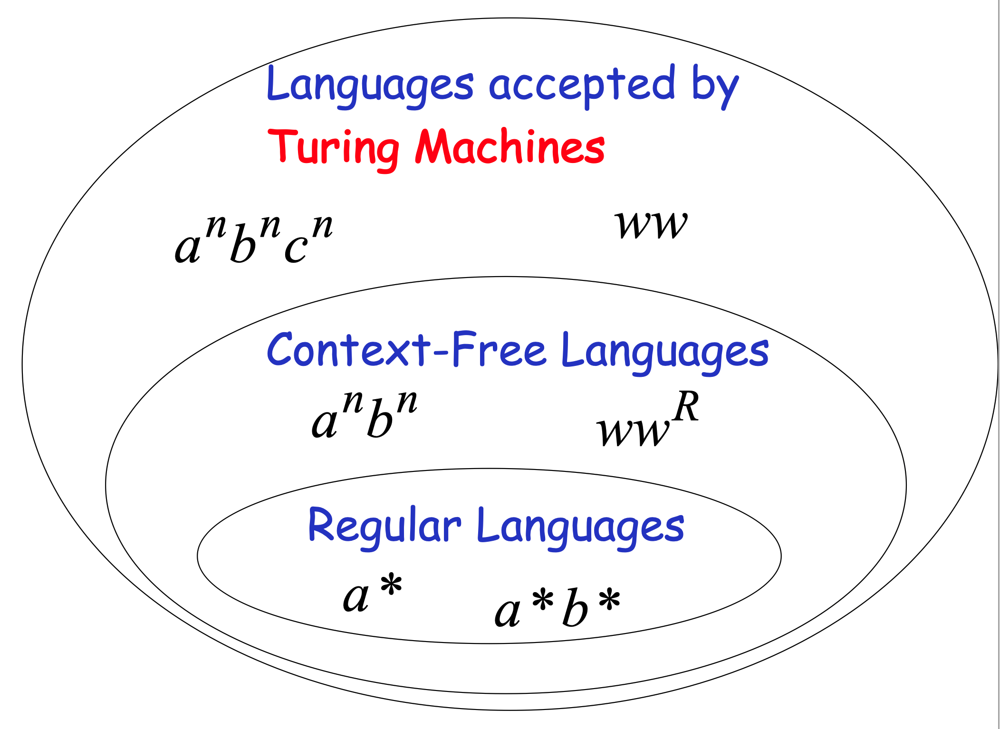
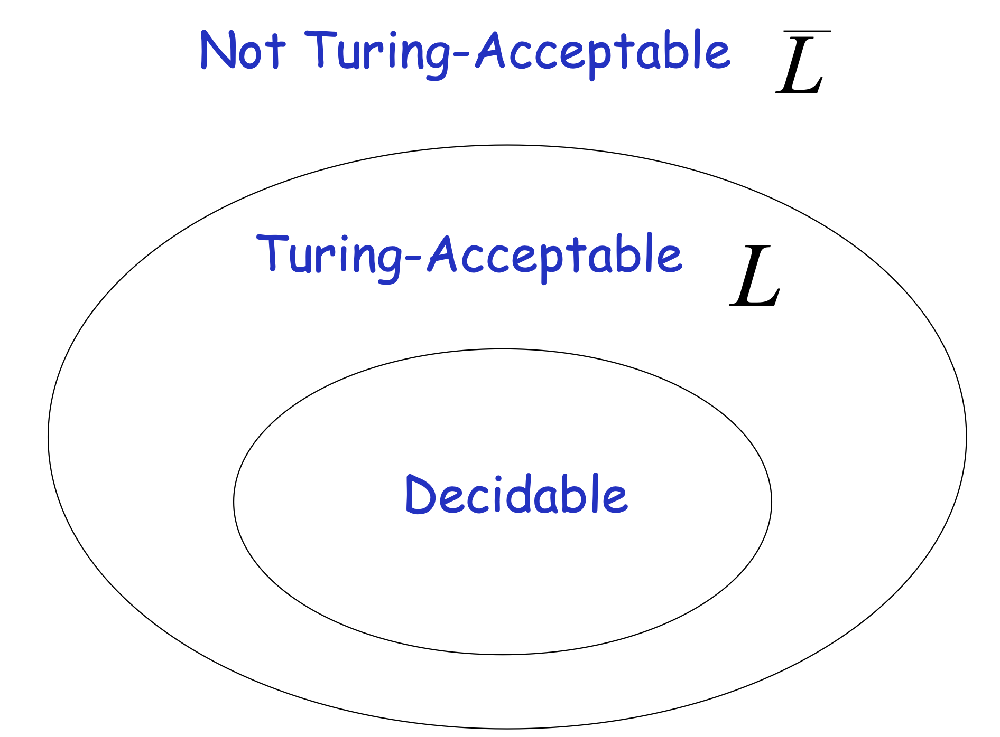
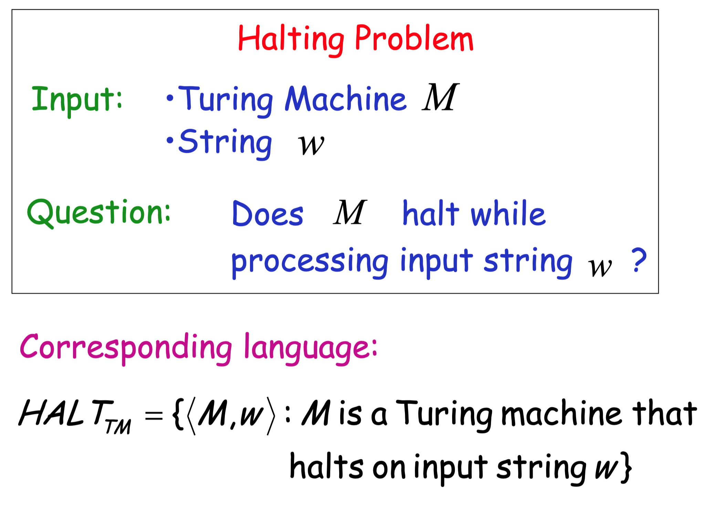
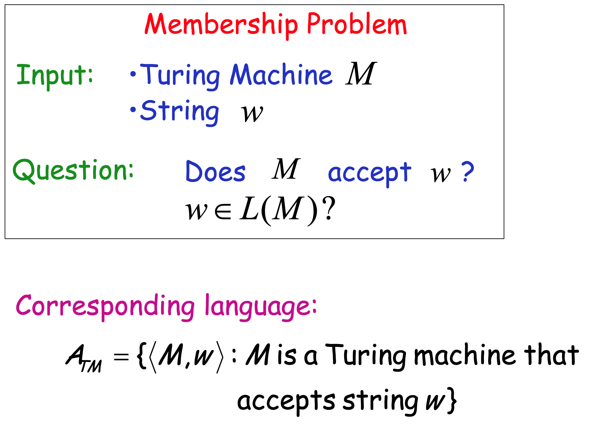
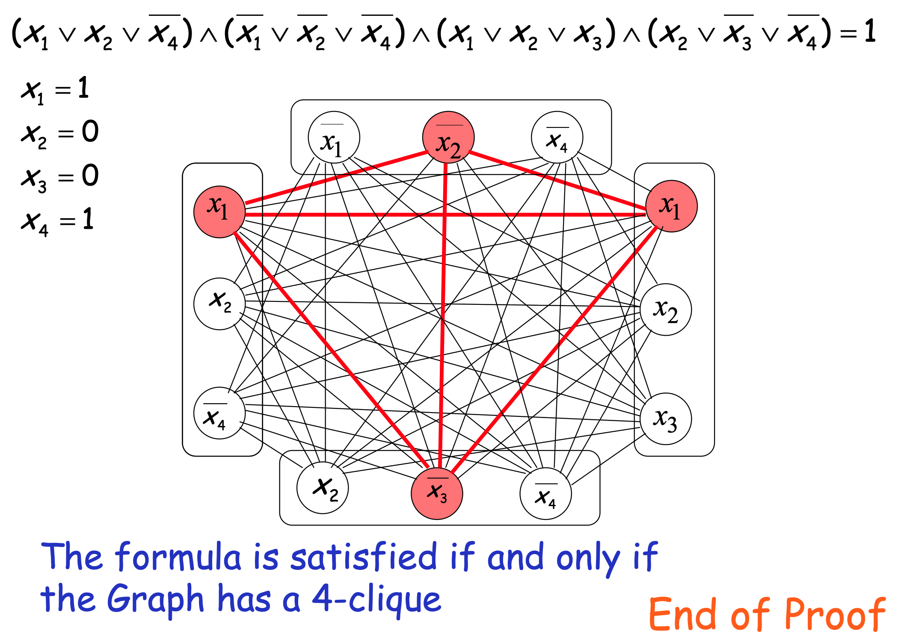
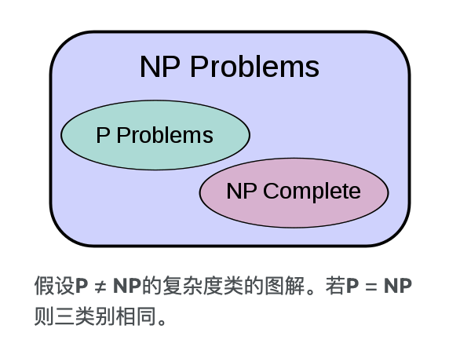
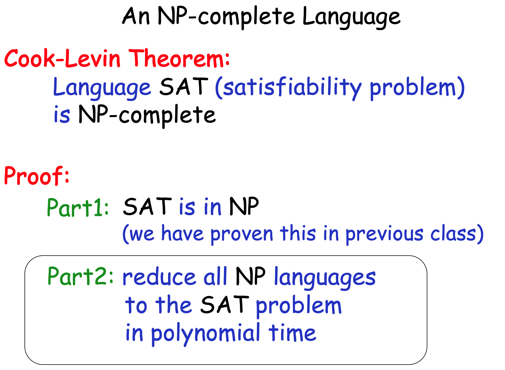
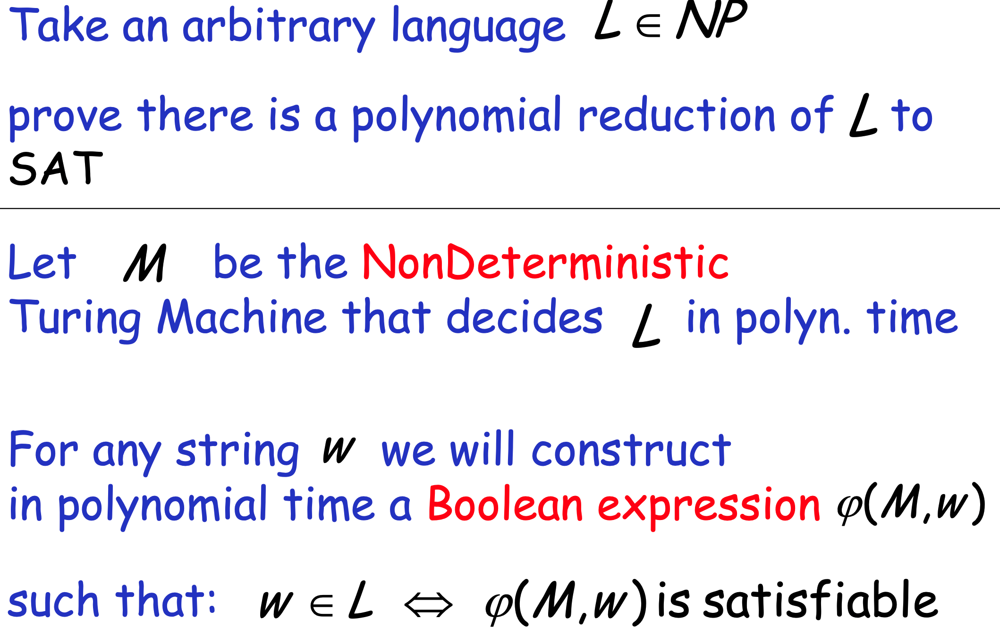

计算理论 (以下大纲 from MIT 6.045)

1. Finite Automata: Simple Models

DFAs, NFAs, regular languages, regular expressions, proving no DFA exists (non-regular languages), Myhill-Nerode Theorem, computing the minimum DFA, streaming algorithms, communication complexity

2. Computability Theory: Powerful Models

Turing Machines, Universal Models and the Church-Turing Thesis, decidable/recognizable languages, undecidability, reductions and oracles, Rice’s theorem, Kolmogorov Complexity, even the foundations of mathematics (what can and can’t be proved)…

3. Complexity Theory: Time and Space Bounded Models

time complexity, classes P and NP, NP-completeness, polynomial time with oracles, space complexity, PSPACE, PSPACE-completeness, randomized complexity theory, other topics TBA

reference:

- cources: [MIT 6.045](https://people.csail.mit.edu/rrw/6.045-2020/) Automata, Computability, and Complexity Theory.
- book [Introduction To The Theory Of Computation, Michael Sipser](https://fuuu.be/polytech/INFOF408/Introduction-To-The-Theory-Of-Computation-Michael-Sipser.pdf)
- 关联: 编译原理

wiki

- [确定有限状态自动机 DFA](https://zh.wikipedia.org/zh-hans/%E7%A1%AE%E5%AE%9A%E6%9C%89%E9%99%90%E7%8A%B6%E6%80%81%E8%87%AA%E5%8A%A8%E6%9C%BA)
- [图灵机](https://zh.wikipedia.org/wiki/%E5%9B%BE%E7%81%B5%E6%9C%BA)
- [递归可枚举语言/图灵可识别](https://zh.wikipedia.org/wiki/%E9%80%92%E5%BD%92%E5%8F%AF%E6%9E%9A%E4%B8%BE%E8%AF%AD%E8%A8%80)
- [NP完全](https://zh.wikipedia.org/zh-cn/NP%E5%AE%8C%E5%85%A8)

---

outline

- (确定) 有限状态自动机 DFA; Language;
- 图灵机 (无限的纸带, 可读写); 因此是算法;
    - 注意, 图灵机支持 accept 无限长的输入 (例如 `{a}*` 类的输入)
    - 
- 通用图灵机 (将描述固定规则的图灵机进行编码存储); Language of Turing Machines
    - 有理论: The set of all Turing Machines is countable (引入可数, 以及一个语言的 enumerator 的概念)
    - 注意到, 在给定Alphabet的情况下所有可能的字符串是无限可数的, 而Languages则对应了这一无限集合中的一个子集 (对应了一个[可识别该语言的图灵机](https://zh.wikipedia.org/wiki/%E9%80%92%E5%BD%92%E5%8F%AF%E6%9E%9A%E4%B8%BE%E8%AF%AD%E8%A8%80)). 然而, 我们知道无限可数集合的超集是不可数的, 因此存在图灵不可识别的语言. (图灵可识别的语言称为 Turing-Acceptable / Turing-Recognizable / Recursively-enumerable)
- 递归语言
    - (decidable / recursive) 注意到, **Turing-Acceptable** 只需要 A language L is Turing-Acceptable if there is a Turing machine M that accepts L; 而可判定 **Turing-Decidable** 增加了对于所有的输入都会终止之一条件, A language L is decidable if there is a Turing machine (decider) which accepts L and halts on every input string, 也即不会出现死循环.
    - 根据定义: Every decidable language is Turing-Acceptable
    - 总结一下: 图灵可判定蕴含了该语言是图灵可识别的, 并且存在图灵不可识别的语言, 如下图. 然后构造了一个语言 L证明其补为图灵不可识别的, 并且由于「可判定则其补也可判定」的结论, 进一步说明 **存在 acceptable 但是非 decidable 的语言** (构造方式类似证明实数不可数).
    - 
    - Turing acceptable languages and Enumerators: 有两个结论
        - 首先, 正式定义 enumerator 迭代器为: S 为某一语言 (a set of strings), 则 An enumerator for S is a Turing Machine that generates (prints on tape) all the strings of one by one and each string is generated in finite time. (重点其实在第二点, 因为 Acceptable 的图灵机可能陷入无限循环)
        - (weak result) If a language is decidable then there is an enumerator for it
        - (strong result) **A language is Turing-acceptable if and only if there is an enumerator for it.** 这里的证明用了一种策略, 使其可以依次生成所有无限序列的每一位, 从而「避免」了因为死循环儿无法输出下一个序列.
    - **Undecidable Problems** (unsolvable problems)
        - 通过图灵机给出问题 decidable/solvable 的定义: A computational problem is decidable if the corresponding language is decidable.
        - 给出两个 unsolvable 的问题: Membership problem 和 **Halting problem**
        - 著名的停机问题: 我们无法判断一个图灵机对于某一输入是否可以停机 (还是陷入死循环).
            - 两种证明思路: 1. 反证法, 即假设该问题是 decidable 的, 那么我们可以利用此图灵机, 将所有的 acceptable 变为 decidable, 即两者等价, 矛盾. 2. 构造反例, 见 [知乎的讨论](https://www.zhihu.com/question/20081359), 给出的 [这个链接](https://blog.csdn.net/pongba/article/details/1336028) 恨数学.
            - 
        - 类似的成员问题: 无法判断图灵机是否接受一个输入.
            - 证明思路是类似的: 反证法, 加入有这样的一个机器, 我们可以利用它来避免死循环, 从而出现 `decidable = acceptable` 的悖论.
            - 
- 时间复杂度
    - The Time Complexity Class $P$
        - $P=\bigcup_{k>0} \operatorname{TIME}\left(n^{k}\right)$
        - 表示多项式时间的算法 polynomial time algorithms, 这类问题是 “tractable” problems
    - Exponential time algorithms: $\operatorname{TIME}\left(2^{n^{k}}\right)$
        - 指数时间复杂度, Represent intractable algorithms
        - 一些指数时间复杂度的问题
            - the `Hamiltonian Path Problem` 找到有向图上s到t的一条哈密顿路径
            - The `clique problem` 查找图上是否存在大小为 k 的 clique
            - The `Satisfiability Problem` 即问 Boolean expressions in Conjunctive Normal Form 是否存在解. 形如 $\left(\bar{x}_{1} \vee x_{2}\right) \wedge\left(x_{1} \vee x_{3}\right)$ 的一组clause的并, 每个clause是一组变量的或.
    - 相较于确定性的算法, 我们可以引入不确定性. 也即非确定图灵机. 对应的, 我们用 NTIME(T(n)) 描述其时间复杂度.
        - Non-Deterministic Polynomial time algorithms: $L \in NTIME\left(n^{k}\right)$
        - The class $NP$: $N P=\bigcup_{k>0} N \operatorname{NIME}\left(n^{k}\right)$. 也即大名鼎鼎的 **Non-Deterministic Polynomial time**. (可理解为, 我们没有找到一个多项式的解法.) 一个例子: 对于SAT问题, 我们对尝试对于变量赋值(随机性), 然后检测是否符合.
    - 注意到, 我们有 $P \subseteq N P$ . 也即 Deterministic Polynomial 被 Non-Deterministic Polynomial 包含.
    - NP-complete Languages
        - 引入 归约/reducible 的概念: Polynomial Time Reductions. 首先, 对于一个函数 $f$, 假如能找到一个 deterministic Turing machine M, 对于任意的输入 w, 可以在 $O(|w|^k)$​ 的时间内得到答案, 则称该函数为多项式可计算的 (**Polynomial Computable function**). 直观理解, 该函数是确定的并且复杂度不高. 在此基础上引入归约的定义:
        - Language A is **polynomial time reducible** to language B if there is a polynomial computable function f such that: $w \in A \Leftrightarrow f(w) \in B$ . 简言之, 两个问题之间可以在多项式时间内转化.
        - 在此基础上, 有一个显然的定理: Suppose that $A$ is polynomial reducible to $B$. If $B \in P$ then $A \in P$.
        - 给出一个多项时间内归约的例子: 将 `3CNF-satisfiability` 问题转化为 `CLIQUE` problem.
            - 转化过程如下: 由于每一个clause是或, 只需要一个元素满足即可. 将一个元素 $x_i$ 与其他clause中除 $\bar{x_i}$ 之外的元素相连, 这样相连节点之前和不冲突的. 这样, 问题就转化为一个求clique的问题.
            - 
        - 进一步定义 NP-Complete: A language L is NP-complete if: 1) L is in NP, and 2) Every language in NP is reduced to L in polynomial time.
            - 理解: NP-Complete 是 NP 问题中相对较难的一类问题.
            - 注意到: If a NP-complete language is proven to be in P then: $P = NP$!
        - 理解三类的关系
            - 
    - 给出一个NPC的例子: SAT问题
        - 注意下面就给了思路, 具体的证明是 [Cook Levin theo](https://en.wikipedia.org/wiki/Cook%E2%80%93Levin_theorem).
        - 
        - 
    - 类似P问题中的结论, 我们有定理: If: Language A is NP-complete Language B is in NP A is polynomial time reducible to B. Then: B is NP-complete. 也即, **为了证明一个问题为NPC, 只需要将其转化为一个已知的NPC问题**.
- More NP-complete Problems: `Vertex-Cover` and `Hamiltonian-Path`
    - Vertex Cover
        - 定义顶点覆盖 Vertex Cover 问题: 图上的一组大小为 k的节点, 这些节点相连的边覆盖了图上所有的边.
        - 证明思路: 1) NP的证明显然; 2) 我们在多项式时间内做归约 `3CNF-SAT` to VERTEX-COVER
    - `Directed HAMILTONIAN-CYCLE`
        - 定义: 在一个有向图上, 找到一个环, 能否访问所有节点一次.
        - 证明: 也是将 `3CNF-SAT` to D. HAMILTONIAN-CLCLE
    - `Subset Sum` 子集和
        - 给定一个数组, 判断其是否存在子集使得和为给定的 k.
    - 更多NPC问题: `Independent Set` (找到图上大小为k的子集, 使其互不相连); `(undirected) HAMILTONIAN Cycle`; `KNAPSACK` 背包问题, 有一组物品, 每个物品有重量u和价值v, 要求是否有子集使得 $\sum_{i \in S} u_{i} \leq U, \quad \sum_{i \in S} v_{i} \geq V$.
