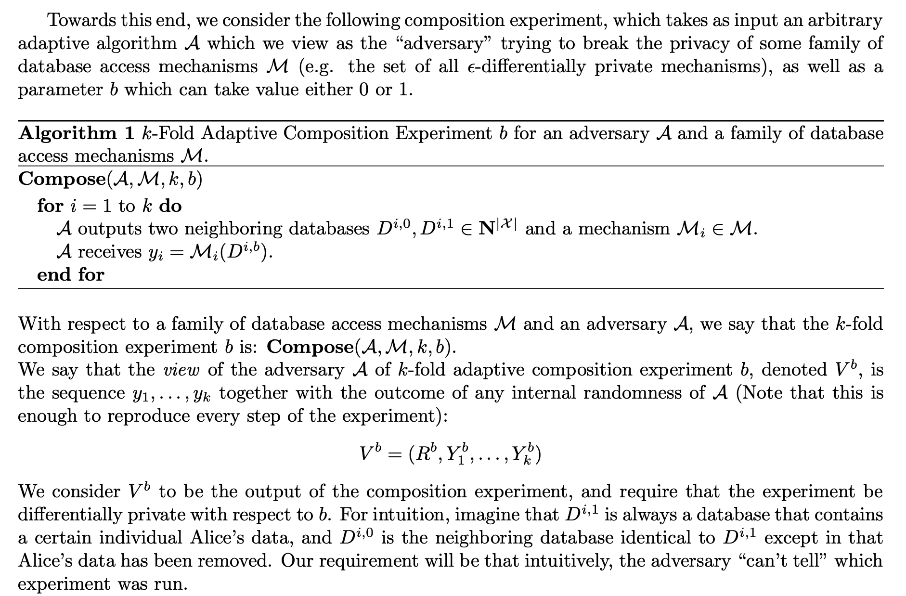

- 知乎 卡兵 | [差分隐私合集](https://www.zhihu.com/column/c_1293586488769040384)

wiki

- [Differential privacy](https://en.wikipedia.org/wiki/Differential_privacy)

## 概念与定义

Differential privacy is a **definition** (i.e., standard) of privacy

It expresses a specific desiderata of an analysis: **Any information-related risk to a person should not change significantly as a result of that person’s information being included, or not, in the analysis**. 也即, 无法基于所给的统计数据, 判断出一个人是否出现在该数据中.

### differential privacy 定义

[DWORK MCSHERRY NISSIM SMITH ’06, ‘16]

A (randomized) algorithm $M: X^{n} \rightarrow T$ satisfies **$\epsilon$-differential privacy** if $\forall x, x^{\prime} \in X^{n}$ that differ on one entry,
$$
M(x) \approx_{\epsilon} M\left(x^{\prime}\right)
$$
也即, differential privacy 是针对算法而言的. 对于任意编辑距离为一的两组数据, 算法给出的值在 $\epsilon$ 范围内接近.

如何度量相似性? $\forall S$ subset of the outcome space $T$,
$$
\underset{M}{\operatorname{Pr}}[M(x) \in S] \leq e^{\epsilon} \underset{M}{\operatorname{Pr}}\left[M\left(x^{\prime}\right) \in S\right]
$$
除了原本的 $\epsilon$ -differential privacy 的定义之外, 还有松弛版本 **$(\epsilon, \delta)$ -differential privacy**, 定义为
$$
\underset{M}{\operatorname{Pr}}[M(x) \in S] \leq e^{\epsilon} \underset{M}{\operatorname{Pr}}\left[M\left(x^{\prime}\right) \in S\right]+\delta
$$
这里指数项 $\epsilon$ 衡量了 ‘leakage’ or ‘harm’, 数量级在 $1/100, 1/10$ 左右, 而 $0 \leq \delta \ll \frac{1}{n}$ (often, cryptographically small)

#### 定义理解

- 对于一个特定的数据集合S而言, 我们希望在引入噪声之后, 尽量不改变原随机变量的分布. 因此, 衡量的是距离, 采用 KL-Divergence $D(Y \| Z)=\mathbb{E}_{y \sim Y}\left[\ln \frac{\operatorname{Pr}[Y=y]}{\operatorname{Pr}[Z=y]}\right]$.
- 我们不关心期望水平, 而关注在取到某一值情况下的改变有多少, 因此用 MAX-Divergence. 因此, 转化为如下的需求:
    - $D_{\infty}(Y \| Z)=\max_{S \subset S u p p(Y)}\left[\ln \frac{\operatorname{Pr}[Y \in S]}{\operatorname{Pr}[Z \in S]}\right]=\max _{y \in Y}\left[\ln \frac{\operatorname{Pr}[Y=y]}{\operatorname{Pr}[Z=y]}\right] \leq \varepsilon$.
    - 注意这里的S是某一数据集, 而y是特定的数据. 而最后的不等式是我们希望这一差异的阈值. 此式即为我们上面的差分隐私定义.

## 数学: 瑞丽熵和Renyi Divergence

参见 [Rényi entropy](https://en.wikipedia.org/wiki/R%C3%A9nyi_entropy) 和 [博文](https://zhuanlan.zhihu.com/p/140945752). 对于上面的式子进行了说明.

## 机制 differentially private mechanisms

首先定义 **Sensitivity** 敏感度: 表示对于任意编辑距离为1的数据集, 它们的查询结果的最大差值.
$$
\Delta f=\max _{D, D^{\prime}}\left\|f(D)-f\left(D^{\prime}\right)\right\|_{1}
$$
注意这里用了L1范数 (匹配Laplace机制), 但是距离的定义可以是其他的, 例如 L2范数可以对应高斯机制.

参见

- [Differential privacy](https://en.wikipedia.org/wiki/Differential_privacy)
    - [Additive noise mechanisms](https://en.wikipedia.org/wiki/Additive_noise_mechanisms); [Exponential mechanism](https://en.wikipedia.org/wiki/Exponential_mechanism_(differential_privacy))

### The Laplace mechanism

所谓的 Laplace 机制, 就是在数值结果的基础上加一个 Laplace 噪声项 (因此属于 Additive noise mechanisms)
$$
\mathcal{M}_{\mathrm{Lap}}(x, f, \epsilon)=f(x)+\operatorname{Lap}\left(\mu=0, b=\frac{\Delta f}{\epsilon}\right)
$$
注意到噪声项的方差为 敏感度/误差阈值. 证明如下: 这里的第一个不等式用了三角不等式; 第二个则是敏感度的定义.
$$
\begin{aligned}
\frac{\operatorname{Pr}\left(\mathcal{M}_{\text {Lap }}(x, f, \epsilon)=z\right)}{\operatorname{Pr}\left(\mathcal{M}_{\text {Lap }}(y, f, \epsilon)=z\right)} &=\frac{\operatorname{Pr}\left(f(x)+\operatorname{Lap}\left(0, \frac{\Delta f}{\epsilon}\right)=z\right)}{\operatorname{Pr}\left(f(y)+\operatorname{Lap}\left(0, \frac{\Delta f}{\epsilon}\right)=z\right)} \\
&=\frac{\operatorname{Pr}\left(\operatorname{Lap}\left(0, \frac{\Delta f}{\epsilon}\right)=z-f(x)\right)}{\operatorname{Pr}\left(\operatorname{Lap}\left(0, \frac{\Delta f}{\epsilon}\right)=z-f(y)\right)} \\
&=\frac{\frac{1}{2 b} \exp \left(-\frac{|z-f(x)|}{b}\right)}{\frac{1}{2 b} \exp \left(-\frac{|z-f(y)|}{b}\right)} \\
&=\exp \left(\frac{|z-f(y)|-|z-f(x)|}{b}\right) \\
& \leq \exp \left(\frac{|f(y)-f(x)|}{b}\right) \\
& \leq \exp \left(\frac{\Delta f}{b}\right)=\exp (\epsilon)
\end{aligned}
$$
另外, 查询的结果也不一定是scale, 可以是向量, 此时误差项为多个独立的Laplace噪声, 距离度量为1范数.

### Gaussian Mechanism

- 注意, 用Laplace机制对应了严格的DP, 而这里对应的是  $(\epsilon, \delta)$-differential privacy.
    - 另外, 这里的隐私预算需要满足 $\epsilon < 1$
- 另外, 下面高斯误差的方差项只要取任意比该方差项更大的值即可. (若更小的话概率过于集中)
    - 相较于Laplace机制中的误差方差 $\Delta ^2f / \epsilon^2$, 这里的方差更大, 体现出了松弛项的作用.

$$
\mathcal{M}_{\text {Gauss }}(x, f, \epsilon, \delta)=f(x)+\mathcal{N}\left(\mu=0, \sigma^{2}=\frac{2 \ln (1.25 / \delta) \cdot(\Delta f)^{2}}{\epsilon^{2}}\right)
$$
provides $(\epsilon, \delta)$-differential privacy.

具体的证明比较长, 见书Appendix.A. 大体如下:

注意到松弛DP的意义: 是希望不满足DP的概率要小于 $\delta$, 也即 privacy loss bounded by $\varepsilon$ with probability at least $1-\delta$ ; 因此, 是希望 $\operatorname{Pr}\left[|x| \geq \sigma^{2} \varepsilon / \Delta f-\Delta f / 2\right]<\delta$. 最后算出来的方差形式正如上. 然后, 对于任意的查询集合S, 我们利用这里定义出来的边界, 可以将其分为两部分. 长尾部分的S2的概率不会超过错误率阈值 $\delta$, 而中间部分S1符合严格DP定义.

Let us parition $\mathbb{R}$ as $\mathbb{R}=R_{1} \cup R_{2}$, where $R_{1}=\{x \in \mathbb{R}:|x| \leq$ $c \Delta f / \varepsilon\}$ and $R_{2}=\{x \in \mathbb{R}:|x|>c \Delta f / \varepsilon\} .$ Fix any subset $S \subseteq \mathbb{R}$, and define
$$
\begin{aligned}
&S_{1}=\left\{f(x)+x \mid x \in R_{1}\right\} \\
&S_{2}=\left\{f(x)+x \mid x \in R_{2}\right\} .
\end{aligned}
$$
We have
$$
\begin{aligned}
\operatorname{Pr}_{x \sim \mathcal{N}\left(0, \sigma^{2}\right)}[f(x)+x \in S]=& \operatorname{Pr}_{x \sim \mathcal{N}\left(0, \sigma^{2}\right)}\left[f(x)+x \in S_{1}\right] \\
&+\operatorname{Pr}_{x \sim \mathcal{N}\left(0, \sigma^{2}\right)}\left[f(x)+x \in S_{2}\right] \\
\leq & \operatorname{Pr}_{x \sim \mathcal{N}\left(0, \sigma^{2}\right)}\left[f(x)+x \in S_{1}\right]+\delta \\
\leq & e^{\varepsilon}\left(\operatorname{Pr}_{x \sim \mathcal{N}\left(0, \sigma^{2}\right)}\left[f(y)+x \in S_{1}\right]\right)+\delta
\end{aligned}
$$
yielding $(\varepsilon, \delta)$-differential privacy for the Gaussian mechanism in one dimension.

### Exponential mechanism

相较于前两种机制仅能用在连续的查询结果上, 这里对于DP的可用范围进行拓展 (输出为离散).

- 在离散情况下, 我们不能把噪声加载结果上, 怎么办? 显然输出应该是在定义域上的一个分布.
- 如何生成这个分布? 我们定义一个对于任意输入和输出组合 (x,r) 的打分函数, 然后用这个分数的指数值作为概率来生成结果.
- 类似的, 我们先定义 **敏感度**:

$$
\Delta u \equiv \max _{r \in \mathcal{R}} \max _{x, y:\|x-y\|_{1} \leq 1}|u(x, r)-u(y, r)|
$$

然后基于敏感度和隐私预算, 生成输出概率:

Definition $3.4$ (The **Exponential Mechanism**). The exponential mechanism $\mathcal{M}_{E}(x, u, \mathcal{R})$ selects and outputs an element $r \in \mathcal{R}$ with probability proportional to $\exp \left(\frac{\varepsilon u(x, r)}{2 \Delta u}\right)$.

证明如下:
$$
\begin{aligned}
\frac{\operatorname{Pr}\left[\mathcal{M}_{E}(x, u, \mathcal{R})=r\right]}{\operatorname{Pr}\left[\mathcal{M}_{E}(y, u, \mathcal{R})=r\right]}=& \frac{\left(\frac{\exp \left(\frac{\varepsilon u(x, r)}{2 u}\right)}{\sum_{r^{\prime} \in \mathcal{R}} \exp \left(\frac{\varepsilon u\left(x, r^{\prime}\right)}{2 \Delta u}\right)}\right)}{\left(\frac{\exp \left(\frac{\varepsilon u(y, r)}{2 u}\right)}{\sum_{r^{\prime} \in \mathcal{R}} \exp \left(\frac{\varepsilon u\left(y, r^{\prime}\right)}{2 \Delta u}\right)}\right)} \\
=&\left(\frac{\exp \left(\frac{\varepsilon u(x, r)}{2 \Delta u}\right)}{\exp \left(\frac{\varepsilon u(y, r)}{2 \Delta u}\right)}\right) \cdot\left(\frac{\sum_{r^{\prime} \in \mathcal{R}} \exp \left(\frac{\varepsilon u\left(y, r^{\prime}\right)}{2 \Delta u}\right)}{\sum_{r^{\prime} \in \mathcal{R}} \exp \left(\frac{\varepsilon u\left(x, r^{\prime}\right)}{2 \Delta u}\right)}\right) \\
=& \exp \left(\frac{\varepsilon\left(u\left(x, r^{\prime}\right)-u\left(y, r^{\prime}\right)\right)}{2 \Delta u}\right) \cdot\left(\frac{\sum_{r^{\prime} \in \mathcal{R}} \exp \left(\frac{\varepsilon u\left(y, r^{\prime}\right)}{2 \Delta u}\right)}{\sum_{r^{\prime} \in \mathcal{R}} \exp \left(\frac{\varepsilon u\left(x, r^{\prime}\right)}{2 \Delta u}\right)}\right) \\
\leq & \exp \left(\frac{\varepsilon}{2}\right) \cdot \exp \left(\frac{\varepsilon}{2}\right) \cdot\left(\frac{\sum_{r^{\prime} \in \mathcal{R}} \exp \left(\frac{\varepsilon u\left(x, r^{\prime}\right)}{2 \Delta u}\right)}{\sum_{r^{\prime} \in \mathcal{R}} \exp \left(\frac{\varepsilon u\left(x, r^{\prime}\right)}{2 \Delta u}\right)}\right) \\
=& \exp (\varepsilon) .
\end{aligned}
$$
其中不等式中, 第一项用了敏感度的定义, 第二项对于分子进行了放缩
$$
\begin{aligned}
&\text { }=\left(\frac{\sum_{r^{\prime}} \exp \left(\frac{\epsilon q\left(D^{\prime}, r^{\prime}\right)}{2 \Delta}\right)}{\sum_{r^{\prime}} \exp \left(\frac{\epsilon q\left(D, r^{\prime}\right)}{2 \Delta}\right)}\right) \leq \left(\frac{\sum_{r^{\prime}} \exp \left(\frac{\epsilon\left(q\left(D, r^{\prime}\right)+\Delta\right)}{2 \Delta}\right)}{\sum_{r^{\prime}} \exp \left(\frac{\epsilon q\left(D, r^{\prime}\right)}{2 \Delta}\right)}\right)=\\
&=\left(\frac{\exp \left(\frac{\epsilon}{2}\right) \sum_{r^{\prime}} \exp \left(\frac{\epsilon q\left(D, r^{\prime}\right)}{2 \Delta}\right)}{\sum_{r} \exp \left(\frac{\epsilon q\left(D, r^{\prime}\right)}{2 \Delta}\right)}\right)=\exp \left(\frac{\epsilon}{2}\right)
\end{aligned}
$$
[这里](https://zhuanlan.zhihu.com/p/144318152) 给出了一个离散分布下的例子 (查询三种疾病中得病人数最多的那一种). 1) 打分函数设置为该种疾病对应的人数; 2) 敏感度显然为1 (差一个人的数据集, 造成的计数最多差1); 3) 隐私预算 $\epsilon$ 可以取不同的值, 例如 1. 从指数机制的结果来看, $\epsilon$ 设置的越大, 输出结果为真的概率也越大.

## Composition theorems 查询的组合

### 基本组合: Sequential & Parallel

- 比较直观, 如下面两条称述
- Sequential: 如果多次查询针对的是同一数据, 它们之间满足线性关系.
- Parallel: 如果多次查询用的是不用的数据, 则互不相关. 若所有的阈值均为 $\epsilon$, 则该值不变; 否则, 这些查询提供了 $\left(\max _{i} \varepsilon_{i}\right)$-differentially private.

THEOREM 3. Let $M_{i}$ each provide $\epsilon_{i}$-differential privacy. The sequence of $M_{i}(X)$ provides $\left(\sum_{i} \epsilon_{i}\right)$-differential privacy.

THEOREM 4. Let $M_{i}$ each provide $\epsilon$-differential privacy. Let $D_{i}$ be arbitrary disjoint subsets of the input domain $D$. The sequence of $M_{i}\left(X \cap D_{i}\right)$ provides $\epsilon$-differential privacy.

### Advanced Composition

#### 实验设置

首先需要定义实验设置/目标. 例如有一个攻击者A可以执行k次查询, 他的目标是根据查询结果, 判断人b是否出现在统计数据集中.

下面分别来看两者DP下的组合结果:

#### Navie Composition Throrem

- 对于 $\epsilon$- DP, 其所能保障的隐私阈值随着k线性增长.

Theorem 1 The class of $\epsilon$-differentially private mechanisms satisfies $k \epsilon$-differential privacy under $k$-fold adaptive composition.
Proof A view of the adversary is a tuple $v=\left(r, y_{1}, \ldots, y_{k}\right)$. We have:
$$
\begin{aligned}
\frac{\operatorname{Pr}\left[V^{0}=v\right]}{\operatorname{Pr}\left[V^{1}=v\right]} &=\left(\frac{\operatorname{Pr}\left[R^{0}=r\right]}{\operatorname{Pr}\left[R^{1}=r\right]}\right) \cdot \prod_{i=1}^{k} \frac{\operatorname{Pr}\left[Y_{i}^{0}=y_{i} \mid Y_{1}^{0}=y_{1}, \ldots, Y_{i-1}^{0}=y_{i-1}\right]}{\operatorname{Pr}\left[Y_{i}^{1}=y_{i} \mid Y_{1}^{1}=y_{1}, \ldots, Y_{i-1}^{1}=y_{i-1}\right]} \\
& \leq \prod_{i=1}^{k} \exp (\epsilon) \\
&=\exp (k \epsilon)
\end{aligned}
$$

#### Strong Composition Throrem

- 然后看  $(\epsilon, \delta)$ 的结果
- 观察下式, 当 $\epsilon$ 数量级较小时 (例如 -5级别) 第二项可以忽略, 因此基本上呈现 $O(\sqrt{k})$ 级别的增长. 这样来看要比 $\epsilon$- DP下更好
- 证明见书, 忽略.

Theorem $3.20$ (Advanced Composition). For all $\varepsilon, \delta, \delta^{\prime} \geq 0$, the class of $(\varepsilon, \delta)$-differentially private mechanisms satisfies $\left(\varepsilon^{\prime}, k \delta+\delta^{\prime}\right)$-differential privacy under $k$-fold adaptive composition for:
$$
\varepsilon^{\prime}=\sqrt{2 k \ln \left(1 / \delta^{\prime}\right)} \varepsilon+k \varepsilon\left(e^{\varepsilon}-1\right)
$$

#### Moments Accountant

