# 优化

- 用的教程是 CMU Ryan TibShirani 的 <http://www.stat.cmu.edu/~ryantibs/convexopt/>
- 可以参考
    - Dongfeng Li 的 [统计计算凸优化部分](https://www.math.pku.edu.cn/teachers/lidf/docs/statcomp/html/_statcompbook/opt-intro.html)

看到的一些材料

- 非线性规划1: 最优化条件和凸性 <https://zhuanlan.zhihu.com/p/45028557>
- 凸优化学习系列(Stephen Boyd)--第二章(Convex sets) <https://zhuanlan.zhihu.com/p/49019759>

## 基本概念

函数

- 利普希茨连续 Lipschitz continuous
- strong convexity

算法

- 收敛速率 convergence rate：

- convex sets
- 性质
    - Separating hyperplane theorem 两个不相交 disjoint 的凸集之间存在可分离超平面
    - Supporting hyperplane theorem 一个凸集的边界点 boundary point 有支撑超平面

保持 convexity 的操作

- Intersection 相交
- Scaling and translation 线性变换
- Affine images and preimages 仿射变换前后保持 convexity

凸函数

- Convex function: $f: \mathbb{R}^{n} \rightarrow \mathbb{R}$ such that $\operatorname{dom}(f) \subseteq \mathbb{R}^{n}$ convex, and $f(t x+(1-t) y) \leq t f(x)+(1-t) f(y)$ for $0 \leq t \leq 1$ and all $x, y \in \operatorname{dom}(f)$
- Strictly convex: $f(t x+(1-t) y)<t f(x)+(1-t) f(y)$ for $x \neq y$ and $0<t<1$. In words, $f$ is convex and has greater curvature than a linear function
- Strongly convex with parameter $m>0: f-\frac{m}{2}\|x\|_{2}^{2}$ is convex. In words, $f$ is at least as convex as a quadratic function

Note: strongly convex $\Rightarrow$ strictly convex $\Rightarrow$ convex

## Gradient descent

- 定义

Consider unconstrained, smooth convex optimization
$$
\min _{x} f(x)
$$
That is, $f$ is convex and differentiable with $\operatorname{dom}(f)=\mathbb{R}^{n}$. Denote optimal criterion value by $f^{\star}=\min_{x} f(x)$, and a solution by $x^{\star}$
Gradient descent: choose initial point $x^{(0)} \in \mathbb{R}^{n}$, repeat:
$$
x^{(k)}=x^{(k-1)}-t_{k} \cdot \nabla f\left(x^{(k-1)}\right), \quad k=1,2,3, \ldots
$$
Stop at some point

- Interpretation：可以理解为在当前点对于函数二阶近似，然后优化这个近似函数

At each iteration, consider the expansion
$$
f(y) \approx f(x)+\nabla f(x)^{T}(y-x)+\frac{1}{2 t}\|y-x\|_{2}^{2}
$$
Quadratic approximation, replacing usual Hessian $\nabla^{2} f(x)$ by $\frac{1}{t} I$
$$
\begin{array}{cc}
f(x)+\nabla f(x)^{T}(y-x) & \text { linear approximation to } f \\
\frac{1}{2 t}\|y-x\|_{2}^{2} & \text { proximity term to } x, \text { with weight } 1 /(2 t)
\end{array}
$$
Choose next point $y=x^{+}$to minimize quadratic approximation:
$$
x^{+}=x-t \nabla f(x)
$$

提纲

- 如何选择 Step sizes
- Conergence analysis
- Nonconvex functions
- Gradient boosting

### Step sizes

#### Backtracking line search 回溯

注意，这里我们想要求的是一个较好的 t。

One way to adaptively choose the step size is to use backtracking line search:

- First fix parameters $0<\beta<1$ and $0<\alpha \leq 1 / 2$
- At each iteration, start with $t=t_{\text {init }}$, and while
$$
f(x-t \nabla f(x))>f(x)-\alpha t\|\nabla f(x)\|_{2}^{2}
$$
shrink $t=\beta t$. Else perform gradient descent update
$$
x^{+}=x-t \nabla f(x)
$$
Simple and tends to work well in practice (further simplification: just take $\alpha=1 / 2$ )

直观理解如下：我们对于当前点的梯度 $t \nabla f(x)$ 作平缓，从而使得以这个斜率过 x 的点和函数 $f$ 相交在一个相对更低的点（相交点和最低点的位置不确定也不重要）；我们限制 $t$ 使得更新后的点不超过这个交点。

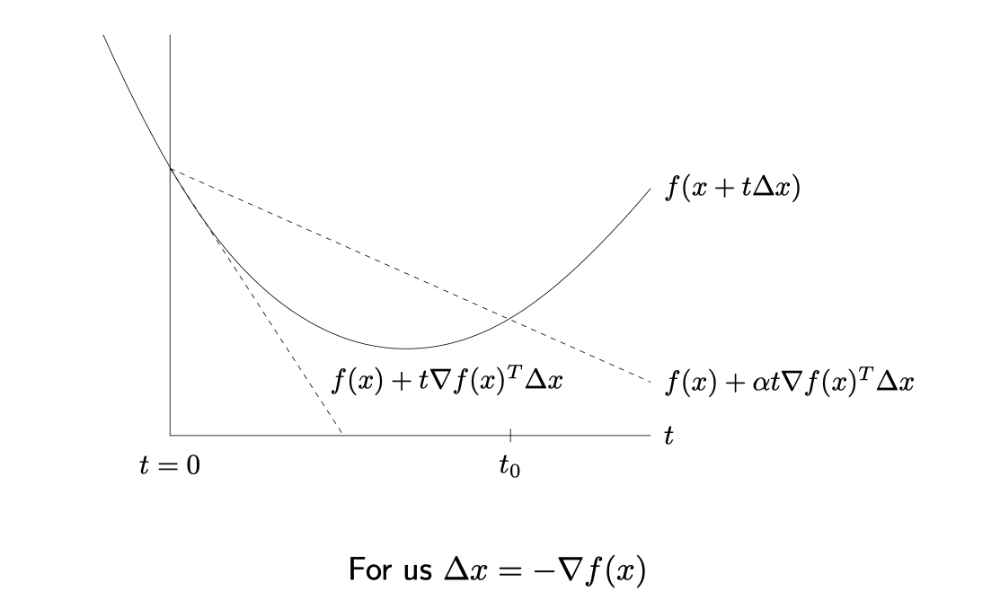

### Convergence analysis 收敛性分析

#### Lipschitz continuous 利普希茨连续

回顾 Lipschitz 连续的定义：不仅要求连续，还要求所有的梯度都是有限的（限制为 L），即 $|f(x)-f(y)| \le L|x-y|$ ；例如 $\sqrt{x}$ 在 $[0,\infty)$ 上就不是 Lipschitz 连续的。

#### 定理：在 Lipschitz 连续条件下，GD 的收敛速度

Assume that $f$ convex and differentiable, with $\operatorname{dom}(f)=\mathbb{R}^{n}$, and additionally that $\nabla f$ is **Lipschitz continuous** with constant $L>0$,
$$
\|\nabla f(x)-\nabla f(y)\|_{2} \leq L\|x-y\|_{2} \quad \text { for any } x, y
$$
(Or when twice differentiable: $\nabla^{2} f(x) \preceq L I$ )

**Theorem**: Gradient descent with fixed step size $t \leq 1 / L$ satisfies
$$
f\left(x^{(k)}\right)-f^{\star} \leq \frac{\left\|x^{(0)}-x^{\star}\right\|_{2}^{2}}{2 t k}
$$
and same result holds for backtracking, with $t$ replaced by $\beta / L$

We say gradient descent has **convergence rate** $O(1 / k)$. That is, it finds $\epsilon$-suboptimal point in $O(1 / \epsilon)$ iterations

注意理解「收敛速率」：对于一个要求的精度 $\epsilon$，算法能够在 $O(1 / \epsilon)$ 步骤内迭代得到一个解。

#### 定理：强凸条件下线性收敛

Reminder: **strong convexity** of $f$ means $f(x)-\frac{m}{2}\|x\|_{2}^{2}$ is convex for some $m>0$ (when twice differentiable: $\nabla^{2} f(x) \succeq m I$ )

Assuming Lipschitz gradient as before, and also strong convexity:
Theorem: Gradient descent with fixed step size $t \leq 2 /(m+L)$ or with backtracking line search search satisfies
$$
f\left(x^{(k)}\right)-f^{\star} \leq \gamma^{k} \frac{L}{2}\left\|x^{(0)}-x^{\star}\right\|_{2}^{2}
$$
where $0<\gamma<1$

Rate under strong convexity is $O\left(\gamma^{k}\right)$, exponentially fast! That is, it finds $\epsilon$-suboptimal point in $O(\log (1 / \epsilon))$ iterations （令 $\gamma^k = \epsilon$，则 $k \log{\gamma} = \log\epsilon$，注意 $\log{\gamma}<0$，则 $\gamma = C\log{\frac{1}{\epsilon}}$）

- 称之为 Linear convergenc，即目标函数相交于迭代次数在 semi-log 图上是线性的。

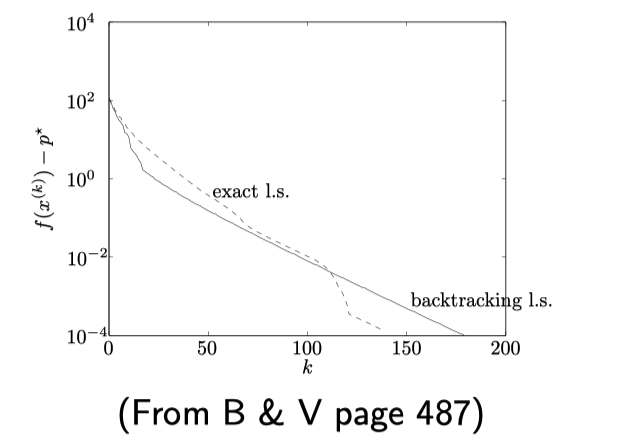

Important note: $\gamma=O(1-m / L)$. Thus we can write convergence rate as
$$
O\left(\frac{L}{m} \log (1 / \epsilon)\right)
$$
Higher **condition number** $L / m \Rightarrow$ slower rate. This is not only true of in theory $\ldots$ very apparent in practice too

#### 例子：LR 中的 condition number

A look at the conditions for a simple problem, $f(\beta)=\frac{1}{2}\|y-X \beta\|_{2}^{2}$

Lipschitz continuity of $\nabla f$ :

- Recall this means $\nabla^{2} f(x) \preceq L I$
- As $\nabla^{2} f(\beta)=X^{T} X$, we have $L=\lambda_{\max }\left(X^{T} X\right)$

Strong convexity of $f$ :

- Recall this means $\nabla^{2} f(x) \succeq m I$
- As $\nabla^{2} f(\beta)=X^{T} X$, we have $m=\lambda_{\min }\left(X^{T} X\right)$

注意到上面的 condition number $L / m$，可知：1. 在数据不足的情况下，LR的优化函数非强凸，收敛速度无法保障；2. 数据量相对较小的情况下，条件数很大，收敛慢。

- If $X$ is wide $(X$ is $n \times p$ with $p>n)$, then $\lambda_{\min }\left(X^{T} X\right)=0$, and $f$ can't be strongly convex
- Even if $\sigma_{\min }(X)>0$, can have a very large condition number $L / m=\lambda_{\max }\left(X^{T} X\right) / \lambda_{\min }\left(X^{T} X\right)$

#### 终止条件：看梯度大小

Stopping rule: stop when $\|\nabla f(x)\|_{2}$ is small

- Recall $\nabla f\left(x^{\star}\right)=0$ at solution $x^{\star}$
- If $f$ is strongly convex with parameter $m$, then
$$
\|\nabla f(x)\|_{2} \leq \sqrt{2 m \epsilon} \Longrightarrow f(x)-f^{\star} \leq \epsilon
$$

Pros and cons of gradient descent:

- Pro: simple idea, and each iteration is cheap (usually)
- Pro: fast for well-conditioned, strongly convex problems
- Con: can often be slow, because many interesting problems aren't strongly convex or well-conditioned
- Con: can't handle nondifferentiable functions

总而言是，上面的 GD存在着局限性：1. 可能速度慢，只有在强凸且 well-conditioned 的情况下才能保证线性收敛；2. 无法处理不可导的情况。

#### First-order method 一阶方法

Gradient descent has $O(1 / \epsilon)$ convergence rate over problem class of convex, differentiable functions with Lipschitz gradients

**First-order method**: iterative method, which updates $x^{(k)}$ in

$$
x^{(0)}+\operatorname{span}\left\{\nabla f\left(x^{(0)}\right), \nabla f\left(x^{(1)}\right), \ldots \nabla f\left(x^{(k-1)}\right)\right\}
$$

**Theorem (Nesterov)**: For any $k \leq(n-1) / 2$ and any starting point $x^{(0)}$, there is a function $f$ in the problem class such that any first-order method satisfies
$$
f\left(x^{(k)}\right)-f^{\star} \geq \frac{3 L\left\|x^{(0)}-x^{\star}\right\|_{2}^{2}}{32(k+1)^{2}}
$$
Can attain rate $O\left(1 / k^{2}\right)$, or $O(1 / \sqrt{\epsilon}) ?$ Answer: yes (we'll see)!

### 非凸情况 Analysis for nonconvex case

在非凸情况下，没有了最优点只有驻点，这里的衡量指标变为函数梯度。注意到收敛率 $O\left(1 / \epsilon^{2}\right)$ 相较于凸函数的 $O(1/\epsilon)$ 也更慢了。

Assume $f$ is differentiable with Lipschitz gradient, now nonconvex. Asking for optimality is too much. Let's settle for a $\epsilon$-substationary point $x$, which means $\|\nabla f(x)\|_{2} \leq \epsilon$

Theorem: Gradient descent with fixed step size $t \leq 1 / L$ satisfies

$$
\min _{i=0, \ldots, k}\left\|\nabla f\left(x^{(i)}\right)\right\|_{2} \leq \sqrt{\frac{2\left(f\left(x^{(0)}\right)-f^{\star}\right)}{t(k+1)}}
$$

Thus gradient descent has rate $O(1 / \sqrt{k})$, or $O\left(1 / \epsilon^{2}\right)$, even in the nonconvex case for finding stationary points

This rate cannot be improved (over class of differentiable functions with Lipschitz gradients) by any deterministic algorithm

### Gradient boosting【略】

Given responses $y_{i} \in \mathbb{R}$ and features $x_{i} \in \mathbb{R}^{p}, i=1, \ldots, n$
Want to construct a flexible (nonlinear) model for response based on features. Weighted sum of trees:
$$
u_{i}=\sum_{j=1}^{m} \beta_{j} \cdot T_{j}\left(x_{i}\right), \quad i=1, \ldots, n
$$
Each tree $T_{j}$ inputs $x_{i}$, outputs predicted response. Typically trees are pretty short

Pick a loss function $L$ to reflect setting. For continuous responses, e.g., could take $L\left(y_{i}, u_{i}\right)=\left(y_{i}-u_{i}\right)^{2}$
Want to solve
$$
\min _{\beta} \sum_{i=1}^{n} L\left(y_{i}, \sum_{j=1}^{M} \beta_{j} \cdot T_{j}\left(x_{i}\right)\right)
$$
Indexes all trees of a fixed size $(e . g .$, depth $=5)$, so $M$ is huge. Space is simply too big to optimize

**Gradient boosting**: basically a version of gradient descent that is forced to work with trees

First think of optimization as $\min _{u} f(u)$, over predicted values $u$, subject to $u$ coming from trees

Start with initial model, a single tree $u^{(0)}=T_{0}$. Repeat:

- Compute negative gradient $d$ at latest prediction $u^{(k-1)}$,
$$
d_{i}=-\left.\left[\frac{\partial L\left(y_{i}, u_{i}\right)}{\partial u_{i}}\right]\right|_{u_{i}=u_{i}^{(k-1)}}, \quad i=1, \ldots, n
$$
- Find a tree $T_{k}$ that is close to $a$, i.e., according to
$$
\min_{\text {trees } T} \sum_{i=1}^{n}\left(d_{i}-T\left(x_{i}\right)\right)^{2}
$$
Not hard to (approximately) solve for a single tree
- Compute step size $\alpha_{k}$, and update our prediction:
$$
u^{(k)}=u^{(k-1)}+\alpha_{k} \cdot T_{k}
$$
Note: predictions are weighted sums of trees, as desired

## Subgradients 次梯度

### 定义

Recall that for convex and differentiable $f$,
$$
f(y) \geq f(x)+\nabla f(x)^{T}(y-x) \text { for all } x, y
$$
That is, linear approximation always underestimates $f$
A **subgradient** of a convex function $f$ at $x$ is any $g \in \mathbb{R}^{n}$ such that
$$
f(y) \geq f(x)+g^{T}(y-x) \text { for all } y
$$

对于梯度的这一个性质进行了扩展，放宽了要求 differentiable。

- 进一步定义 **Subdifferential 次微分** [注意, 在某一点的次微分可能是空集?]

Set of all subgradients of convex $f$ is called the **subdifferential**:
$$
\partial f(x)=\left\{g \in \mathbb{R}^{n}: g \text { is a subgradient of } f \text { at } x\right\}
$$

可知，对于凸函数，1. 其 subdifferential 总是非空的；2. subdifferential 总是 closed and convex（非凸情况也成立）；3. 函数可导和其次函数为单点集合一一对映。

例子：Connection to convex geometry

对于凸集的指示函数而言，其次微分就是之前对于一个凸集所定义的 normal cone

Convex set $C \subseteq \mathbb{R}^{n}$, consider **indicator function** $I_{C}: \mathbb{R}^{n} \rightarrow \mathbb{R}$
$$
I_{C}(x)=I\{x \in C\}= \begin{cases}0 & \text { if } x \in C \\ \infty & \text { if } x \notin C\end{cases}
$$
For $x \in C, \partial I_{C}(x)=\mathcal{N}_{C}(x)$, the **normal cone** of $C$ at $x$ is, recall
$$
\mathcal{N}_{C}(x)=\left\{g \in \mathbb{R}^{n}: g^{T} x \geq g^{T} y \text { for any } y \in C\right\}
$$
Why? By definition of subgradient $g$,
$$
I_{C}(y) \geq I_{C}(x)+g^{T}(y-x) \text { for all } y
$$

- For $y \notin C, I_{C}(y)=\infty$
- For $y \in C$, this means $0 \geq g^{T}(y-x)$

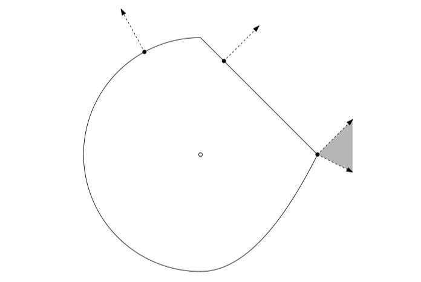

### 性质

基本操作

- Scaling: $\partial(a f)=a \cdot \partial f$ provided $a>0$
- Addition: $\partial\left(f_{1}+f_{2}\right)=\partial f_{1}+\partial f_{2}$
- Affine composition: if $g(x)=f(A x+b)$, then
$$
\partial g(x)=A^{T} \partial f(A x+b)
$$
- Finite pointwise maximum: if $f(x)=\max _{i=1, \ldots, m} f_{i}(x)$, then
$$
\partial f(x)=\operatorname{conv}\left(\bigcup_{i: f_{i}(x)=f(x)} \partial f_{i}(x)\right)
$$
**convex hull** 凸包 of union of subdifferentials of active functions at $x$ （可以画张图直观理解）
- General composition: if
$$
f(x)=h(g(x))=h\left(g_{1}(x), \ldots, g_{k}(x)\right)
$$
where $g: \mathbb{R}^{n} \rightarrow \mathbb{R}^{k}, h: \mathbb{R}^{k} \rightarrow \mathbb{R}, f: \mathbb{R}^{n} \rightarrow \mathbb{R}, h$ is convex and nondecreasing in each argument, $g$ is convex, then
$$
\begin{aligned}
\partial f(x) \subseteq\left\{p_{1} q_{1}+\cdots+p_{k} q_{k}:\right.& \\
\left.p \in \partial h(g(x)), q_{i} \in \partial g_{i}(x), i=1, \ldots, k\right\} &
\end{aligned}
$$
- General pointwise maximum: if $f(x)=\max _{s \in S} f_{s}(x)$, then
$$
\partial f(x) \supseteq \operatorname{cl}\left\{\operatorname{conv}\left(\bigcup_{s: f_{s}(x)=f(x)} \partial f_{s}(x)\right)\right\}
$$
Under some regularity conditions (on $S, f_{s}$ ), we get equality
- Norms: important special case. To each norm $\|\cdot\|$, there is a dual norm $\|\cdot\|_{*}$ such that
$$
\|x\|=\max_{\|z\|_{*} \leq 1} z^{T} x
$$
(For example, $\|\cdot\|_{p}$ and $\|\cdot\|_{q}$ are dual when $1 / p+1 / q=1 .$ ) In fact, for $f(x)=\|x\|$ (and $\left.f_{z}(x)=z^{T} x\right)$, we get equality:
$$
\partial f(x)=\operatorname{cl}\left\{\operatorname{conv}\left(\bigcup_{z: f_{z}(x)=f(x)} \partial f_{z}(x)\right)\right\}
$$
Note that $\partial f_{z}(x)=z .$ And if $z_{1}, z_{2}$ each achieve the max at $x$, which means that $z_{1}^{T} x=z_{2}^{T} x=\|x\|$, then by linearity, so will $t z_{1}+(1-t) z_{2}$ for any $t \in[0,1]$. Thus
$$
\partial f(x)=\underset{\|z\|_{*} \leq 1}{\operatorname{argmax}} z^{T} x
$$

### 优化特征

基于次梯度我们可以得到优化问题的条件

For any $f$ (convex or not),
$$
f\left(x^{\star}\right)=\min _{x} f(x) \Longleftrightarrow 0 \in \partial f\left(x^{\star}\right)
$$
That is, $x^{\star}$ is a minimizer if and only if 0 is a subgradient of $f$ at $x^{\star}$. This is called the **subgradient optimality condition**

#### 例子：证明 first-order optimality contiditon

Example of the power of subgradients: we can use what we have learned so far to derive the **first-order optimality condition**. Recall
$$
\min _{x} f(x) \text { subject to } x \in C
$$
is solved at $x$, for $f$ convex and differentiable, if and only if
$$
\nabla f(x)^{T}(y-x) \geq 0 \text { for all } y \in C
$$
Intuitively: says that gradient increases as we move away from $x$. How to prove it? First recast problem as
$$
\min_{x} f(x)+I_{C}(x)
$$
Now apply subgradient optimality: $0 \in \partial\left(f(x)+I_{C}(x)\right)$
Observe
$$
\begin{aligned}
0 \in \partial(f(x)+&\left.I_{C}(x)\right) \\
& \Longleftrightarrow 0 \in\{\nabla f(x)\}+\mathcal{N}_{C}(x) \\
& \Longleftrightarrow-\nabla f(x) \in \mathcal{N}_{C}(x) \\
& \Longleftrightarrow-\nabla f(x)^{T} x \geq-\nabla f(x)^{T} y \text { for all } y \in C \\
& \Longleftrightarrow \nabla f(x)^{T}(y-x) \geq 0 \text { for all } y \in C
\end{aligned}
$$
as desired
Note: the condition $0 \in \partial f(x)+\mathcal{N}_{C}(x)$ is a **fully general** condition for optimality in convex problems. But it's not always easy to work with (KKT conditions, later, are easier)

#### Example: lasso optimality conditions

Given $y \in \mathbb{R}^{n}, X \in \mathbb{R}^{n \times p}$, lasso problem can be parametrized as
$$
\min _{\beta} \frac{1}{2}\|y-X \beta\|_{2}^{2}+\lambda\|\beta\|_{1}
$$
where $\lambda \geq 0 .$ **Subgradient optimality**:
$$
\begin{aligned}
{0 \in \partial\left(\frac{1}{2}\|y-X \beta\|_{2}^{2}+\lambda\|\beta\|_{1}\right)} \\
& \Longleftrightarrow 0 \in-X^{T}(y-X \beta)+\lambda \partial\|\beta\|_{1} \\
& \Longleftrightarrow X^{T}(y-X \beta)=\lambda v
\end{aligned}
$$
for some $v \in \partial\|\beta\|_{1}$, i.e.,
$$
v_{i} \in \begin{cases}\{1\} & \text { if } \beta_{i}>0 \\ \{-1\} & \text { if } \beta_{i}<0, \quad i=1, \ldots, p \\ {[-1,1]} & \text { if } \beta_{i}=0\end{cases}
$$
Write $X_{1}, \ldots, X_{p}$ for columns of $X$. Then our condition reads:
$$
\begin{cases}X_{i}^{T}(y-X \beta)=\lambda \cdot \operatorname{sign}\left(\beta_{i}\right) & \text { if } \beta_{i} \neq 0 \\ \left|X_{i}^{T}(y-X \beta)\right| \leq \lambda & \text { if } \beta_{i}=0\end{cases}
$$
Note: subgradient optimality conditions don't lead to closed-form expression for a lasso solution ... however they do provide a way to check lasso optimality

They are also helpful in understanding the lasso estimator; e.g., if $\left|X_{i}^{T}(y-X \beta)\right|<\lambda$, then $\beta_{i}=0$ (used by screening rules, later?)

注意，基于 Subgradient optimality，并没有给出 lasso 问题的解法，但是推导出了解的一些特性。

#### 略

## Subgradient method 次梯度方法

之前的 GD 只能解决可导的凸优化问题，这里利用次梯度拓展到 **非可导的凸函数**。

Now consider $f$ convex, having $\operatorname{dom}(f)=\mathbb{R}^{n}$, but not necessarily differentiable

Subgradient method: like gradient descent, but replacing gradients with subgradients. Initialize $x^{(0)}$, repeat:
$$
x^{(k)}=x^{(k-1)}-t_{k} \cdot g^{(k-1)}, \quad k=1,2,3, \ldots
$$
where $g^{(k-1)} \in \partial f\left(x^{(k-1)}\right)$, any subgradient of $f$ at $x^{(k-1)}$
Subgradient method is not necessarily a descent method, thus we keep track of best iterate $x_{\text {best }}^{(k)}$ among $x^{(0)}, \ldots, x^{(k)}$ so far, i.e.,
$$
f\left(x_{\text {best }}^{(k)}\right) = \min_{i=0, \ldots, k} f\left(x^{(i)}\right)
$$

提纲

- step sizes
- convergence analysis
- 例子：intersection of sets
- projected subgradient methods

## Proximal gradient descent 近端梯度下降法

参见

- 机器学习 | 近端梯度下降法 (proximal gradient descent) <https://zhuanlan.zhihu.com/p/82622940>

Last time: subgradient method
Consider the problem
$$
\min _{x} f(x)
$$
with $f$ convex, and $\operatorname{dom}(f)=\mathbb{R}^{n}$. **Subgradient method**: choose an initial $x^{(0)} \in \mathbb{R}^{n}$, and repeat:
$$
x^{(k)}=x^{(k-1)}-t_{k} \cdot g^{(k-1)}, \quad k=1,2,3, \ldots
$$
where $g^{(k-1)} \in \partial f\left(x^{(k-1)}\right)$. We use pre-set rules for the step sizes (e.g., diminshing step sizes rule)

If $f$ is Lipschitz, then subgradient method has a convergence rate $O\left(1 / \epsilon^{2}\right)$

Upside: very generic. Downside: can be slow - addressed today

回顾上一节的次梯度方法：优势在于通用型较强，但问题是收敛速度较慢 —— 这一节讨论。

- proximal GD
- convergence analysis
- ISTA, matrix completion
- special cases
- acceleration

### Proximal GD

#### Composite functions

Suppose
$$
f(x)=g(x)+h(x)
$$

- $g$ is convex, differentiable, $\operatorname{dom}(g)=\mathbb{R}^{n}$
- $h$ is convex, not necessarily differentiable
If $f$ were differentiable, then gradient descent update would be:
$$
x^{+}=x-t \cdot \nabla f(x)
$$
Recall motivation: minimize **quadratic approximation** to $f$ around $x$, replace $\nabla^{2} f(x)$ by $\frac{1}{t} I$
$x^{+}=\underset{z}{\operatorname{argmin}} \underbrace{f(x)+\nabla f(x)^{T}(z-x)+\frac{1}{2 t}\|z-x\|_{2}^{2}}_{\bar{f}_{t}(z)}$

In our case $f$ is not differentiable, but $f=g+h, g$ differentiable. Why don't we make quadratic approximation to $g$, leave $h$ alone?
That is, update
$$
\begin{aligned}
x^{+} &=\underset{z}{\operatorname{argmin}} \bar{g}_{t}(z)+h(z) \\
&=\underset{z}{\operatorname{argmin}} g(x)+\nabla g(x)^{T}(z-x)+\frac{1}{2 t}\|z-x\|_{2}^{2}+h(z) \\
&=\underset{z}{\operatorname{argmin}} \frac{1}{2 t}\|z-(x-t \nabla g(x))\|_{2}^{2}+h(z)
\end{aligned}
$$
$$
\frac{1}{2 t}\|z-(x-t \nabla g(x))\|_{2}^{2} \quad \text{stay close to gradient update for } g \\
h(z) \quad \text{also make } h \text{ small}
$$

这里一个不可导的函数分解出可导的部分；然后对于这个可导函数 $g$ 进行二阶近似/先求解可导函数。

#### Proximal operator

定义 近端算子 (proximal operator)。可以理解为，对于一个不可微的函数 $h$ ，在一个 x 相近的范围内找到一个最小化这个函数的点。由于加了二次项变为**强凸**，因此该函数有**唯一的最小值**。

Define **proximal mapping**:
$$
\operatorname{prox}_{h, t}(x)=\underset{z}{\operatorname{argmin}} \frac{1}{2 t}\|x-z\|_{2}^{2}+h(z)
$$

Stanford 的 [课件](https://web.stanford.edu/~boyd/papers/pdf/prox_algs.pdf) 中给了在约束条件下的例子：直观理解，通过**近端算子**，将解约束在 x 附近；而其另一个翻译 投影，则可理解为对于在定义域之外的点，通过这一算子将其优化到靠近的边界上。

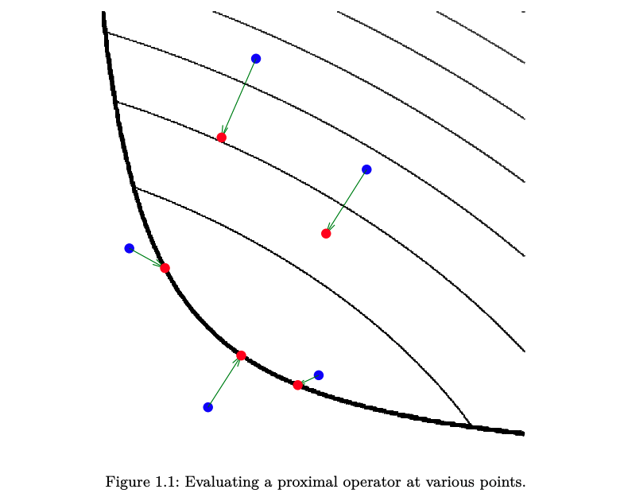

#### Proximal gradient descent

理解了「近端算子」的基础上，再来看下面的「近端梯度下降」，可以直观理解：在迭代过程中，每一次都先优化可导函数 $g$，然后再借助 prox 算子优化不可导的函数 $h$。

**Proximal gradient descent**: choose initialize $x^{(0)}$, repeat:
$$
x^{(k)}=\operatorname{prox}_{h, t_{k}}\left(x^{(k-1)}-t_{k} \nabla g\left(x^{(k-1)}\right)\right), \quad k=1,2,3, \ldots
$$

To make this update step look familiar, can rewrite it as
$$
x^{(k)}=x^{(k-1)}-t_{k} \cdot G_{t_{k}}\left(x^{(k-1)}\right)
$$
where $G_{t}$ is the generalized gradient of $f$,
$$
G_{t}(x)=\frac{x-\operatorname{prox}_{h, t}(x-t \nabla g(x))}{t}
$$

What good did this do?

You have a right to be suspicious ... may look like we just swapped one minimization problem for another

Key point is that $\operatorname{prox}_{h, t}(\cdot)$ has a **closed-form** for many important functions $h$. Note:

- Mapping $\operatorname{prox}_{h, t}(\cdot)$ doesn't depend on $g$ at all, only on $h$
- Smooth part $g$ can be complicated, we only need to compute its gradients

Convergence analysis: will be in terms of the number of iterations, and each iteration evaluates $\operatorname{prox}_{h, t}(\cdot)$ once (this can be cheap or expensive, depending on $h$ )

### Example: ISTA / lasso

prox GD 似乎用在解 lasso 这样的惩罚项挺有用的（上面 Stanford 课件）。注意这里 1范数经过 prox 操作正是得到了 软阈值函数。

Given $y \in \mathbb{R}^{n}, X \in \mathbb{R}^{n \times p}$, recall the **lasso** criterion:
$$
f(\beta)=\underbrace{\frac{1}{2}\|y-X \beta\|_{2}^{2}}_{g(\beta)}+\underbrace{\lambda\|\beta\|_{1}}_{h(\beta)}
$$
Proximal mapping is now
$$
\begin{aligned}
\operatorname{prox}_{t}(\beta) &=\underset{z}{\operatorname{argmin}} \frac{1}{2 t}\|\beta-z\|_{2}^{2}+\lambda\|z\|_{1} \\
&=S_{\lambda t}(\beta)
\end{aligned}
$$
where $S_{\lambda}(\beta)$ is the **soft-thresholding operator**, 软阈值函数
$$
\left[S_{\lambda}(\beta)\right]_{i}= \begin{cases}\beta_{i}-\lambda & \text { if } \beta_{i}>\lambda \\ 0 & \text { if }-\lambda \leq \beta_{i} \leq \lambda, \quad i=1, \ldots, n \\ \beta_{i}+\lambda & \text { if } \beta_{i}<-\lambda\end{cases}
$$

Recall $\nabla g(\beta)=-X^{T}(y-X \beta)$, hence proximal gradient update is:
$$
\beta^{+}=S_{\lambda t}\left(\beta+t X^{T}(y-X \beta)\right)
$$
Often called the **iterative soft-thresholding algorithm** (ISTA). ${ }$ Very simple algorithm （Beck and Teboulle (2008), “A fast iterative shrinkage-thresholding algorithm for linear inverse problems”）

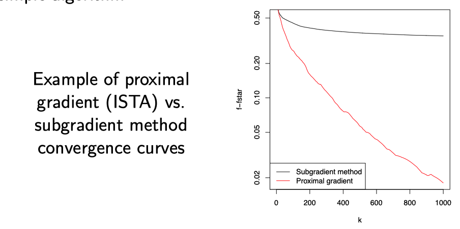

#### Backtracking line search

Backtracking for prox gradient descent works similar as before (in gradient descent), but operates on $g$ and not $f$

Choose parameter $0<\beta<1$. At each iteration, start at $t=t_{\text {init }}$, and while
$$
g\left(x-t G_{t}(x)\right)>g(x)-t \nabla g(x)^{T} G_{t}(x)+\frac{t}{2}\left\|G_{t}(x)\right\|_{2}^{2}
$$
shrink $t=\beta t$, for some $0<\beta<1$. Else perform proximal gradient update
(Alternative formulations exist that require less computation, i.e., fewer calls to prox)

## Stochastic gradient descent

Consider minimizing an average of functions
$$
\min _{x} \frac{1}{m} \sum_{i=1}^{m} f_{i}(x)
$$
As $\nabla \sum_{i=1}^{m} f_{i}(x)=\sum_{i=1}^{m} \nabla f_{i}(x)$, gradient descent would repeat:
$$
x^{(k)}=x^{(k-1)}-t_{k} \cdot \frac{1}{m} \sum_{i=1}^{m} \nabla f_{i}\left(x^{(k-1)}\right), \quad k=1,2,3, \ldots
$$
In comparison, **stochastic gradient descent** or SGD (or incremental gradient descent) repeats:
$$
x^{(k)}=x^{(k-1)}-t_{k} \cdot \nabla f_{i_{k}}\left(x^{(k-1)}\right), \quad k=1,2,3, \ldots
$$
where $i_{k} \in\{1, \ldots, m\}$ is some chosen index at iteration $k$

Two rules for choosing index $i_{k}$ at iteration $k$ :

- **Randomized rule**: choose $i_{k} \in\{1, \ldots, m\}$ uniformly at random
- Cyclic rule: choose $i_{k}=1,2, \ldots, m, 1,2, \ldots, m, \ldots$

Randomized rule is more common in practice. For randomized rule, note that
$$
\mathbb{E}\left[\nabla f_{i_{k}}(x)\right]=\nabla f(x)
$$
so we can view SGD as using an **unbiased estimate** of the gradient at each step
Main appeal of SGD:

- Iteration cost is independent of $m$ (number of functions)
- Can also be a big savings in terms of memory useage

SGD 相较于 GD 每次选择一个成分函数来优化。优势：1. 例如在 LM 场景下样本量太大的问题；2. 减小内存开销。

## Duality in Linear Programs

- Dualit y in g eneral LPs
- 例子: Max flow and min cut
- Second take on dualit y
- 例子: Matrix g ames

### Duality for general form LP

Given $c \in \mathbb{R}^{n}, A \in \mathbb{R}^{m \times n}, b \in \mathbb{R}^{m}, G \in \mathbb{R}^{r \times n}, h \in \mathbb{R}^{r}$ :

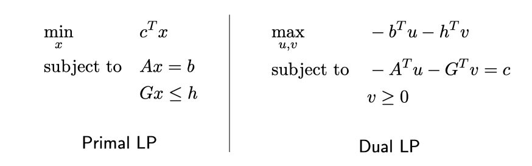

Explanation: for any $u$ and $v \geq 0$, and $x$ primal feasible,
$$
\begin{aligned}
& u^{T}(A x-b)+v^{T}(G x-h) \leq 0 \\
\Longleftrightarrow &\left(-A^{T} u-G^{T} v\right)^{T} x \geq-b^{T} u-h^{T} v
\end{aligned}
$$
So if $c=-A^{T} u-G^{T} v$, we get a bound on primal optimal value

### Example: max flow and min cut

略

## Duality in General Programs

- Lagrange dual function
- Lagrange dual problem
- Weak and strong duality
- Preview of duality uses

### Lagrangian

Consider general minimization problem
$$
\begin{array}{ll}
\min _{x} & f(x) \\
\text { subject to } & h_{i}(x) \leq 0, i=1, \ldots, m \\
& \ell_{j}(x)=0, j=1, \ldots, r
\end{array}
$$
Need not be convex, but of course we will pay special attention to convex case
We define the **Lagrangian** as
$$
L(x, u, v)=f(x)+\sum_{i=1}^{m} u_{i} h_{i}(x)+\sum_{j=1}^{r} v_{j} \ell_{j}(x)
$$
New variables $u \in \mathbb{R}^{m}, v \in \mathbb{R}^{r}$, with $u \geq 0($ else $L(x, u, v)=-\infty)$

定义 Lagrangian 的意义: 它保证了 f 的下界. 在系数合法的情况下, 对于每一个 feasible 点 x 均满足 $L \le f$.

Important property: for any $u \geq 0$ and $v$, $f(x) \geq L(x, u, v)$ at each feasible $x$
Why? For feasible $x$,
$$
L(x, u, v)=f(x)+\sum_{i=1}^{m} u_{i} \underbrace{h_{i}(x)}_{\leq 0}+\sum_{j=1}^{r} v_{j} \underbrace{\ell_{j}(x)}_{=0} \leq f(x)
$$

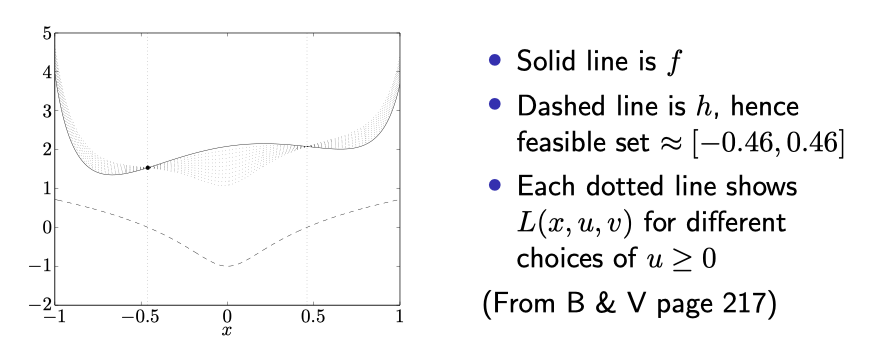

#### Lagrange dual function

Let $C$ denote primal feasible set, $f^{\star}$ denote primal optimal value. Minimizing $L(x, u, v)$ over all $x$ gives a lower bound:
$$
f^{\star} \geq \min _{x \in C} L(x, u, v) \geq \min_{x} L(x, u, v):=g(u, v)
$$
We call $g(u, v)$ the Lagrange dual function, and it gives a lower bound on $f^{\star}$ for any $u \geq 0$ and $v$ , called **dual feasible** $u, v$

由于 Lagrangian 的性质, 放开 x 的可行域限制, 将 Lagrangian 看作是系数的函数, 即得到了 **Lagrange dual function**, 可知在 dual feasible 范围内, 这一对偶函数的也是 f 的下界.

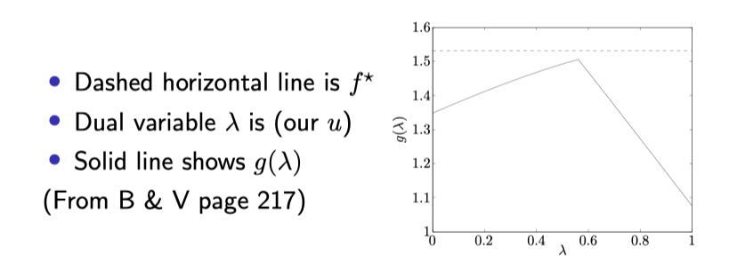

#### Example: quadratic program

Consider quadratic program:
$$
\begin{array}{ll}
\min _{x} & \frac{1}{2} x^{T} Q x+c^{T} x \\
\text { subject to } & A x=b, x \geq 0
\end{array}
$$
where $Q \succ 0$. Lagrangian:
$$
L(x, u, v)=\frac{1}{2} x^{T} Q x+c^{T} x-u^{T} x+v^{T}(A x-b)
$$
Lagrange dual function:
$$
g(u, v)=\min_{x} L(x, u, v)=-\frac{1}{2}\left(c-u+A^{T} v\right)^{T} Q^{-1}\left(c-u+A^{T} v\right)-b^{T} v
$$
For any $u \geq 0$ and any $v$, this lower bounds primal optimal value $f^{\star}$

如果将 Q 拓展到半正定的情况:

Same problem
$$
\begin{array}{cc}
\min _{x} & \frac{1}{2} x^{T} Q x+c^{T} x \\
\text { subject to } & A x=b, x \geq 0
\end{array}
$$
but now $Q \succeq 0$. Lagrangian:
$$
L(x, u, v)=\frac{1}{2} x^{T} Q x+c^{T} x-u^{T} x+v^{T}(A x-b)
$$
Lagrange dual function:
$$
g(u, v)= \begin{cases}-\frac{1}{2}\left(c-u+A^{T} v\right)^{T} Q^{+}\left(c-u+A^{T} v\right)-b^{T} v & \\ & \text { if } c-u+A^{T} v \perp \operatorname{null}(Q) \\ -\infty & \text { otherwise }\end{cases}
$$
where $Q^{+}$ denotes **generalized inverse** of $Q$. For any $u \geq 0, v$, and $c-u+A^{T} v \perp \operatorname{null}(Q), g(u, v)$ is a nontrivial lower bound on $f^{\star}$

### Lagrange dual problem

由于上面所定义的 Lagrange dual function 的性质(在系数取任意值的情况下均为 f 的下界), 可以得到对偶问题: 计算 Lagrange dual function 的最大值.

Given primal problem
$$
\begin{array}{ll}
\min _{x} & f(x) \\
\text { subject to } & h_{i}(x) \leq 0, i=1, \ldots, m \\
& \ell_{j}(x)=0, j=1, \ldots, r
\end{array}
$$
Our dual function $g(u, v)$ satisfies $f^{\star} \geq g(u, v)$ for all $u \geq 0$ and $v$. Hence best lower bound: maximize $g(u, v)$ over dual feasible $u, v$, yielding **Lagrange dual problem**:
$$
\begin{array}{ll}
\max_{u, v} & g(u, v) \\
\text { subject to } & u \geq 0
\end{array}
$$
Key property, called **weak duality**: if dual optimal value is $g^{\star}$, then
$$
f^{\star} \geq g^{\star}
$$
Note that this always holds (even if primal problem is nonconvex) **对偶问题的最大值总小于原问题的最小值, 也即「弱对偶性」, 这一结论即使原问题非凸也成立; 并且, 由于这里的约束条件都是线性, 其 pointwise maximum 也不改变, 因此对偶问题总是一个凸优化问题(对偶函数为凹函数)**

Another key property: the dual problem is a **convex optimization problem** (as written, it is a concave maximization problem)

Again, this is always true (even when primal problem is not convex)
By definition:
$$
\begin{aligned}
g(u, v) &=\min _{x}\left\{f(x)+\sum_{i=1}^{m} u_{i} h_{i}(x)+\sum_{j=1}^{r} v_{j} \ell_{j}(x)\right\} \\
&=-\underbrace{\max_{x}\left\{-f(x)-\sum_{i=1}^{m} u_{i} h_{i}(x)-\sum_{j=1}^{r} v_{j} \ell_{j}(x)\right\}}_{\text {pointwise maximum of convex functions in }(u, v)}
\end{aligned}
$$
That is, $g$ is concave in $(u, v)$, and $u \geq 0$ is a convex constraint, so dual problem is a concave maximization problem

#### Example: nonconvex quartic minimization

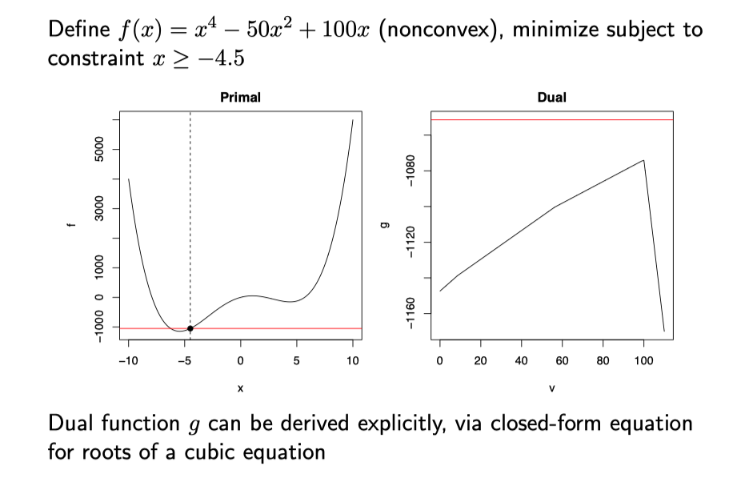

事实上该问题的对偶问题有显式解, 但是形式非常复杂; 但基于对偶问题的性质, 我们可立即知道对偶函数是 concave 的.

### Strong duality

Recall that we always have $f^{\star} \geq g^{\star}$ (weak duality). On the other hand, in some problems we have observed that actually
$$
f^{\star}=g^{\star}
$$
which is called

**Slater's condition**: if the primal is a **convex problem** (i.e., $f$ and $h_{1}, \ldots, h_{m}$ are convex, $\ell_{1}, \ldots, \ell_{r}$ are affine), and there exists at least one strictly feasible $x \in \mathbb{R}^{n}$, meaning
$$
h_{1}(x)<0, \ldots, h_{m}(x)<0 \text { and } \ell_{1}(x)=0, \ldots, \ell_{r}(x)=0
$$
then strong duality holds

**Refinement**: actually only need strict inequalities for non-affine $h_{i}$

Slater's condition 指的是: 如果存在可行解, 使得所有的不等式约束都严格满足, 则此时强对偶成立.

#### LPs: back to where we started

对于线性规划问题而言,

For linear programs:

- Easy to check that the dual of the dual LP is the primal LP
- Refined version of Slater's condition: strong duality holds for an LP if it is feasible
- Apply same logic to its dual LP: strong duality holds if it is feasible
- Hence strong duality holds for LPs, except when both primal and dual are infeasible

In other words, we nearly always have strong duality for LPs

### Example: support vector machine dual

Given $y \in\{-1,1\}^{n}, X \in \mathbb{R}^{n \times p}$, rows $x_{1}, \ldots x_{n}$, recall the **support vector machine** or SVM problem:
$$
\begin{array}{ll}
\min _{\beta, \beta_{0}, \xi} & \frac{1}{2}\|\beta\|_{2}^{2}+C \sum_{i=1}^{n} \xi_{i} \\
\text { subject to } & \xi_{i} \geq 0, i=1, \ldots, n \\
& y_{i}\left(x_{i}^{T} \beta+\beta_{0}\right) \geq 1-\xi_{i}, i=1, \ldots, n
\end{array}
$$

Introducing dual variables $v, w \geq 0$, we form the Lagrangian:
$$
\begin{aligned}
L\left(\beta, \beta_{0}, \xi, v, w\right)=\frac{1}{2}\|\beta\|_{2}^{2}+C & \sum_{i=1}^{n} \xi_{i}-\sum_{i=1}^{n} v_{i} \xi_{i}+\\
& \sum_{i=1}^{n} w_{i}\left(1-\xi_{i}-y_{i}\left(x_{i}^{T} \beta+\beta_{0}\right)\right)
\end{aligned}
$$

Minimizing over $\beta, \beta_{0}, \xi$ gives Lagrange dual function:
$$
g(v, w)= \begin{cases}-\frac{1}{2} w^{T} \tilde{X} \tilde{X}^{T} w+1^{T} w & \text { if } w=C 1-v, w^{T} y=0 \\ -\infty & \text { otherwise }\end{cases}
$$
for $\tilde{X}=\operatorname{diag}(y) X$. Thus SVM dual, eliminating slack variable $v$ :
$$
\begin{array}{lc}
\max_{w} & -\frac{1}{2} w^{T} \tilde{X} \tilde{X}^{T} w+1^{T} w \\
\text { subject to } & 0 \leq w \leq C 1, w^{T} y=0
\end{array}
$$
Check: Slater's condition is satisfied, and we have strong duality. Further, from study of SVMs, might recall that at optimality
$$
\beta=\tilde{X}^{T} w
$$
This is not a coincidence, as we'll see via the KKT conditions

### Duality gap

Given primal feasible $x$ and dual feasible $u, v$, the quantity
$$
f(x)-g(u, v)
$$
is called the duality gap between $x$ and $u, v$. Note that
$$
f(x)-f^{\star} \leq f(x)-g(u, v)
$$
so if the duality gap is zero, then $x$ is primal optimal (and similarly, $u, v$ are dual optimal)

Also from an algorithmic viewpoint, provides a stopping criterion: if $f(x)-g(u, v) \leq \epsilon$, then we are guaranteed that $f(x)-f^{\star} \leq \epsilon$
Very useful, especially in conjunction with iterative methods ... more dual uses in coming lectures

总结一下:

- 对于一个带约束的优化问题, 我们可以定义 Lagrange 函数, 在一定的系数可行域下, 取 x 的最小值, 即得到 Lagrage dual function;
- 在系数的可行域内求 Lagrange 对偶函数的最大值, 即为对偶问题 dual problem
- 一些性质:
    - 对偶问题总是凸的 (即对偶函数是凹函数)
    - weak duality: 对偶问题的解总是原问题解的下界
    - Slater条件: 对于凸函数约束, 当存在 x 使得约束条件严格成立时, 强对偶性成立

## KKT, Karush-Kuhn-Tucker Conditions

KKT 条件是非线性规划领域中最重要的理论成果之一，是确定某点是最优点的**一阶必要条件**，只要是最优点就一定满足这个条件，但是一般来说不是充分条件，因此满足这个点的不一定是最优点。但对于**凸优化而言，KKT条件是最优点的充要条件**。[注意这里的结论应该是基于导数形式, 而下面的充分性必要性讨论好像是基于次微分的; 此时的结论变为, KKT条件总是充分的, 而当强对偶成立的情况下, KKT条件是必要的].

参见

- wiki: <https://en.wikipedia.org/wiki/Karush%E2%80%93Kuhn%E2%80%93Tucker_conditions>
- 简单介绍, 从等式约束的 Lagrange乘数法 讲起很清楚 [Karush-Kuhn-Tucker (KKT)条件](https://zhuanlan.zhihu.com/p/38163970)
- KKT 公式理解/推导 [真正理解拉格朗日乘子法和 KKT 条件](https://www.cnblogs.com/xinchen1111/p/8804858.html)  

大纲

- KKT conditions
- 例子
- Constrained and Lagrange forms
- Uniqueness with $l_1$ penalties

### Karush-Kuhn-Tucker conditions

Given general problem
$$
\begin{array}{ll}
\min _{x} & f(x) \\
\text { subject to } & h_{i}(x) \leq 0, i=1, \ldots, m \\
& \ell_{j}(x)=0, j=1, \ldots, r
\end{array}
$$

The Karush-Kuhn-Tucker conditions or **KKT conditions** are:

- $0 \in \partial_{x}\left(f(x)+\sum_{i=1}^{m} u_{i} h_{i}(x)+\sum_{j=1}^{r} v_{j} \ell_{j}(x)\right) \quad$ (**stationarity**)
- $u_{i} \cdot h_{i}(x)=0$ for all $i$ (**complementary slackness**)
- $h_{i}(x) \leq 0, \ell_{j}(x)=0$ for all $i, j$ (primal feasibility)
- $u_{i} \geq 0$ for all $i$ (dual feasibility)

#### Necessity

必要性: 当强对偶成立的时候(Slater's condition), 要证明KKT条件一定成立.

Let $x^{\star}$ and $u^{\star}, v^{\star}$ be primal and dual solutions with zero duality gap (strong duality holds, e.g., under Slater's condition). Then
$$
\begin{aligned}
f\left(x^{\star}\right) &=g\left(u^{\star}, v^{\star}\right) \\
&=\min _{x} f(x)+\sum_{i=1}^{m} u_{i}^{\star} h_{i}(x)+\sum_{j=1}^{r} v_{j}^{\star} \ell_{j}(x) \\
& \leq f\left(x^{\star}\right)+\sum_{i=1}^{m} u_{i}^{\star} h_{i}\left(x^{\star}\right)+\sum_{j=1}^{r} v_{j}^{\star} \ell_{j}\left(x^{\star}\right) \\
& \leq f\left(x^{\star}\right)
\end{aligned}
$$
In other words, all these inequalities are actually equalities

Two things to learn from this:

- The point $x^{\star}$ minimizes $L\left(x, u^{\star}, v^{\star}\right)$ over $x \in \mathbb{R}^{n}$. Hence the subdifferential of $L\left(x, u^{\star}, v^{\star}\right)$ must contain 0 at $x=x^{\star}$ -this is exactly the **stationarity** condition
- We must have $\sum_{i=1}^{m} u_{i}^{\star} h_{i}\left(x^{\star}\right)=0$, and since each term here is $\leq 0$, this implies $u_{i}^{\star} h_{i}\left(x^{\star}\right)=0$ for every $i$-this is exactly **complementary slackness** 互补松弛条件

Primal and dual feasibility hold by virtue of optimality. Therefore:

> If $x^{\star}$ and $u^{\star}, v^{\star}$ are primal and dual solutions, with zero duality gap, then $x^{\star}, u^{\star}, v^{\star}$ satisfy the KKT conditions

(Note that this statement assumes nothing a priori about convexity of our problem, i.e., of $f, h_{i}, \ell_{j}$ )

#### Sufficiency

充分性: 必然成立? 注意这里用的是次微分的形式.

If there exists $x^{\star}, u^{\star}, v^{\star}$ that satisfy the KKT conditions, then
$$
\begin{aligned}
g\left(u^{\star}, v^{\star}\right) &=f\left(x^{\star}\right)+\sum_{i=1}^{m} u_{i}^{\star} h_{i}\left(x^{\star}\right)+\sum_{j=1}^{r} v_{j}^{\star} l_{j}\left(x^{\star}\right) \\
&=f\left(x^{\star}\right)
\end{aligned}
$$
where the first equality holds from stationarity, and the second holds from complementary slackness

Therefore the duality gap is zero (and $x^{\star}$ and $u^{\star}, v^{\star}$ are primal and dual feasible) so $x^{\star}$ and $u^{\star}, v^{\star}$ are primal and dual optimal. Hence, we've shown:

> If $x^{\star}$ and $u^{\star}, v^{\star}$ satisfy the KKT conditions, then $x^{\star}$ and $u^{\star}, v^{\star}$ are primal and dual solutions

#### Putting it together

In summary, KKT conditions are equivalent to zero duality gap:

- always sufficient
- necessary under strong duality

> For a problem with strong duality (e.g., assume Slater's condition: convex problem and there exists $x$ strictly satisfying nonaffine inequality contraints),
>
>$x^{\star}$ and $u^{\star}, v^{\star}$ are primal and dual solutions $\Longleftrightarrow x^{\star}$ and $u^{\star}, v^{\star}$ satisfy the KKT conditions

(Warning, concerning the stationarity condition: for a differentiable function $f$, we cannot use $\partial f(x)=\{\nabla f(x)\}$ unless $f$ is convex!)

#### Example: quadratic with equality constraints

Consider for $Q \succeq 0$,
$$
\begin{array}{ll}
\min _{x} & \frac{1}{2} x^{T} Q x+c^{T} x \\
\text { subject to } & A x=0
\end{array}
$$
(For example, this corresponds to Newton step for the constrained problem $\min_{x} f(x)$ subject to $A x=b$ )

Convex problem, no inequality constraints, so by KKT conditions: $x$ is a solution if and only if
$$
\left[\begin{array}{cc}
Q & A^{T} \\
A & 0
\end{array}\right]\left[\begin{array}{l}
x \\
u
\end{array}\right]=\left[\begin{array}{c}
-c \\
0
\end{array}\right]
$$
for some $u$. Linear system combines **stationarity, primal feasibility** (complementary slackness and dual feasibility are vacuous)

#### Example: water-filling

Example from B \& V page 245: consider problem
$$
\begin{array}{lc}
\min _{x} & -\sum_{i=1}^{n} \log \left(\alpha_{i}+x_{i}\right) \\
\text { subject to } & x \geq 0,1^{T} x=1
\end{array}
$$
Information theory: think of $\log \left(\alpha_{i}+x_{i}\right)$ as communication rate of $i$ th channel. KKT conditions:
$$
\begin{gathered}
-1 /\left(\alpha_{i}+x_{i}\right)-u_{i}+v=0, \quad i=1, \ldots, n \\
u_{i} \cdot x_{i}=0, \quad i=1, \ldots, n, \quad x \geq 0, \quad 1^{T} x=1, \quad u \geq 0
\end{gathered}
$$
Eliminate $u$ :
$$
\begin{gathered}
1 /\left(\alpha_{i}+x_{i}\right) \leq v, \quad i=1, \ldots, n \\
x_{i}\left(v-1 /\left(\alpha_{i}+x_{i}\right)\right)=0, \quad i=1, \ldots, n, \quad x \geq 0, \quad 1^{T} x=1
\end{gathered}
$$

Can argue directly **stationarity and complementary slackness** imply

$x_{i}=\left\{\begin{array}{ll}1 / v-\alpha_{i} & \text { if } v<1 / \alpha_{i} \\ 0 & \text { if } v \geq 1 / \alpha_{i}\end{array}=\max \left\{0,1 / v-\alpha_{i}\right\}, \quad i=1, \ldots, n\right.$
Still need $x$ to be feasible, i.e., $1^{T} x=1$, and this gives
$$
\sum^{n} \max \left\{0,1 / v-\alpha_{i}\right\}=1
$$

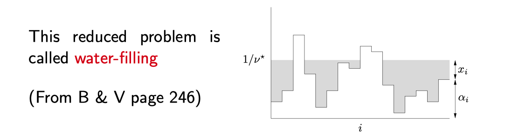

#### Example: support vector machines

Given $y \in\{-1,1\}^{n}$, and $X \in \mathbb{R}^{n \times p}$, the support vector machine problem is:
$$
\begin{array}{ll}
\min _{\beta, \beta_{0}, \xi} & \frac{1}{2}\|\beta\|_{2}^{2}+C \sum_{i=1}^{n} \xi_{i} \\
\text { subject to } & \xi_{i} \geq 0, i=1, \ldots, n \\
& y_{i}\left(x_{i}^{T} \beta+\beta_{0}\right) \geq 1-\xi_{i}, i=1, \ldots, n
\end{array}
$$
Introduce dual variables $v, w \geq 0$. KKT stationarity condition:
$$
0=\sum_{i=1}^{n} w_{i} y_{i}, \quad \beta=\sum_{i=1}^{n} w_{i} y_{i} x_{i}, \quad w=C 1-v
$$
Complementary slackness:
$$
v_{i} \xi_{i}=0, w_{i}\left(1-\xi_{i}-y_{i}\left(x_{i}^{T} \beta+\beta_{0}\right)\right)=0, \quad i=1, \ldots, n
$$

Hence at optimality we have $\beta=\sum_{i=1}^{n} w_{i} y_{i} x_{i}$, and $w_{i}$ is nonzero only if $y_{i}\left(x_{i}^{T} \beta+\beta_{0}\right)=1-\xi_{i}$. Such points $i$ are called the **support points**

- For support point $i$, if $\xi_{i}=0$, then $x_{i}$ lies on edge of margin, and $w_{i} \in(0, C]$;
- For support point $i$, if $\xi_{i} \neq 0$, then $x_{i}$ lies on wrong side of margin, and $w_{i}=C$

- KKT conditions do not really give us a way to find solution, but gives a better understanding
- In fact, we can use this to screen away non-support points before performing optimization

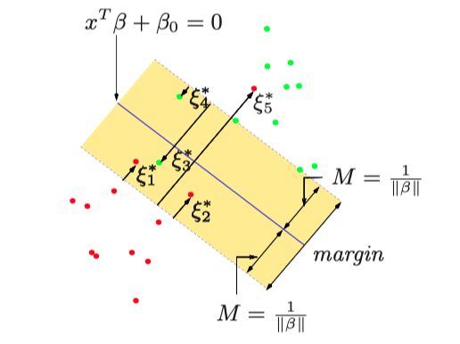

### Constrained and Lagrange forms

Often in statistics and machine learning we'll switch back and forth between **constrained** form, where $t \in \mathbb{R}$ is a tuning parameter,
$$
\min _{x} f(x) \text { subject to } h(x) \leq t \tag{C}
$$
and **Lagrange** form, where $\lambda \geq 0$ is a tuning parameter,
$$
\min_{x} f(x)+\lambda \cdot h(x) \tag{L}
$$
and claim these are equivalent. Is this true (assuming convex $f, h$ )?

- (C) to $(L)$ : if $(C)$ is strictly feasible, then strong duality holds, and there exists $\lambda \geq 0$ (dual solution) such that any solution $x^{\star}$ in (C) minimizes
$$
f(x)+\lambda \cdot(h(x)-t)
$$
so $x^{\star}$ is also a solution in $(\mathrm{L})$
- ($\mathrm{L})$ to $(\mathrm{C})$ : if $x^{\star}$ is a solution in $(\mathrm{L})$, then the KKT conditions for (C) are satisfied by taking $t=h\left(x^{\star}\right)$, so $x^{\star}$ is a solution in (C)

**Conclusion**:
$$
\begin{aligned}
&\bigcup_{\lambda \geq 0}\{\text { solutions in }(\mathrm{L})\} \subseteq \bigcup_{t}\{\text { solutions in }(\mathrm{C})\} \\
&\bigcup_{\lambda \geq 0}\{\text { solutions in }(\mathrm{L})\} \quad \supseteq \bigcup_{\begin{array}{c}
t \text { such that } (C) \\
\text { is strictly feasible }
\end{array}}
\end{aligned} \{\text { solutions in }(\mathrm{C})\}
$$
This is nearly a perfect equivalence. Note: when the only value of $t$ that leads to a feasible but not strictly feasible constraint set is $t=0$, then we do get perfect equivalence

For example, if $h \geq 0$, and problems (C), (L) are feasible for $t \geq 0$, $\lambda \geq 0$, respectively, then we do get perfect equivalence

### 略过

### Back to duality: 利用对偶问题求解原问题

- 假如一个问题满足**强对偶**, 那么 $x^{\prime}, u^{\prime}, v^{\prime}$ 是原问题和对偶问题的最优解 $\longleftrightarrow x^{\prime}, u^{\prime}, v^{\prime}$ 满足KKT条件。
- 因此通过对偶问题求得 $u^{\prime}, v^{\prime}$ 后，代入 KKT 条件即可求出 $x^{\prime}$ 。

A key use of duality: under **strong duality**, can characterize primal solutions from dual solutions

Recall that under strong duality, the KKT conditions are necessary for optimality. Given dual solutions $u^{\star}, v^{\star}$, any primal solution $x^{\star}$ satisfies the stationarity condition
$$
0 \in \partial f\left(x^{\star}\right)+\sum_{i=1}^{m} u_{i}^{\star} \partial h_{i}\left(x^{\star}\right)+\sum_{j=1}^{r} v_{i}^{\star} \partial \ell_{j}\left(x^{\star}\right)
$$
In other words, $x^{\star}$ solves $\min _{x} L\left(x, u^{\star}, v^{\star}\right)$
In particular, if this is satisfied uniquely (above problem has unique minimizer), then corresponding point must be the primal solution $\ldots$ very useful when dual is easier to solve than primal

## Duality Uses and Correspondences

- Dual norms
- Conjugate functions
- Dual cones
- Dual tricks and subtleties

### Uses of duality

Two key uses of duality:

- For $x$ primal feasible and $u, v$ dual feasible,
$$
f(x)-f\left(x^{\star}\right) \leq f(x)-g(u, v)
$$
Right-hand side is called **duality gap**. Note that a zero duality gap implies **optimality**. Also, the duality gap can be used as a **stopping criterion** in algorithms
- Under strong duality, given dual optimal $u^{\star}, v^{\star}$ , any primal solution $x^{\star}$ solves
$$
\min _{x} L\left(x, u^{\star}, v^{\star}\right)
$$
(i.e., satisfies the stationarity condition). This can be used to **characterize** or **compute** primal solutions from dual solution

#### When is dual easier?

Key facts about primal-dual relationship (some covered here, some later):

- Dual has complementary **number of variables**: recall, number of primal constraints
- Dual involves **complementary norms**: $\|\cdot\|$ becomes $\|\cdot\|_{*}$
- Dual has **"identical" smoothness**: $L / m$ (Lipschitz constant of gradient by strong convexity parameter) is unchanged between $f$ and its conjugate $f^{*}$
- Dual can **"shift" linear transformations** between terms ... this leads to key idea: dual decomposition

#### Solving the primal via the dual

An important consequence of stationarity: under strong duality, given a dual solution $u^{\star}, v^{\star}$, any primal solution $x^{\star}$ solves
$$
\min _{x} f(x)+\sum_{i=1}^{m} u_{i}^{\star} h_{i}(x)+\sum_{j=1}^{r} v_{j}^{\star} l_{j}(x)
$$
Often, solutions of this unconstrained problem can be expressed explicitly, giving an explicit **characterization** of primal solutions from dual solutions

Furthermore, suppose the solution of this problem is unique; then it must be the primal solution $x^{\star}$

This can be very helpful **when the dual is easier to solve than the primal**

For example, consider:
$$
\min _{x} \sum_{i=1}^{n} f_{i}\left(x_{i}\right) \quad \text { subject to } a^{T} x=b
$$
where each $f_{i}\left(x_{i}\right)=\frac{1}{2} c_{i} x_{i}^{2}($ smooth and strictly convex $)$. Dual function:
$$
\begin{aligned}
g(v) &=\min _{x} \sum_{i=1}^{n} f_{i}\left(x_{i}\right)+v\left(b-a^{T} x\right) \\
&=b v+\sum_{i=1}^{n} \min_{x_{i}}\left\{f_{i}\left(x_{i}\right)-a_{i} v x_{i}\right\} \\
&=b v-\sum_{i=1}^{n} f_{i}^{*}\left(a_{i} v\right)
\end{aligned}
$$
where each $f_{i}^{*}(y)=\frac{1}{2 c_{i}} y^{2}$ , called the **conjugate** of $f_{i}$

Therefore the dual problem is
$$
\max _{v} b v-\sum_{i=1}^{n} f_{i}^{*}\left(a_{i} v\right) \quad \Longleftrightarrow \min _{v} \sum_{i=1}^{n} f_{i}^{*}\left(a_{i} v\right)-b v
$$
This is a convex minimization problem with scalar variable-much easier to solve than primal

Given $v^{\star}$ , the primal solution $x^{\star}$ solves
$$
\min _{x} \sum_{i=1}^{n}\left(f_{i}\left(x_{i}\right)-a_{i} v^{\star} x_{i}\right)
$$
Strict convexity of each $f_{i}$ implies that this has a unique solution, namely $x^{\star}$, which we compute by solving $f_{i}^{\prime}\left(x_{i}\right)=a_{i} v^{\star}$ for each $i$. This gives $x_{i}^{\star}=a_{i} v^{\star} / c_{i}$

### Dual norms 略

## ADMM

- 分布式计算、统计学习与ADMM算法 <https://joegaotao.github.io/2014/02/11/admm-stat-compute/>
